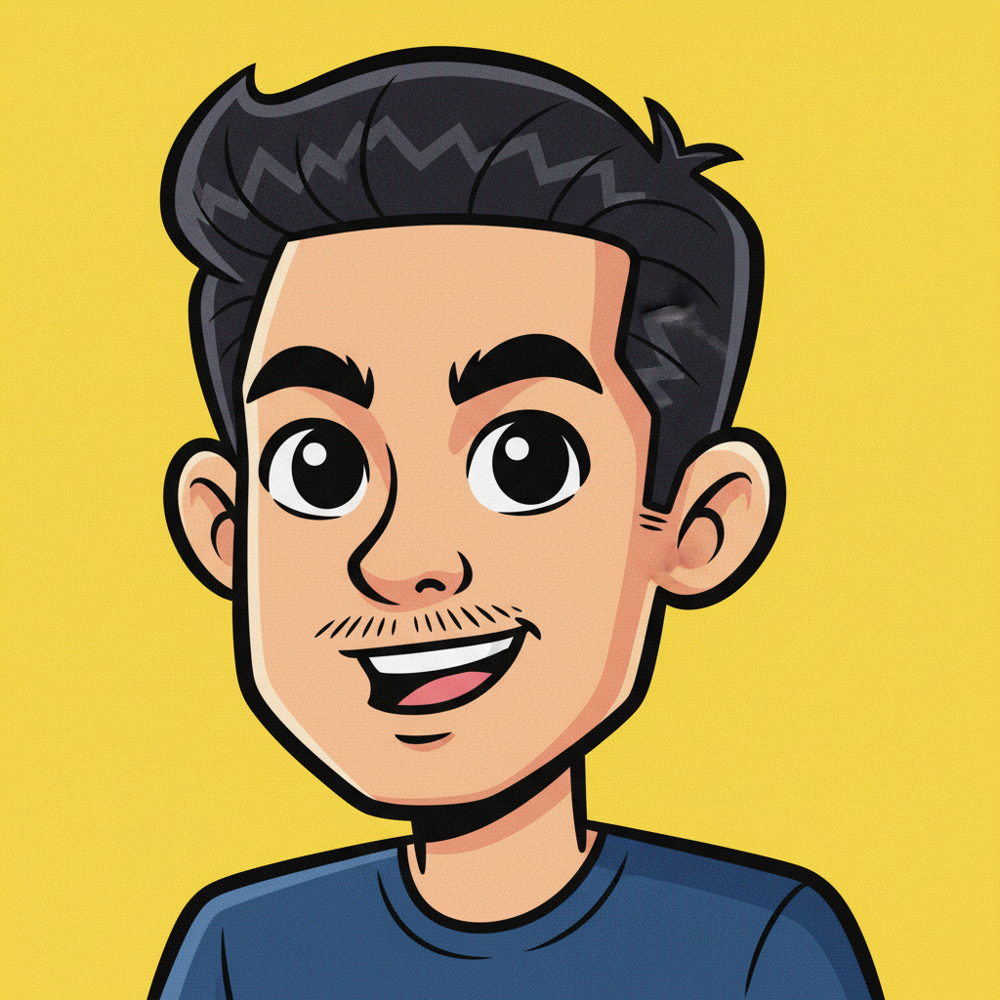

# About

## Personal Info

<figure><figcaption></figcaption></figure>

**Name:** Hau (Howie) Nguyen\
**Location:** Ho Chi Minh City, Vietnam

***

## **Summary**



* **10+ years** in UI/UX Design, Graphic Design, and Digital Art across multiple industries, including Web3, Software, FinTech, Gaming, and Marketing.
* With **5+ years** of experience working alongside startup companies and projects, contributing to the significant growth.
* **UI/UX & Graphic Design** – Expertise in intuitive interfaces, prototypes, wireframes, and brand assets for web and mobile.
* **Web3 & Marketing** – Skilled in branding, website design, and campaign execution, driving significant user growth.
* **Design Systems** – Built and maintained design systems for efficiency and visual consistency.
* **Cross-functional Collaboration** – Worked closely with developers, marketers, and product teams to align design with business goals.
* **Rebranding & Growth** – Led rebranding efforts, enhancing brand recognition and engagement.
* **Gaming Industry** – Extensive experience in game UI/UX, 2D/3D design, and product development, contributing to millions of downloads and revenue. 

***

## **Experience**

#### **Nebula Block**

_Nebula Block provides **cloud computing** and **GPU resources**._

**Company type:** _Service-based company_

**Company size:** _15 - 20_

**Position:** _UI/UX, Marketing Designer_

**Duration:** _2024 - 2025_

**Website:** [_nebulablock.com_](https://nebulablock.com)

**Responsibilities:**

* Designed and developed **marketing and web assets** for **Web3 products**, including landing pages, dashboards, and campaign visuals.
* Collaborated with **product, marketing, and blockchain teams** to translate complex technical concepts into **user-friendly designs**.
* Supported **branding and visual identity** across multiple touchpoints: website, social media, pitch decks, and community materials.
* Worked closely with **developers** to ensure **design feasibility, responsiveness, and performance optimization**.
* Maintained **design consistency** while adapting assets for different platforms and global audiences.

**Achievements:**

* Successfully delivered **marketing campaigns** that improved **user engagement and brand visibility**.
* Designed **high-converting landing pages** supporting **user acquisition and project launches**.

#### **Dakai**

_Dakai delivers **high-quality software solutions**, combining **modern technology** with **traditional development**. They help **startups succeed** and build **strong client relationships**._

**Company type:** _Software outsourcing_

**Company size:** _15 - 20_

**Position:** _UI/UX, Graphic Designer_

**Duration:** _2021 - 2023_

**Website:** [_dakai.io_](https://dakai.io/)

**Clients:** _DealTitan,_ [_Topic Ranker_](https://topicranker.com/)_, Qarik, Cartesi, CompostCoin, DropToken, TM Wallet, Vercel, Solana, Quillytics,..._

**Responsibilities:**

* Worked with **clients, managers, designers**, and **front-end developers** to turn **project requirements** and **business goals** into polished **user interfaces**.
* Designed **user-friendly** and **visually appealing interfaces** for **websites** and **mobile applications**.
* Turned **wireframes** and **user flows** into engaging **visual designs** that meet **user needs** and **business objectives**.
* Created **interactive prototypes** and **mock-ups** to share **design ideas** and collect feedback from **stakeholders**.
* Collaborated with **development** and **product teams** to ensure designs were **implemented successfully**.
* Gathered and used **user feedback** to **improve** and **refine designs** continuously.
* Built and maintained **design systems**, **style guides**, and **brand assets** to ensure **consistency** for each project.
* **Rebranded** [**websites**](design/branding/dakai.md)**,** [**logos**](multimedia/logo.md)**,** [**presentations**](multimedia/deck.md)**,** [**brand books**](design/branding/dakai.md#brand-guidelines), and [**internal tools**](design/branding/dakai.md#dashboard).

**Achievements:**

* Delivered **20+ polished user interfaces** for **websites** and **mobile apps**, improving **user experience** and meeting **client goals**.
* Built the [**design system**](article/design-system.md) to keep projects consistent and saved **20% of design time**. 

#### **FPT Telecom**

_A product of **FPT Telecom**, **FPT Camera** offers a **smart home security**_ _**solution** by developing an intuitive app that integrates with **smart cameras** for **seamless home monitoring**._

**Company type:** _Product_

**Team size:** _40 - 50_

**Position:** _UI/UX Designer_

**Duration:** _2020 - 2021_

**Projects:** [_FPT Camera_](https://fpt-camera.com.vn/)_, FPT TV Playbox Camera_

**Responsibilities:**

* **Developed** and **expanded user flows** to create **intuitive** and **functional User Interfaces**.
* **Communicated** with **product managers** and **business analysts** to ensure alignment between **project requirements** and **UI design objectives**.
* Participated in **brainstorming** and **strategy sessions** with **developers** and **managers** to define methods for achieving **project goals**.
* **Collaborated** with **developers** to implement **UI features** and integrate **technical design guidelines** into the final product.
* Designed **site maps**, **user flows**, **wireframes**, and **mockups** based on **proven methodologies**, **stakeholder feedback**, and **user needs**.

**Achievements:**

* Successfully **improved the user experience** by refining and expanding **user flows**, leading to more **intuitive interfaces**.
* Contributed to **cross-functional collaboration** that resulted in the **seamless integration** of **UI features**, meeting both **business** and **customer expectations**. 

#### **Waves8**

_A **startup company** that focus create an app listening to **Podcast** for **Vietnamese people**._

**Company type:** _Startup_

**Team size:** _15 - 20_

**Position:** _UI/UX/Graphic Designer_

**Duration:** _2019_

**Project:** [_Waves_](./#waves)

**Responsibilities:**

* **Receiving requirements** with a list of features, **collaborating** with the team to evaluate suitable functionalities.
* **Conducting research** and understanding **user needs** through **interviews**.
* Producing design such as **Sitemap, Wireframes, Mockups, Prototypes** to gather feedback from both **internal and external users**.
* **Released an MVP version** with the most basic functions, **attracted users**, and received **positive feedback**.
* **Multitasking in design** such as **Mobile, Web, Graphics,** and other **Marketing collateral**.

**Achievements:**

* After the app's release, it received a [**$1.2 million investment** ](https://www.techinasia.com/waves-receives-1m-seed-funding)in the **seed round**.

#### **Shinhan Finance**

_Design **iShinhan** app, enables users to apply for **loans**, **manage repayments**, and access various **financial services** conveniently._

**Company type:** _Consumer finance_

**Position:** _UI Designer_

**Duration:** _2019_

**Project:** [_iShinhan_](./#shinhan-finance)

**Responsibilities:**

* **Translated specifications** into both **mobile** and **desktop web versions**, ensuring a **seamless** and **intuitive user experience** across platforms.
* **Communicated effectively** with **head managers** and **customer experience teams** to align **project requirements** and **business objectives** with polished, **user-centered interfaces.**
* Collaborated closely with **developers** to integrate **UI features** while adhering to **technical design guidelines** and maintaining high **usability standards.**

**Achievements:**

* Successfully completed all **design sprints** on time, delivering **user-friendly designs** that met **project milestones** and exceeded **client expectations.**

#### **Exoty**

_Exoty appears to be a game studio that specializes in developing **multiplayer card and board games**, primarily targeting the **French market** and other European audiences._

**Company type:** _Game product_

**Company size:** _15 - 20_

**Position:** _UI Designer_

**Duration:** _2015 - 2018_

**Website:** [_exoty.com_](https://exoty.com/)

**Projects:** [_Exoty Belote_](./#exoty)_,_ [_Exoty Tarot_](./#exoty)

**Responsibilities:**

* Collaborated with **product managers** and team members to translate **user feedback** into practical and impactful features.
* Worked closely with developers to ensure **UI features** were seamlessly integrated, adhering to **design standards** and **technical guidelines.**
* Crafted **on-brand creative solutions** to align with marketing objectives and merchant goals.
* Ensured **design consistency** across all deliverables by following the brand’s **visual identity** and **style guidelines.**
* Effectively managed and prioritized tasks to meet **tight deadlines** while maintaining **high-quality design standards.**

**Achievements:**

* Two games achieved significant success, reached [**1 million downloads**](design/mobile-app-design/exoty-multiplayer-card-games.md#rating-on-google-play-apple-store) on **Google Play** and the **Apple App Store**.
* Received positive [**user reviews**](design/mobile-app-design/exoty-multiplayer-card-games.md#rating-on-google-play-apple-store) with an average rating of **4.5+** on both platforms, demonstrating high **user satisfaction**.
* The company reached **$1 million in game revenue** in [**4 years and half**](https://www.linkedin.com/in/hoangdangtran/).

#### **Colorbox**

_**Colorbox** is a prominent game development, create innovative casual games for mobile devices._&#x20;

**Company type:** _Game product_

**Company size:** _15 - 20_

**Position:** _2D Artist_

**Duration:** _2012 - 2014_

**Responsibilities:**

* Designed and created **2D graphics** for games, including **characters, backgrounds, objects, animations, effects,** and **user interfaces.**
* Collaborated closely with the **product development team**, including **game designers, developers, project managers,** and **artists,** to ensure alignment with project goals and creative vision.

**Achievements:**

* Contributed to the development of multiple **mobile games,** with several achieving **notable success** in terms of downloads, user engagement, and market recognition.
* Understand all stages of **mobile game development**, including **character creation**, **background design**, **object modeling**, **animation**, and overall **game mechanics**. 

#### **DWV**

_Specializing in **software, games, online games, CG content, amusement arcade games, films, VFX,** and **IT projects**, primarily catering to the **Japanese market.**_

**Company type:** _Game outsourcing_

**Company size:** _75 - 100_

**Position:** _3D Artist_

**Duration:** _2010 - 2012_

_**Website:**_ [_dworks-vn.com_](https://dworks-vn.com/)

**Responsibilities:**

* Designed and developed **3D assets** for games, including **characters, environments, objects,** and **animations.**
* Collaborated closely with the **Lead Artist** to maintain high standards of quality and ensure timely project delivery.

**Achievements:**

* Contributed to the successful development of **several console games**, some of which achieved **notable commercial and critical success.**
* Understand all stages of **3D game development**, including **character creation**, **modeling**, **environment background**, **animation**, and **rendering**.

***

## Skills

[**UI/UX Design**](portfolio.md)

* [Web design](article/the-design-process/the-process-to-design-landing-page.md), [mobile app design](article/the-design-process/the-process-to-design-mobile-app.md), and [dashboards](article/the-design-process/the-process-to-design-dashboard.md).
* Collaborating with product and marketing teams to enhance user experience.
* Building [design systems](article/design-system.md), [style guides](article/design-system.md#styles-and-spacing), and [documentation](article/design-system.md#guidelines).
* Understanding HTML/CSS and working with developers to implement UI.

[**Graphic Design**](multimedia/banner.md)

* [2D](multimedia/2d-art.md)/[3D design](multimedia/3d-design.md) for various digital and print media.
* Creating [marketing materials](multimedia/marketing-materials.md), [presentations](multimedia/deck.md), and corporate assets.

[**Branding & Identity**](multimedia/logo.md)

* Designing unique and visually appealing [logos](multimedia/logo.md).
* Developing comprehensive [brand guidelines](article/brand-guideline.md), color schemes, typography, and brand books.

[**Illustration & Graphics**](multimedia/2d-art.md)

* Concept art, vector art, and digital painting.
* Custom illustrations, icons, and graphics for marketing and digital use.

[**Marketing & Advertising Design**](multimedia/banner.md)

* Designing [banners](multimedia/banner.md), posters, brochures, and digital advertisements.
* Creating animations, [videos](multimedia/video-and-animation.md), GIFs, and motion graphics.
* Supporting website, landing page, and app designs with engaging visuals.

[**Presentation Design**](multimedia/deck.md)

* Crafting professional, visually consistent Google Slides, PowerPoint, Figma Slide presentations.

[**Print & Digital Media**](multimedia/marketing-materials.md)

* Designing high-quality assets for both online and print materials.

**Collaboration & Asset Management**

* Working with marketing, product, and leadership teams to create compelling visuals.
* Organizing and maintaining a library of design assets for consistency and reuse.

**Continuous Learning & Innovation**

* Staying updated on industry trends, tools, and best practices to create modern, fresh designs.

***

## **Tools**

**UI/UX Design**: \
Figma.

**Graphic Design**: \
Figma, Canva, Illustrator, Photoshop, etc.

**3D Design**: \
Maya, 3DsMax, etc.

**Video & Editing**: \
After Effects, Premier, Capcut, etc.

**Animation**:\
Lottie, Hype 4, Jitter, Rive, etc.

**Prototype**:\
Figma, Visily, Framer, ProtoPie, etc.

**No-code tools**: \
Framer, Webflow, WordPress.\
\
**AI Tools**: \
ChatGPT, Claude, Gemini, Comfy UI, etc.&#x20;

**Collaboration Tools**: \
Teams, Notion, Trello, Slack, etc.

**Office Tools**: \
Mac Office, Microsoft Office, Google Office.\
&#x20;&#x20;

***

## Education

Multimedia Graphic Design\
&#x20;&#x20;

***

## **Languages**

English (Intermediate) - [Certificate](https://cert.efset.org/en/GGQcKL)

Vietnamese (Native)\
&#x20;&#x20;

***

## FAQs

1.  **Do you have a favorite project?**

    _I don't have a single favorite project, but I enjoy projects that allow me to experiment with new ideas, collaborate with others, and learn from each experience._\
    &#x20;
2.  **How do you define good design?**&#x20;

    _Good design is simple, user-friendly, and solves a problem. It also looks great and connects with the audience._\
    &#x20;
3.  **How do you define a good UX?**&#x20;

    _Good UX solves user problems quickly, is easy to use, provides trust and clear information, supports user choices, and focuses on benefiting users. I also use_ [_UX checklist_](article/the-document/ux-checklist.md) _to ensure for each project._\
    &#x20;
4. _**What are your strengths?**_\
   _My strengths include high-quality thinking, team spirit, a user-first approach, and a commitment to efficient processes._\
   &#x20;
5.  **How do you solve problems?**&#x20;

    _I discuss about the problem, separate them, brainstorm and find the good solution._ \
    &#x20;
6.  **What tools and software do you use regularly in your design process?**&#x20;

    _I use tools like Figma, Adobe Illustrator, and Photoshop for design._ \
    &#x20;
7.  **How do you approach starting a new project?**&#x20;

    _I follow this_ [_design process_](article/the-design-process/) _to start a new project._ \
    &#x20;
8.  **Can you describe your design workflow?**&#x20;

    _I research, make high-fidelity wireframe included styles, prototypes, gather feedback, and improve them._ \
    &#x20;
9.  **How do you ensure consistency across your design?**&#x20;

    _I use my fundamental_ [_design system_](article/design-system.md) _to ensure consistency across the design._ \
    &#x20;
10. **How do you prioritize tasks when managing multiple projects?**&#x20;

    _I focus on deadlines and the importance of each task._ \
    &#x20;
11. **What is your most design challenge?**&#x20;

    _My most common design challenge is often deal with tight deadlines, but I still ensure the work is delivered on time while maintaining both quality and visual appeal._ \
    &#x20;
12. **How do you handle creative blocks?**&#x20;

    _I take breaks, look for inspiration, or talk to others for fresh ideas._ \
    &#x20;
13. **How do you collaborate with developers, marketers, or other teams?**&#x20;

    _I work closely with them, share ideas and updates through on tool like Figma, Slack or Teams, make sure everyone is on the same page._\
    &#x20;
14. **How do you handle criticism of your designs?**&#x20;

    _I take it as a chance to improve. I listen, ask questions, and adjust my work if needed._ \
    &#x20;
15. **How do you present your design to stakeholders or clients?**&#x20;

    _I present a few design options with the reasoning behind for each one to find a good option._ \
    &#x20;
16. **How do you maintain an effective process?**\
    &#xNAN;_&#x49; always reduce repetitive work, find supporting tools, and continuously iterating for improvement._\
    &#x20;
17. **How do you ensure accessibility in your designs?**&#x20;

    _I use tools like_ [_Stark_](https://www.getstark.co/) _to check color contrast, ensure fonts are readable, etc to meet accessibility standards._ \
    &#x20;
18. **How do you handle designing for different formats and sizes?**&#x20;

    _I use scalable graphics and test layouts for different formats to make sure everything looks great._ \
    &#x20;
19. **What steps do you take to create pixel-perfect designs?**&#x20;

    _I use grids, align everything carefully, and double-check all details before finalizing._\
    &#x20;
20. **Do you often use AI tools for design?**\
    &#xNAN;_&#x59;es, I regularly use_ [_AI tools_](article/the-document/ai-tools-for-design.md) _to enhance my daily design work._\
    &#x20;
21. **Can you support after work hours?**\
    _Yes, I can._\
    &#x20;
22. **Can you work at the same time in different time zones?**\
    &#xNAN;_&#x59;es, I can._\
    &#x20;&#x20;
23. **What motivates you to keep pushing boundaries in your design work?**&#x20;

    _My motivates are creating things that solve problems and make people’s lives better._\
    &#x20;

***

## Testimonials

[**Laszlo L. Mari**](https://www.linkedin.com/in/laszlolm?lipi=urn%3Ali%3Apage%3Ad_flagship3_profile_view_base_recommendations_details%3BR0oUIOzVR3OmtMybyci6tg%3D%3D) - Founder of Dakai

_Over the past 2+ years I've worked together with Howie on a daily basis. At Dakai, one of our main priorities is creating products that leave a lasting impression on users. UI is a critical component of this ambitious goal, and we could reach it every time with Howie._

_Howie works with heart & soul and always leaves an element of magic in his work. He's a true artist of his craft, and I will be grateful for his contributions to my company. If you're reading this and considering hiring him, I can absolutely recommend choosing him over other designers. He will live up to your expectations and push the limits of what you think is possible in UI._

[**Dan Ng**](https://www.linkedin.com/in/danngwh/) - Digital Marketing | Content | MBA

I had the pleasure of working with Howie across both Outshare and Social Tellers and he has been an incredible designer to collaborate with.

Howie combines strong UI/UX particularly in Figma and design thinking skills with a genuine openness to feedback and new ideas. He approaches every project with curiosity and creativity, ensuring that design decisions are thoughtful and user-centered.

What stands out most is his efficiency and responsiveness. He communicates clearly, adapts quickly and always delivers high-quality work or time. Beyond his technical skill, Howie is collaborative, reliable and a great team player who makes the creative process smooth and enjoyable.

[**Masud Parvez**](https://www.linkedin.com/in/masudparvezpm/) - Creating Breakthroughs by Leaders, Strategy & Incredible Digital Products, Services | TEDx & Keynote Speaker | CIO

_The thing I really like about Hau is his attitude and commitment toward the work. I like this focus during the project. I gave him multiple design projects, which he did with good commitment. If you are looking for UI/UX designer, then i strongly recover Hau, he will be a good asset for your team._&#x20;

## Connects

[Email](mailto:howienguyen15@gmail.com) | [LinkedIn](https://www.linkedin.com/in/howienguyen/) | [Behance](https://www.behance.net/howiedesign) | [500px](https://500px.com/p/howiesphoto) | [Side project](https://humanworks-lab.framer.website/)\
&#x20;
