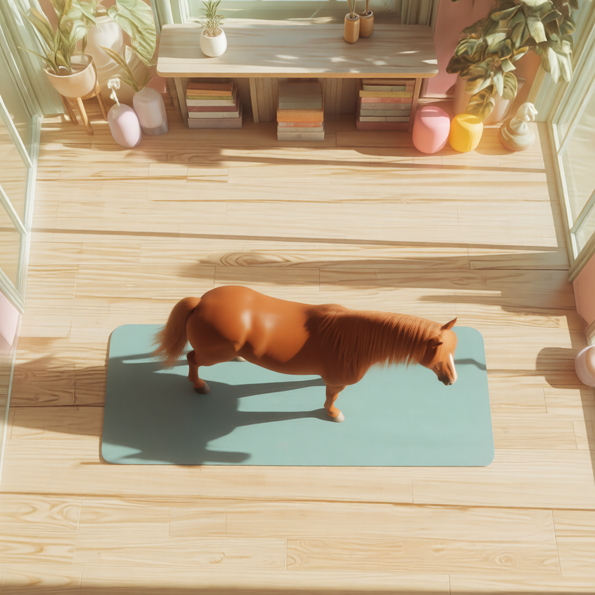

# Generate Images

## Purpose

I use Comfy UI to create images, using various templates, which can be customized to create images with different resolutions and qualities.

<figure><figcaption></figcaption></figure>

## Output Images

<figure><figcaption></figcaption></figure>

<figure><figcaption></figcaption></figure>

<figure><figcaption></figcaption></figure>

<figure><figcaption></figcaption></figure>

<figure><figcaption></figcaption></figure> <figure><figcaption></figcaption></figure>

