# Image to Images (Other Styles)

## Purpose

It helps create different photo styles based on a single angle, for experimental purposes or practical application in a project if the style is suitable, ensuring style consistency between images, just need to pose appropriately.

<figure><figcaption></figcaption></figure>

## Orginal Image

<figure>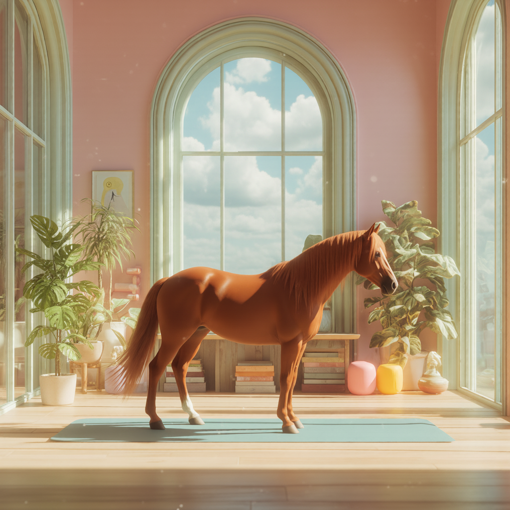<figcaption></figcaption></figure>

<figure><figcaption></figcaption></figure>

## Generated Images

<figure>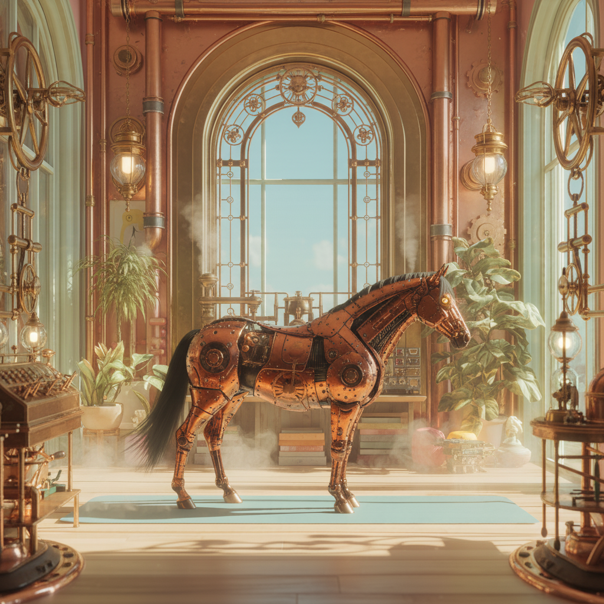<figcaption></figcaption></figure>

<figure>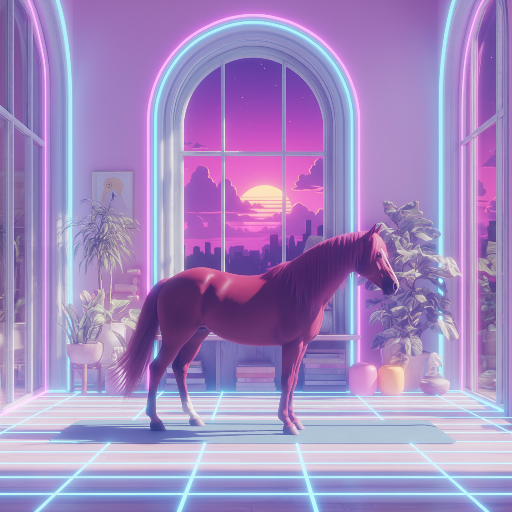<figcaption></figcaption></figure>

<figure>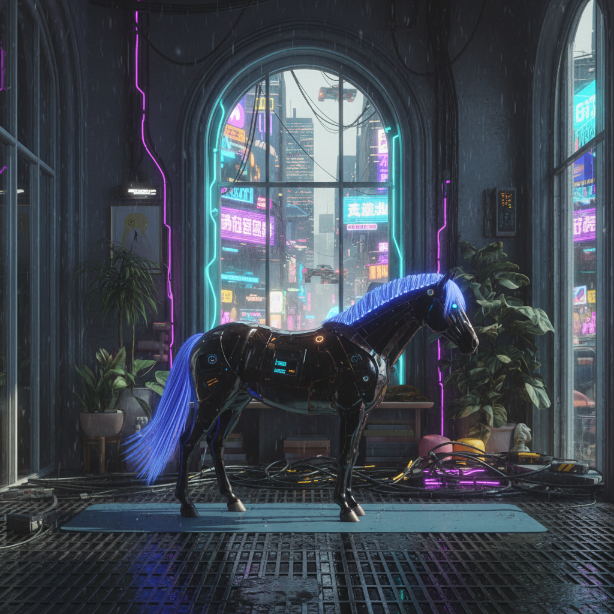<figcaption></figcaption></figure>

<figure>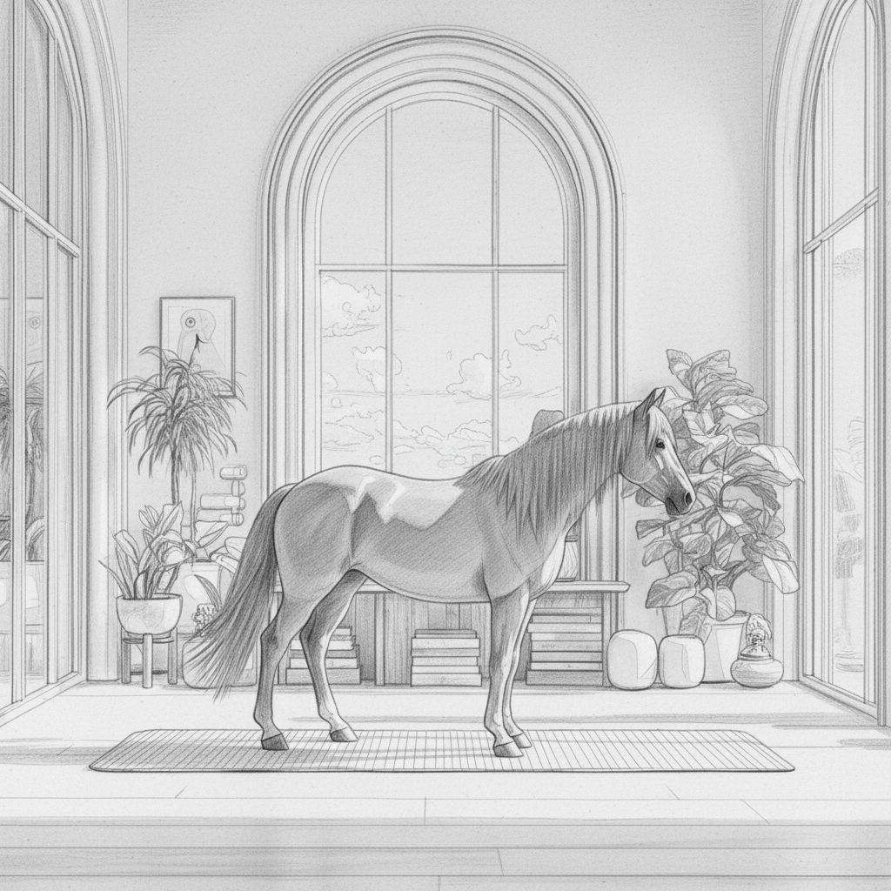<figcaption></figcaption></figure>

<figure>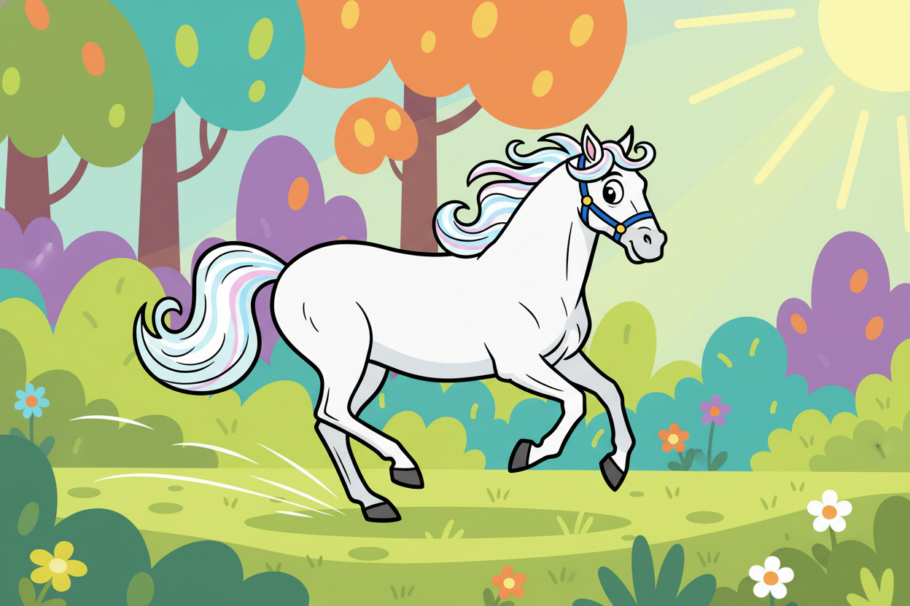<figcaption></figcaption></figure>

<figure>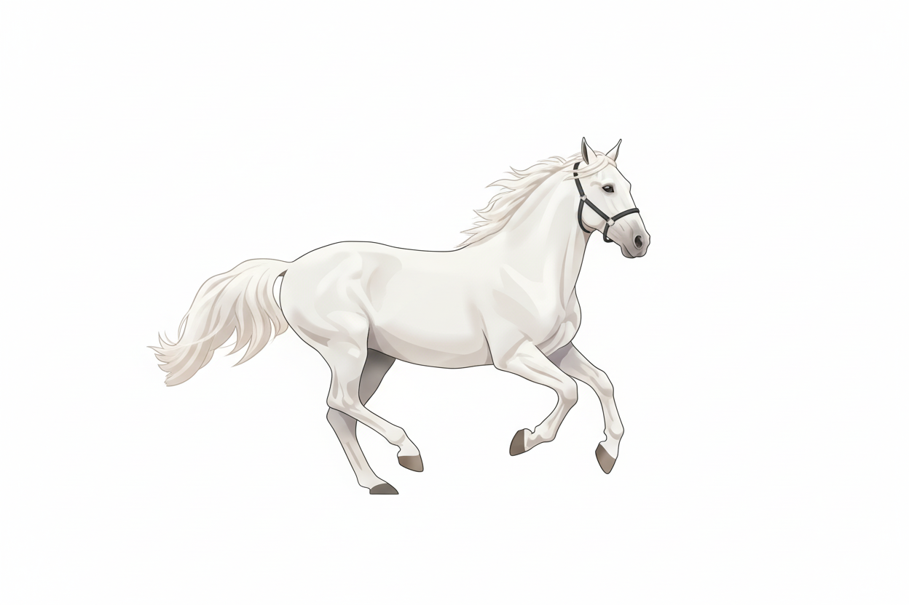<figcaption></figcaption></figure>

<figure>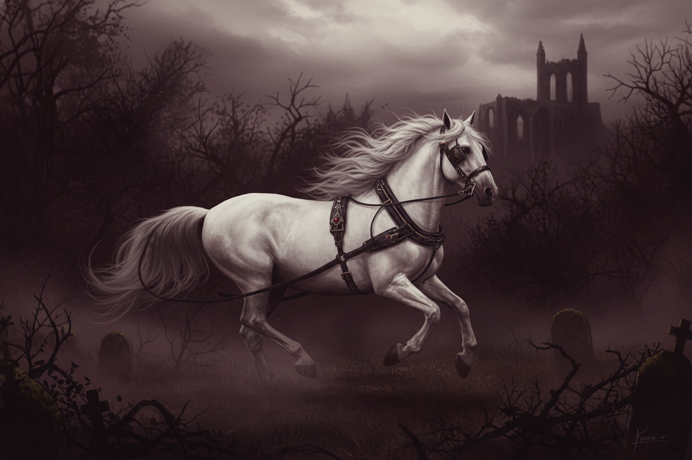<figcaption></figcaption></figure>

<figure>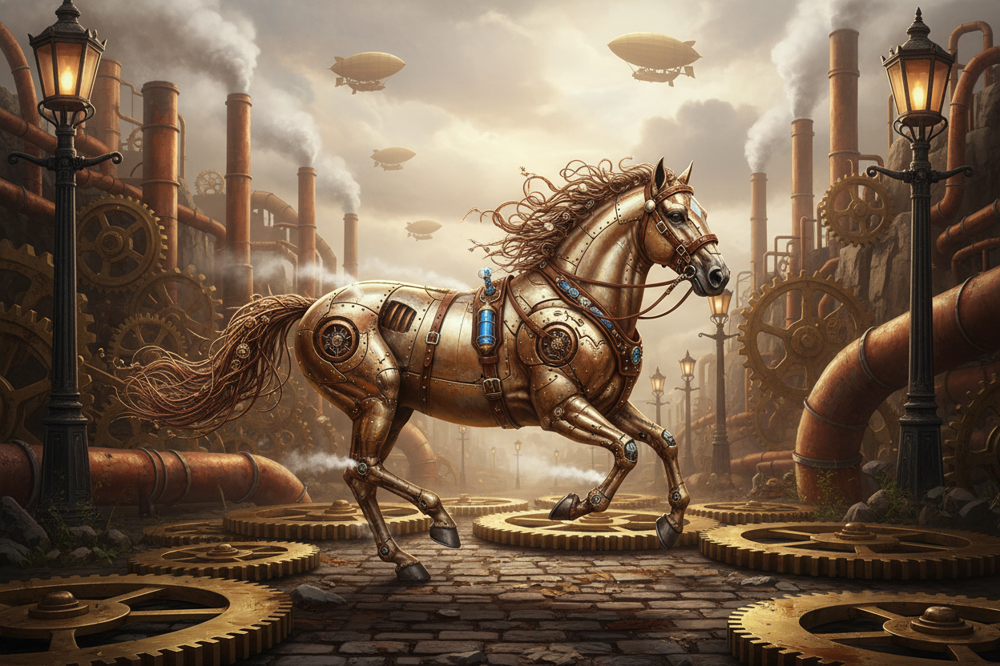<figcaption></figcaption></figure>

<figure>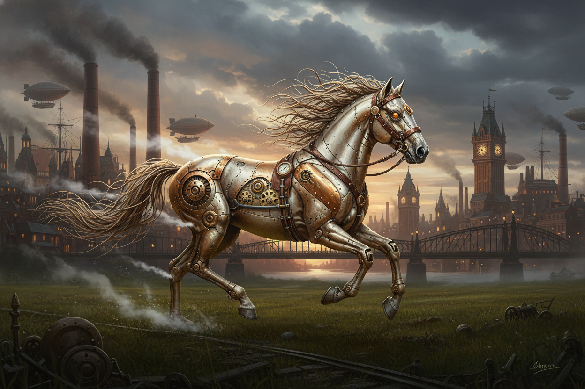<figcaption></figcaption></figure>

<figure>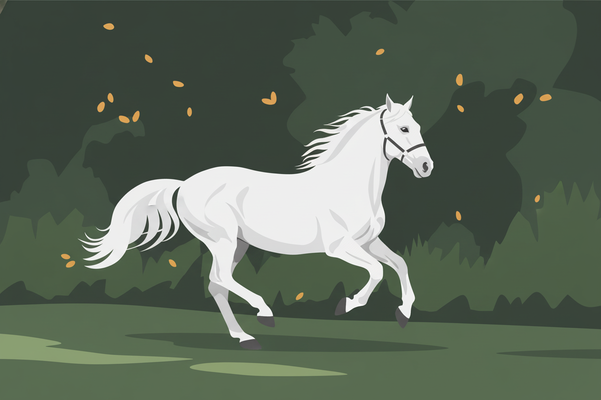<figcaption></figcaption></figure>
