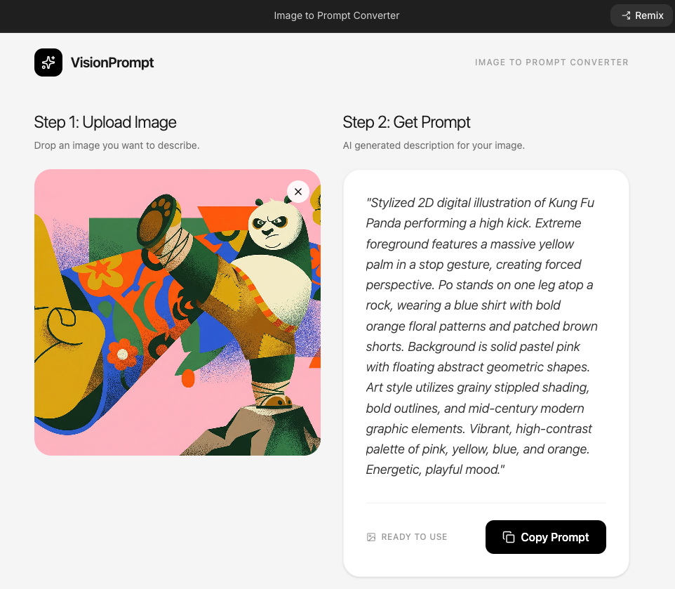

# Image to Prompt

## Purpose

Using Google AI Studio, create an image to prompt. This prompt will be used to create the image on another platform, allowing you to compare image quality across different platforms.

<figure><figcaption></figcaption></figure>

