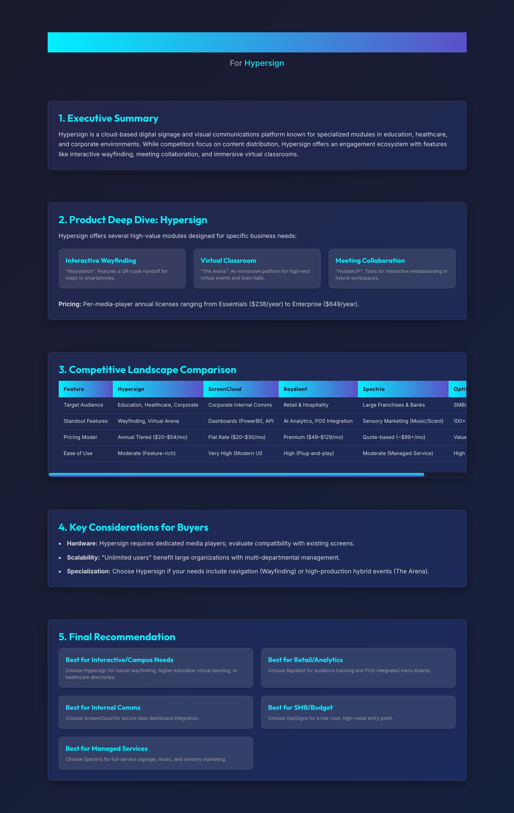

# Research Projects

## Purpose

I use Notebook LM to create visual reports, answer project questions, provide data and information, and offer project insights.

<figure><figcaption></figcaption></figure>

<figure><figcaption></figcaption></figure>





## Product Research

Use Google Opal to research the project.

<figure><figcaption></figcaption></figure>

## Visual Storyteller

Use Google Opal to create a visual storyteller.

<figure><figcaption></figcaption></figure>
