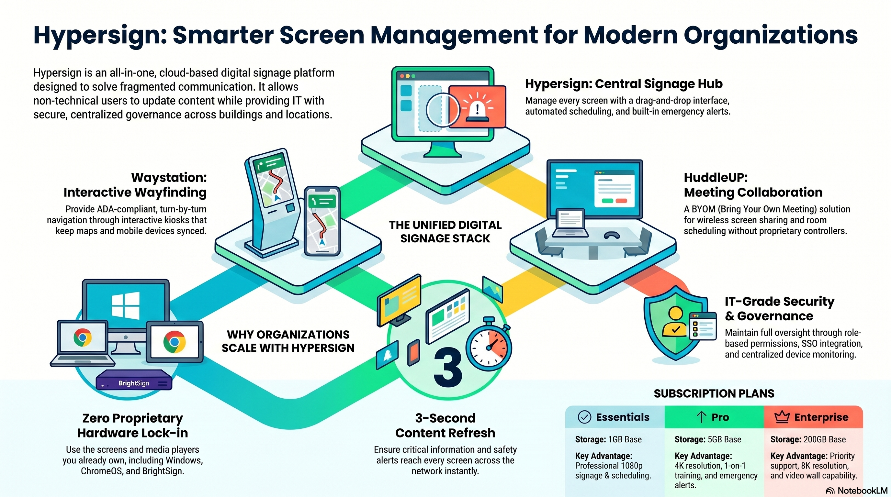

# Research Projects

## Process

I usually use NotebookLM to support my research process for each project. It helps me collect, organize, and understand a large amount of information in one place.



### Step 1

I gather all the available project data and upload it into NotebookLM. This can include documents, notes, and any related content.

<figure><figcaption></figcaption></figure>



### Step 2

I find the website sitemap. The sitemap helps me understand the full structure of the website, including all pages and content.

<figure><figcaption></figcaption></figure>



### Step 3

I convert all the sitemap pages into markdown files. This step helps turn the website content into a clean and readable format.

<figure><figcaption></figcaption></figure>



### Step 4

I upload this combined file back into NotebookLM. With this process, NotebookLM can read and analyze all the project-related data in one place.

<figure><figcaption></figcaption></figure>



This helps me get a clear overview of the project, understand the structure, and support better research and decision-making.

## Review

<figure><figcaption></figcaption></figure>

{% embed url="https://files.gitbook.com/v0/b/gitbook-x-prod.appspot.com/o/spaces%2FKLkB3qUl3bnZtTfcQj08%2Fuploads%2FS5UbplqYeOPeDO3aR4mX%2FClear_Communication.mp4?alt=media&token=07b35dc8-9a95-4f22-8098-ebb8dca60b03" %}



