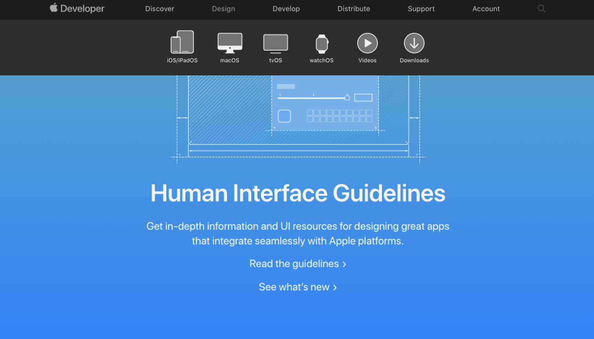
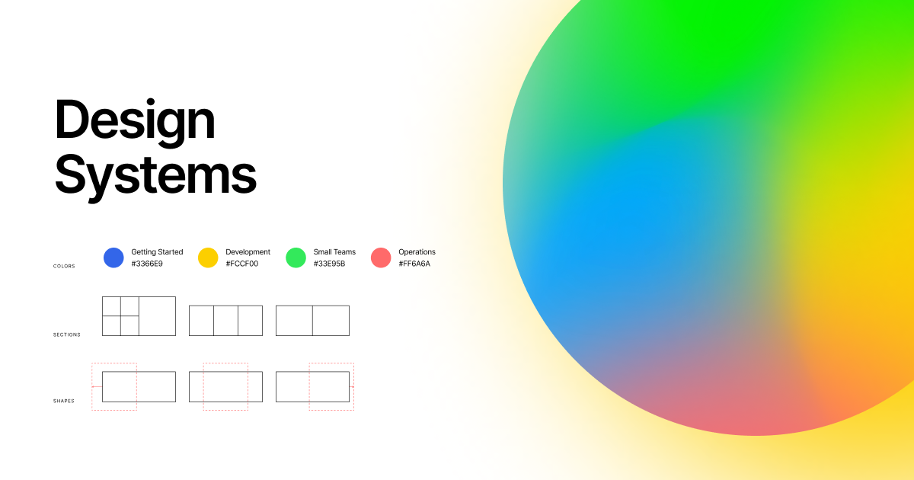

# Design System

## Experiment

I have gained valuable experience in creating many design systems, which has significantly enhanced my skills.

<figure><figcaption></figcaption></figure> <figure><figcaption></figcaption></figure> <figure><figcaption></figcaption></figure>

## Styles and spacing

I maintain a centralized style guide that includes typography, color palettes, spacing scales, and grid systems. This ensures a unified aesthetic across all projects.

<figure><figcaption></figcaption></figure>

## Components

I design and document components like buttons, forms, modals, and navigation menus as reusable.

<figure><figcaption></figcaption></figure>

I followed the guidelines outlined in [Component Gallery](https://component.gallery/components/) to ensure that all fundamental components adhere to the established standards.

<figure><figcaption></figcaption></figure>

## Guidelines

Each element adheres to the guidelines for colors, typography, and spacing, reinforcing a consistent visual language. Ready to export them to document.

<figure><figcaption></figcaption></figure>

## Pattern library

The patterns are available for quick replacement.

<figure><figcaption></figcaption></figure>

Followed the structure of Untitled UI to apply best practices. 

<figure><figcaption></figcaption></figure>

## Adapt rapid wireframe and prototype

Customized to a version that supports rapid wireframing, prototyping.

<figure><figcaption></figcaption></figure>

## Can customize to fit any popular Design System

<figure><figcaption></figcaption></figure> <figure><figcaption></figcaption></figure> <figure><figcaption></figcaption></figure>

<figure><figcaption></figcaption></figure> <figure><figcaption></figcaption></figure> <figure><figcaption></figcaption></figure>

<figure><figcaption></figcaption></figure> <figure><figcaption></figcaption></figure> <figure><figcaption></figcaption></figure>

## Customized for specific projects

Customized for certain projects and applied my design system to others.

<figure><figcaption></figcaption></figure>

<figure><figcaption></figcaption></figure>

## Earn some reviews

<figure><figcaption></figcaption></figure>

## Review Figma


