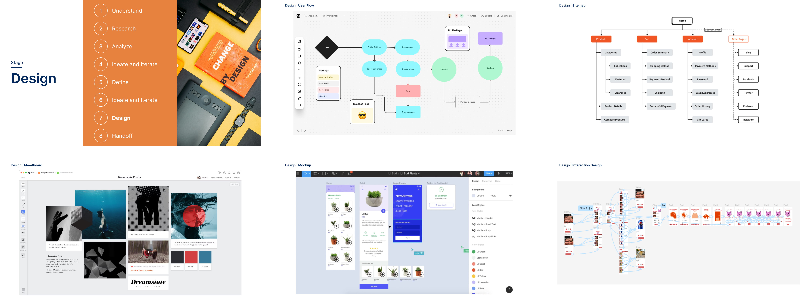

# The Design Process

## Understand&#x20;

I start by identifying the problem or opportunity the product aims to address. This includes defining goals, understanding user needs, and setting measurable success criteria.

<figure><figcaption></figcaption></figure>

## Research&#x20;

I gather insights by exploring the target audience, analyzing competitors, and understanding market trends to inform the product’s direction.

<figure><figcaption></figcaption></figure>

## Analyze&#x20;

I assess potential solutions by creating user journey maps, customer journey maps, and conducting competitor analysis. This helps me identify the most effective and feasible approaches to address the identified challenges.

<figure><figcaption></figcaption></figure>

## Validation&#x20;

I ensure that the product concept aligns with both user needs and business objectives. This includes validating assumptions through user feedback and checking for feasibility, viability, and strategic fit.

<figure><figcaption></figcaption></figure>

## Define&#x20;

I translate insights and goals into detailed user stories and product specifications. This step defines how the product should function and what it needs to achieve from the user’s perspective.

<figure><figcaption></figcaption></figure>

## Ideate and Iterate&#x20;

I brainstorm ideas and refine them through sketches, wireframes, and low-fidelity prototypes, ensuring that the product aligns with its defined goals.

<figure><figcaption></figcaption></figure>

## Design&#x20;

I translate the product definition into detailed designs, focusing on usability, aesthetics, and a cohesive user experience.

<figure><figcaption></figcaption></figure>

## Handoff&#x20;

I prepare design assets, specifications, and documentation to ensure a smooth transition to development and maintain the integrity of the product definition.

<figure><figcaption></figcaption></figure>

## Preview&#x20;


