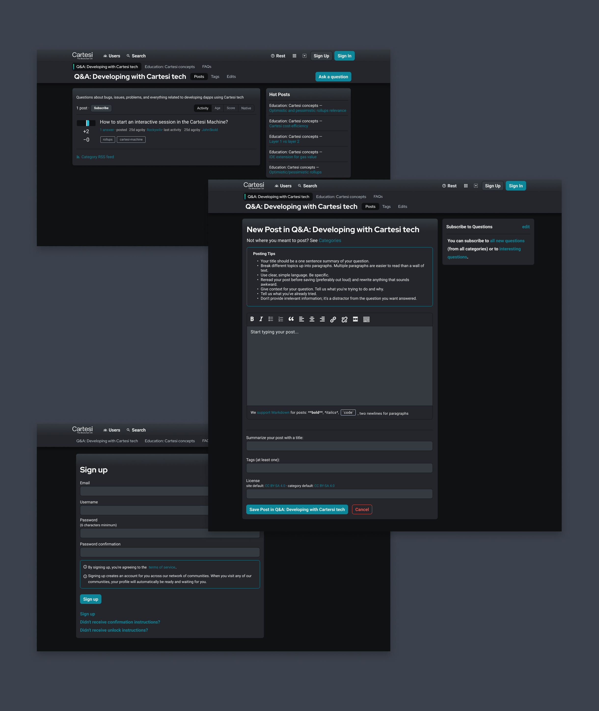
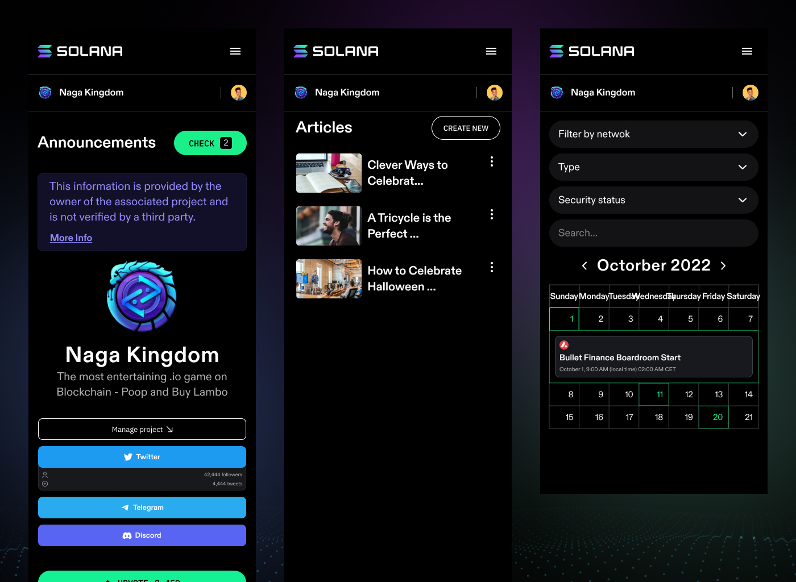
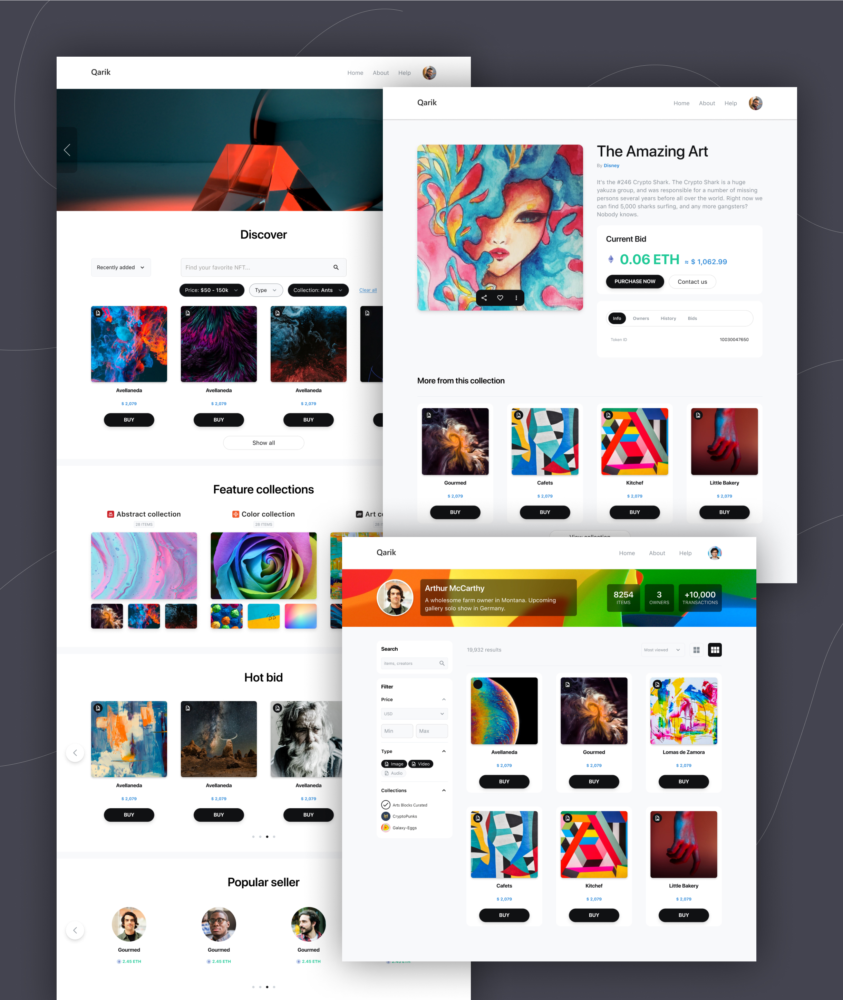
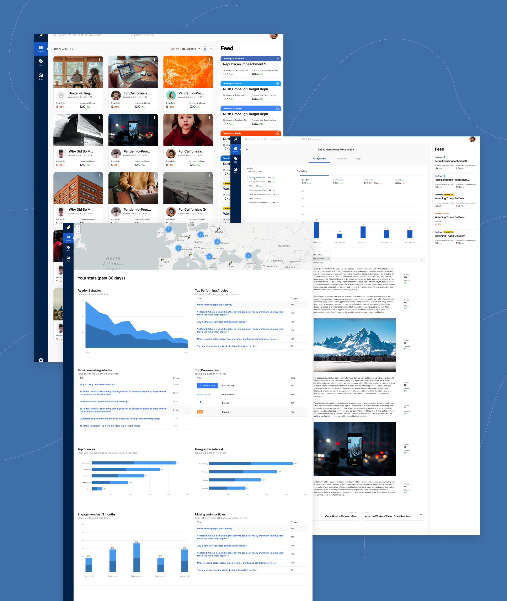

---
metaLinks:
  alternates:
    - /broken/spaces/Q1wr0S5TkpyomM2jKPhF/pages/AwvqXdmT4i1MlYalJXue
---

# The Process to Design Dashboard

## **Understand Requirements**

* Review the wireframe provided by the client or team.
* Collaborate with clients and team members to deeply understand the needs, functionality, and goals of the dashboard.

<figure><figcaption></figcaption></figure>

## **Research and Ideation**

* Explore ideas for layout, style, and user interface elements.
* Analyze design trends, similar dashboards, and user experience best practices for inspiration.

<figure><figcaption></figcaption></figure> <figure><figcaption></figcaption></figure> <figure><figcaption></figcaption></figure> <figure><figcaption></figcaption></figure> <figure><figcaption></figcaption></figure>

## **Create a Mockup**

* Translate the wireframe into a high-fidelity design mockup.
* Incorporate branding, user-friendly layouts, and intuitive navigation.

<figure><figcaption></figcaption></figure>

## **Feedback and Iteration**

* Share the mockup with clients and team members for review.
* Implement feedback and refine the design through multiple iterations.

<figure><figcaption></figcaption></figure>

<figure><figcaption></figcaption></figure>

## **Finalize Design**

* Ensure the final design meets the project's requirements, aligns with user needs, and is ready for development handoff.

<figure><figcaption></figcaption></figure>

<figure><figcaption></figcaption></figure>

<figure><figcaption></figcaption></figure>

<figure><figcaption></figcaption></figure>

<figure><figcaption></figcaption></figure>

<figure><figcaption></figcaption></figure>

<figure><figcaption></figcaption></figure>

<figure><figcaption></figcaption></figure>

<figure><figcaption></figcaption></figure>

<figure><figcaption></figcaption></figure>

<figure><figcaption></figcaption></figure>
