# The Process to Design Landing Page

## Receive Brief

Gather all necessary information from the client or team, including:

* Content requirements.
* Layout preferences.
* Design concept or brand guidelines.
* Goals and target audience for the landing page.

## Competitor Analysis

Research similar landing pages within the project's industry or niche.

<figure><figcaption></figcaption></figure>

## Research for Inspiration

* Explore design platforms like Dribbble, Awwwards, and Behance to gather creative ideas and trends.
* Focus on finding layouts, animations, and visual styles that align with the project's goals.

<figure><figcaption></figcaption></figure> <figure><figcaption></figcaption></figure> <figure><figcaption></figcaption></figure> <figure><figcaption></figcaption></figure> <figure><figcaption></figcaption></figure>

## Design Concept

Design and propose design concepts as well as prototype to the client or team, gather feedback, and find the best option.

<figure><figcaption></figcaption></figure> <figure><figcaption></figcaption></figure> <figure><figcaption></figcaption></figure> <figure><figcaption></figcaption></figure>

<figure><figcaption></figcaption></figure>

## Design

Use Figma to create the layout, incorporating:

* Content structure.
* Images and graphics that enhance the page’s message.
* A visually appealing and functional design that aligns with the brand's identity.

<figure>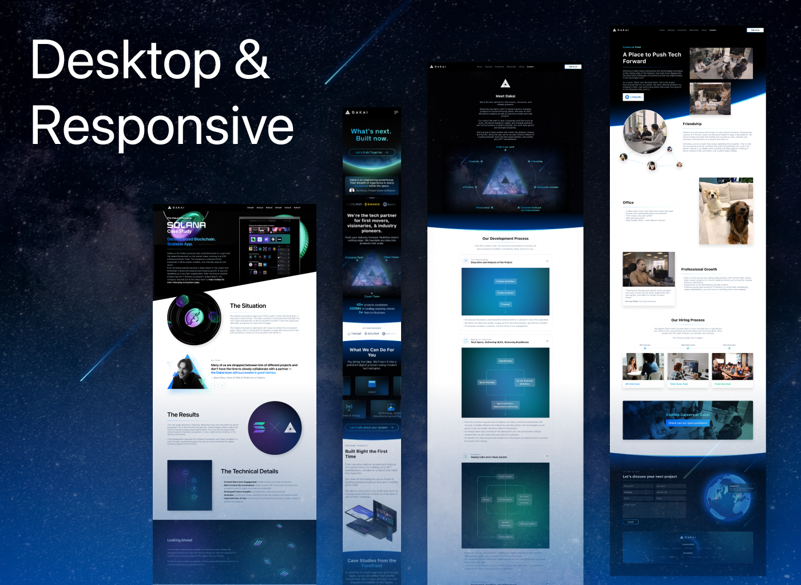<figcaption></figcaption></figure>

## Handoff

* Develop a style guide to define typography, colors, spacing, and other design elements.
* Collaborate with developers to ensure a smooth transition from design to development.
* Monitor the development process to ensure the final website matches the design and functions as intended.

<figure><figcaption></figcaption></figure>

<figure><figcaption></figcaption></figure>

## Finalize

<figure>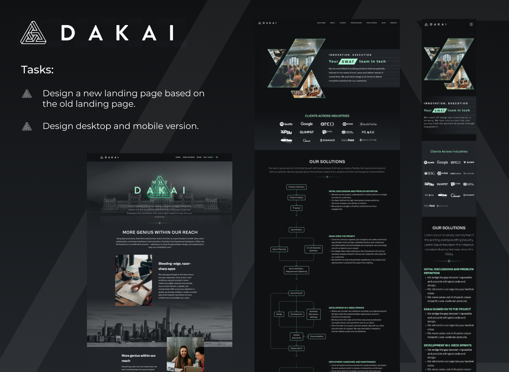<figcaption></figcaption></figure>

<figure>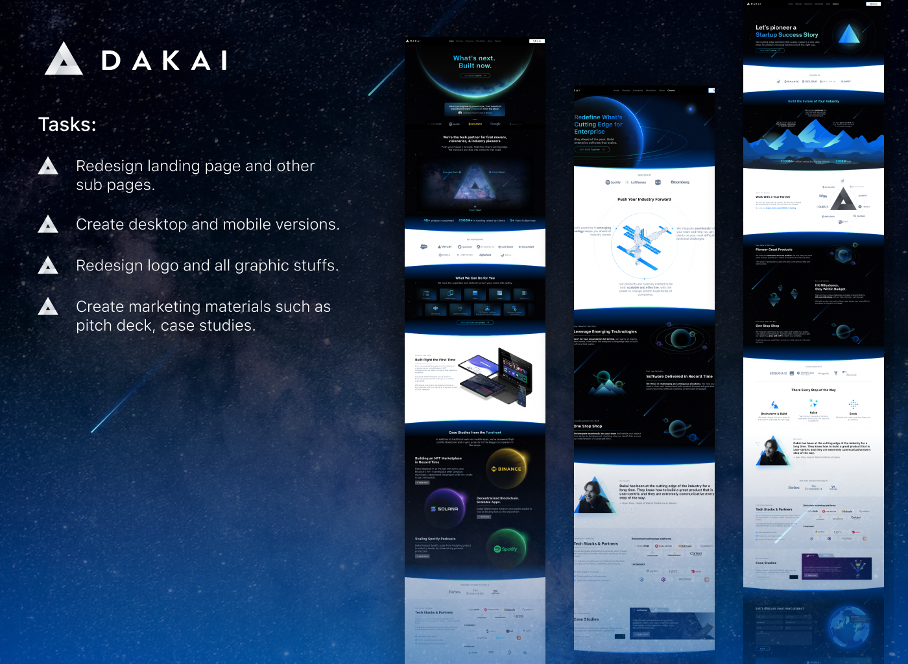<figcaption></figcaption></figure>

<figure><figcaption></figcaption></figure>

<figure>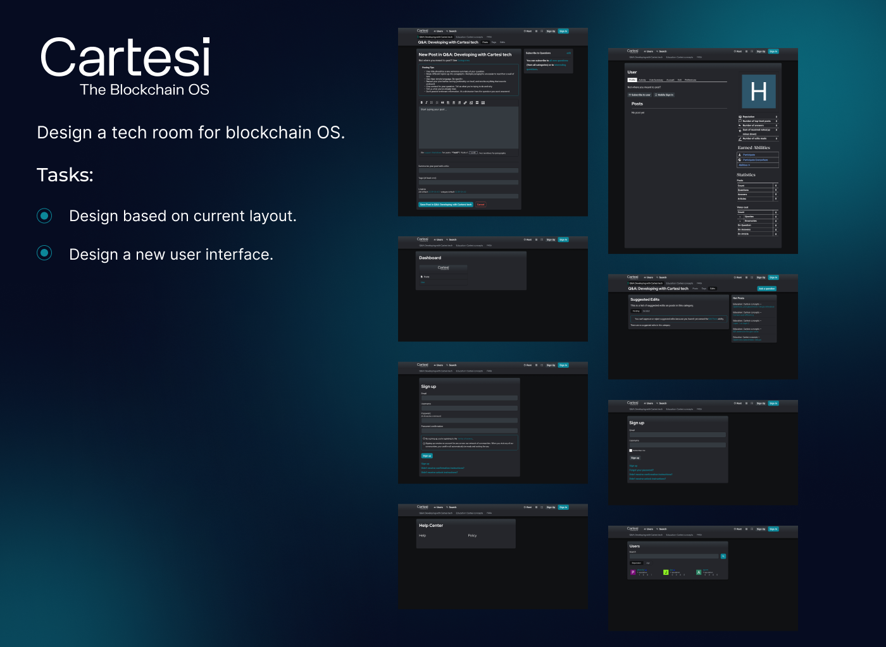<figcaption></figcaption></figure>

<figure>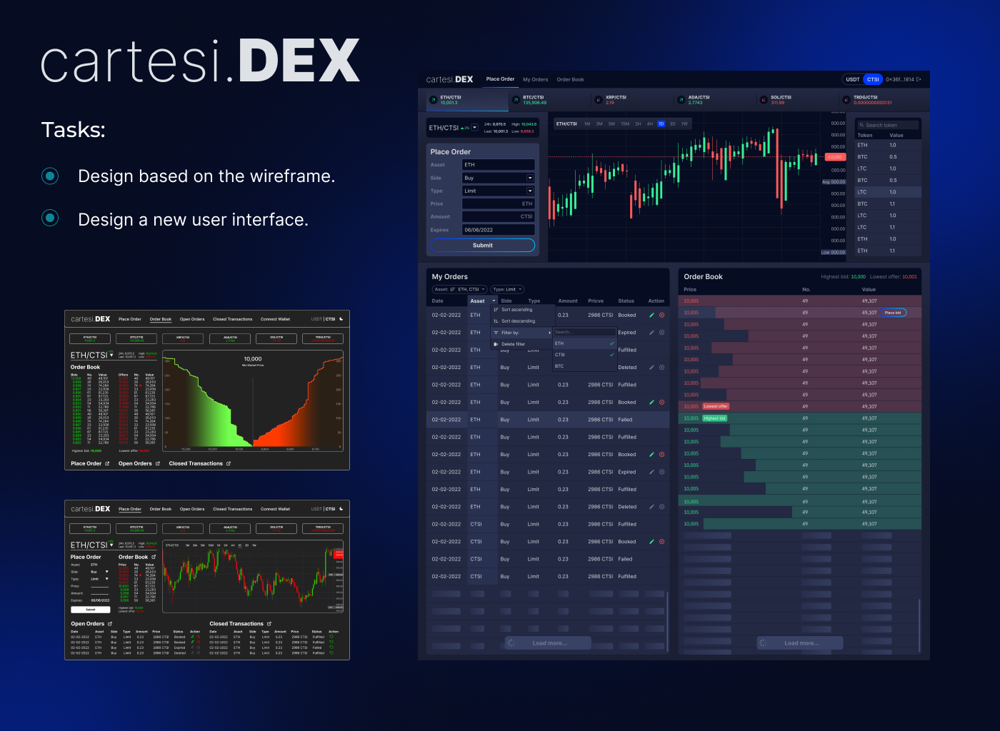<figcaption></figcaption></figure>

<figure>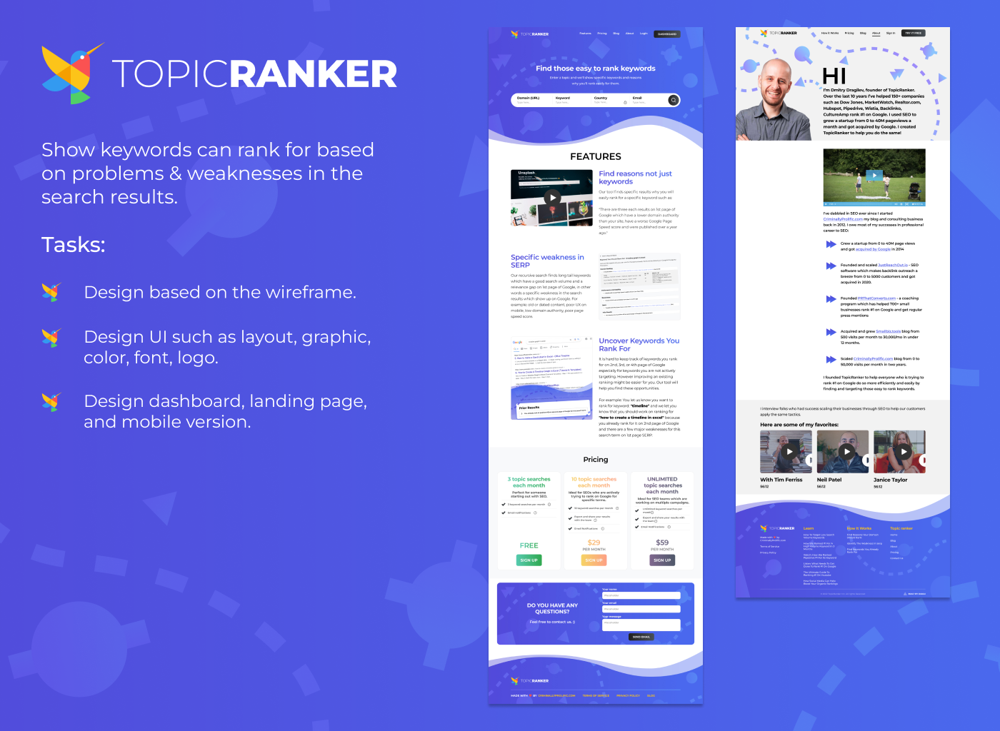<figcaption></figcaption></figure>

<figure>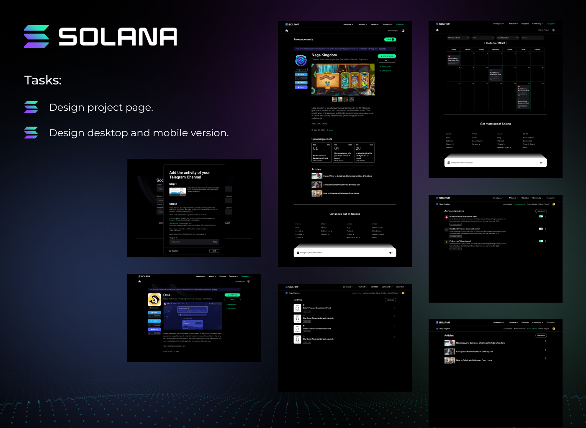<figcaption></figcaption></figure>

<figure>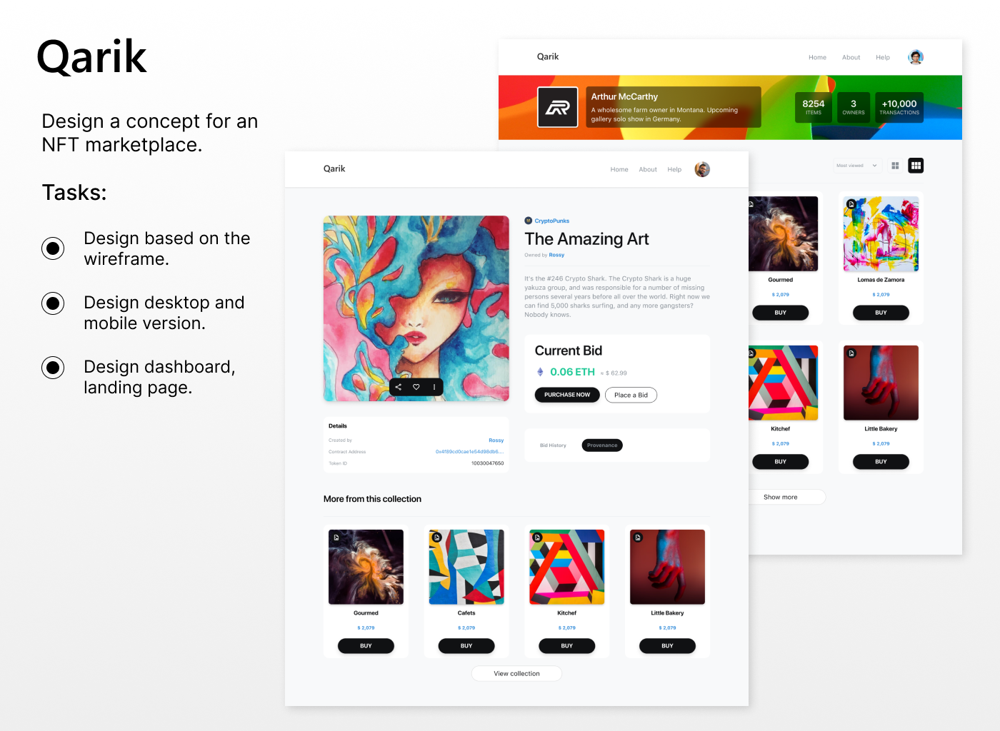<figcaption></figcaption></figure>

<figure>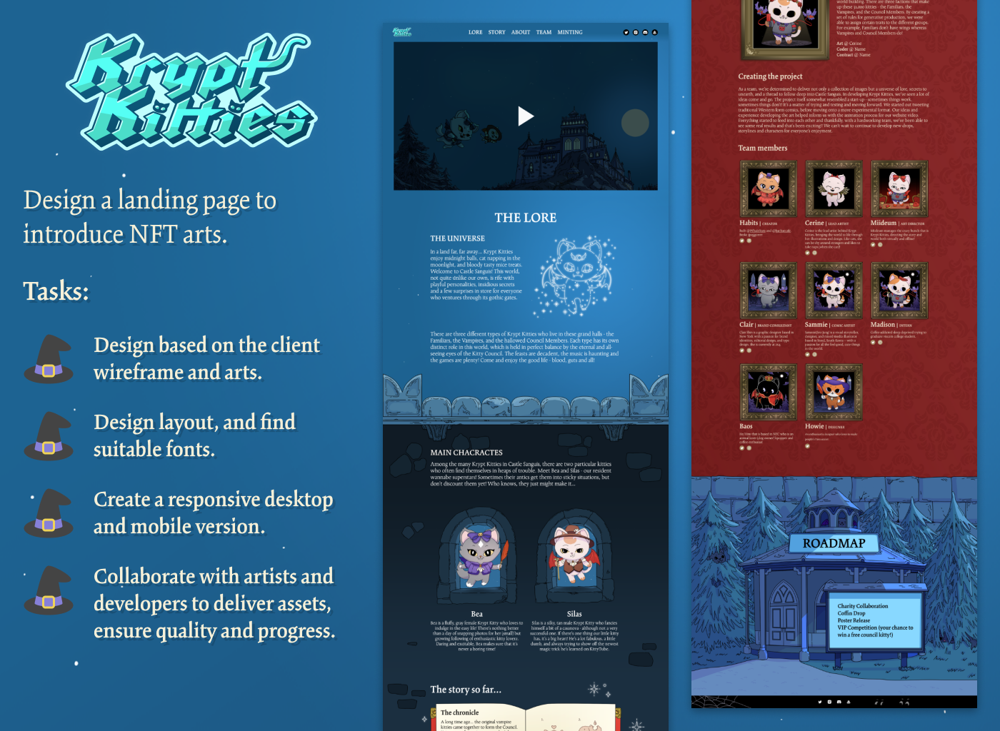<figcaption></figcaption></figure>

<figure><figcaption></figcaption></figure>

<figure>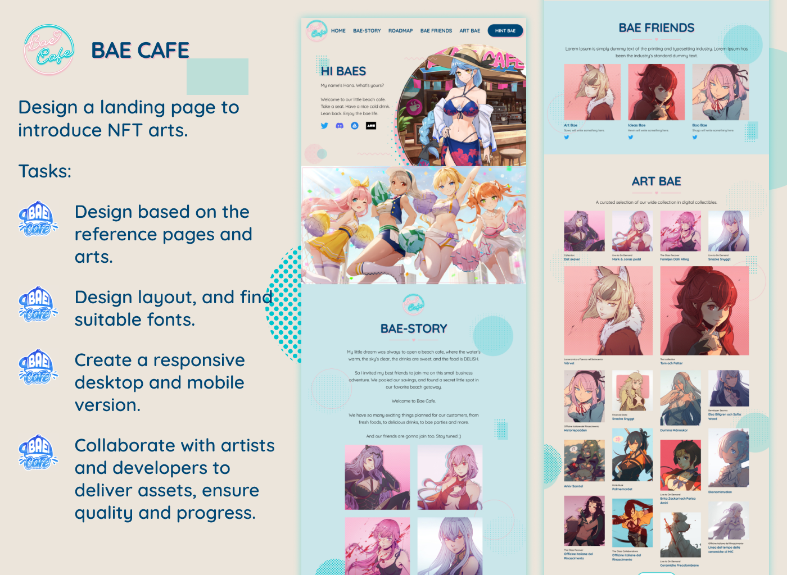<figcaption></figcaption></figure>

<figure>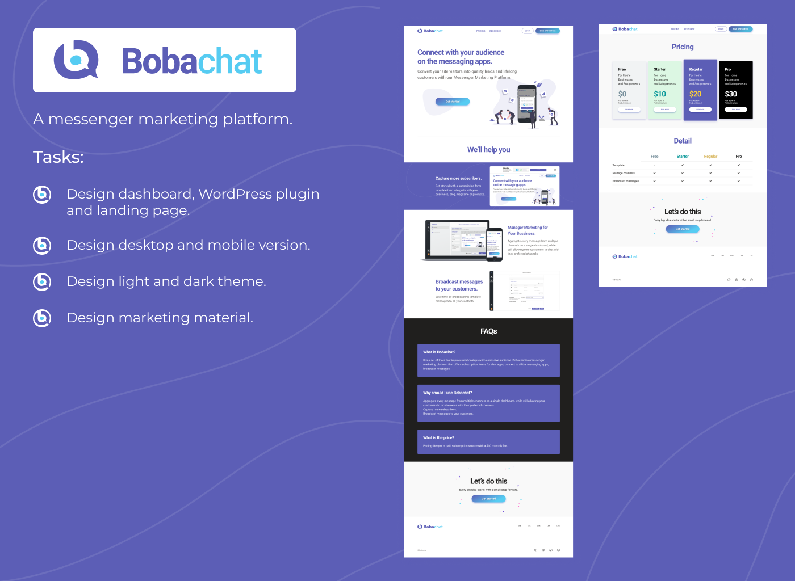<figcaption></figcaption></figure>

<figure><figcaption></figcaption></figure>
