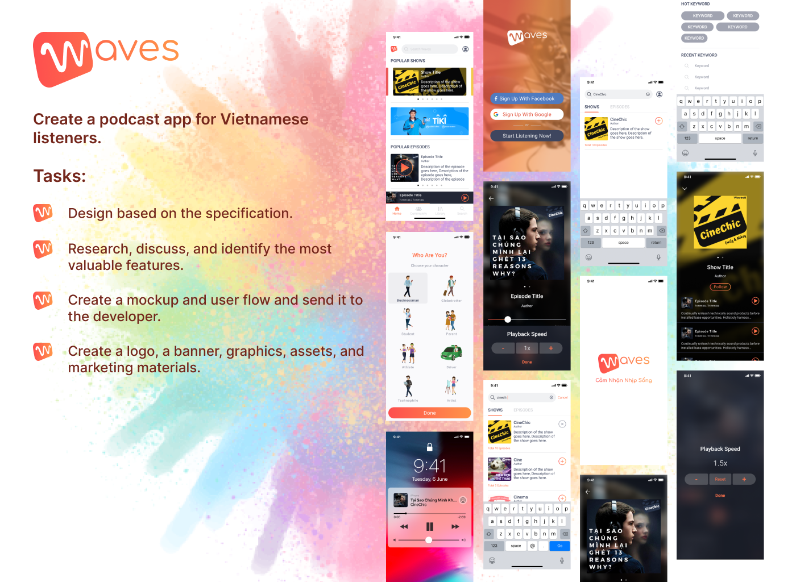
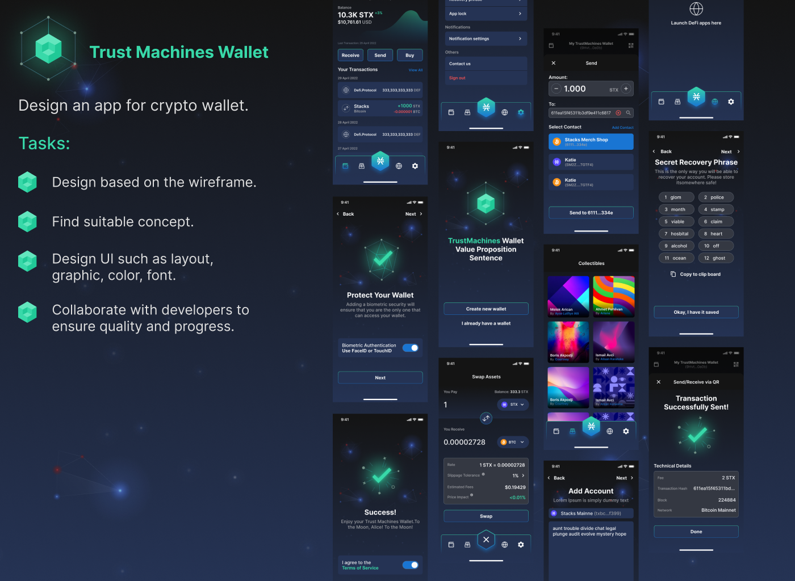
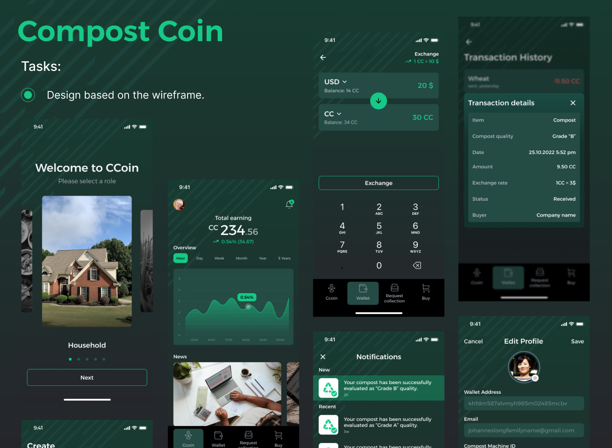
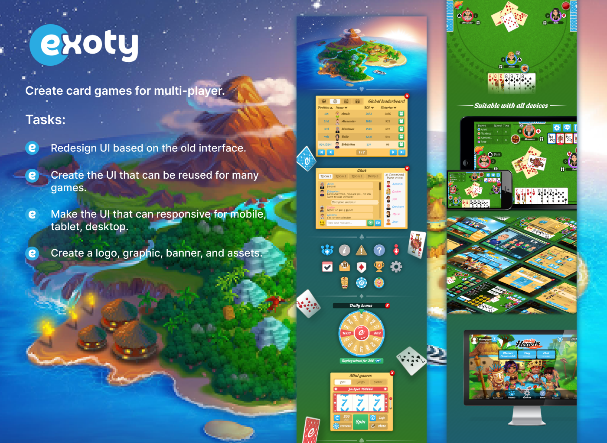
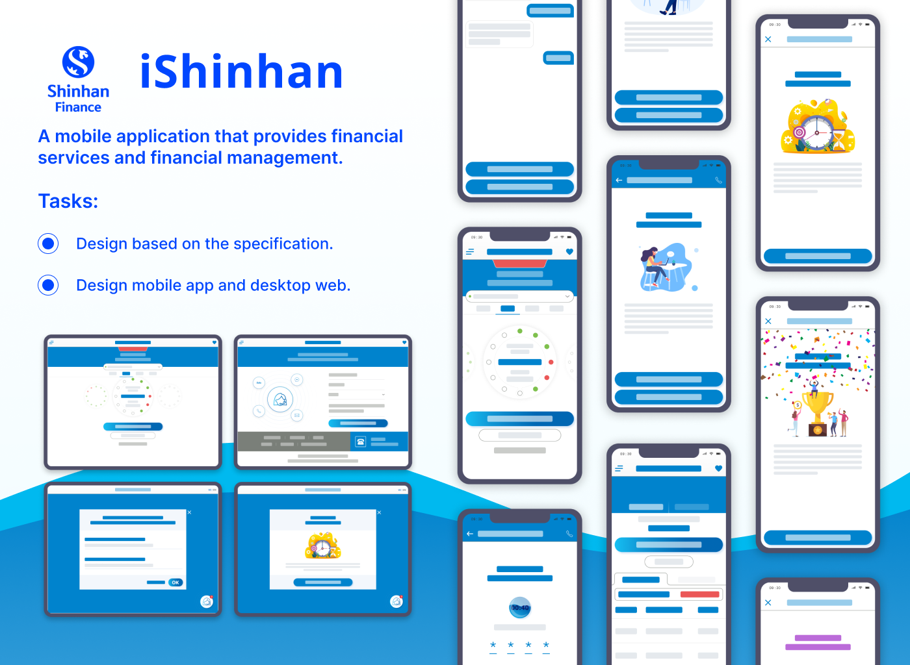

---
metaLinks:
  alternates:
    - /broken/spaces/Q1wr0S5TkpyomM2jKPhF/pages/ShAFkz7FCD80dM8E9br6
---

# The Process to Design Mobile App

## Define purpose

<figure><figcaption></figcaption></figure>

## Define personas

<figure><figcaption></figcaption></figure>

## Define specifications

<figure><figcaption></figcaption></figure>

## Define competitors

<figure><figcaption></figcaption></figure>

## Define moodboard

<figure><figcaption></figcaption></figure>

## Define sitemap

<figure><figcaption></figcaption></figure>

## Define user flow

<figure><figcaption></figcaption></figure>

## Define wireframe

<figure><figcaption></figcaption></figure>

## Define low-fidelity prototype

<figure><figcaption></figcaption></figure>

## Define visual mockup

<figure><figcaption></figcaption></figure>

## Define high-fidelity prototype

<figure><figcaption></figcaption></figure>

## Final App

<figure><figcaption></figcaption></figure>

<figure><figcaption></figcaption></figure>

<figure><figcaption></figcaption></figure>

<figure><figcaption></figcaption></figure>

<figure><figcaption></figcaption></figure>

<figure><figcaption></figcaption></figure>
