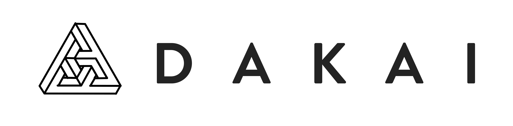
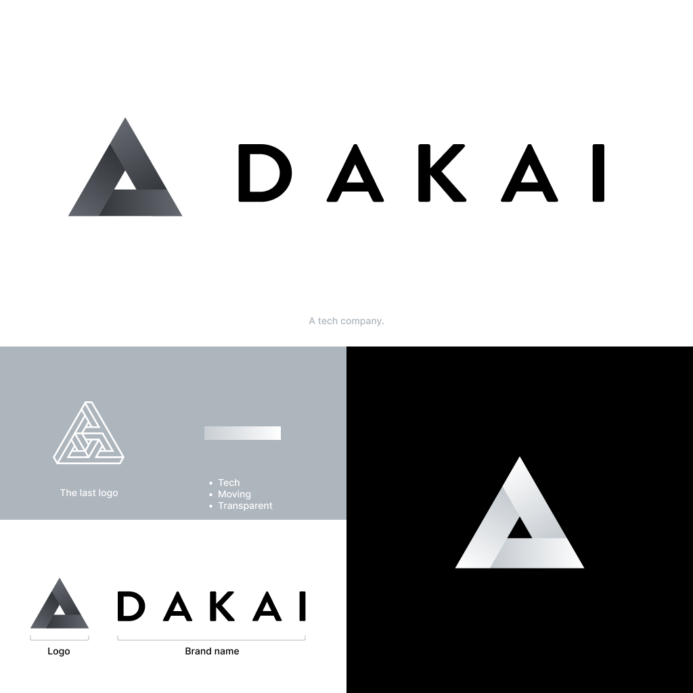
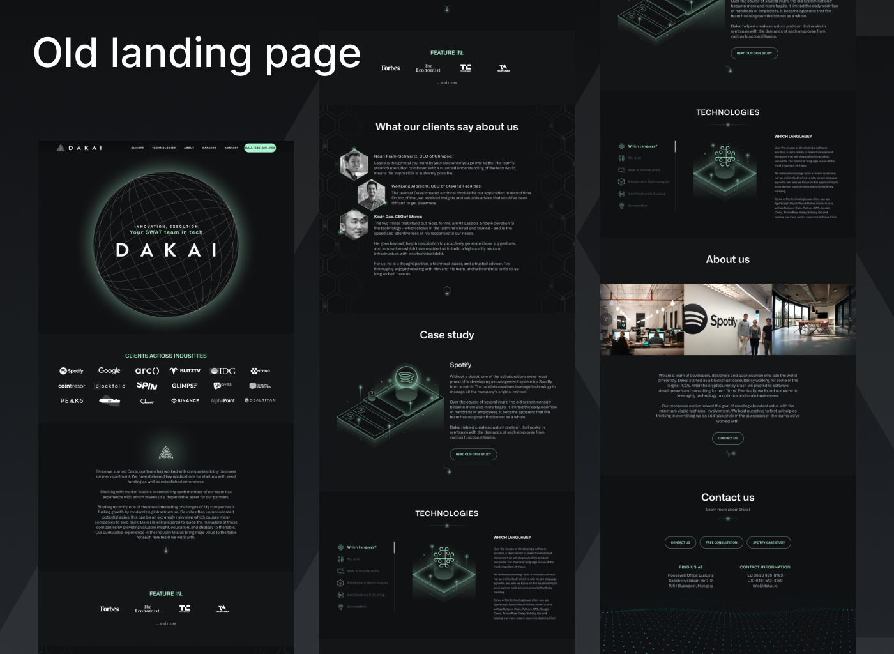
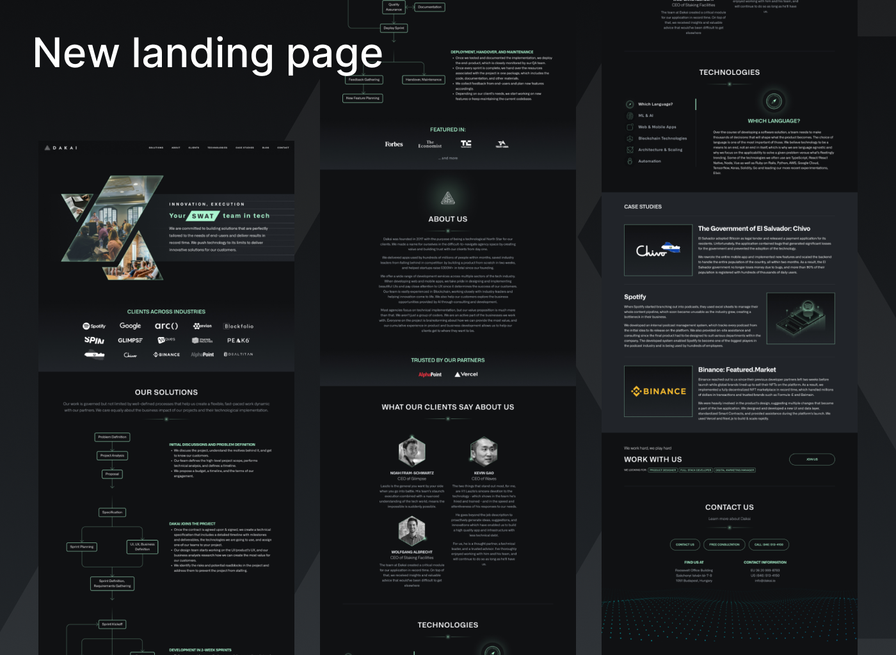
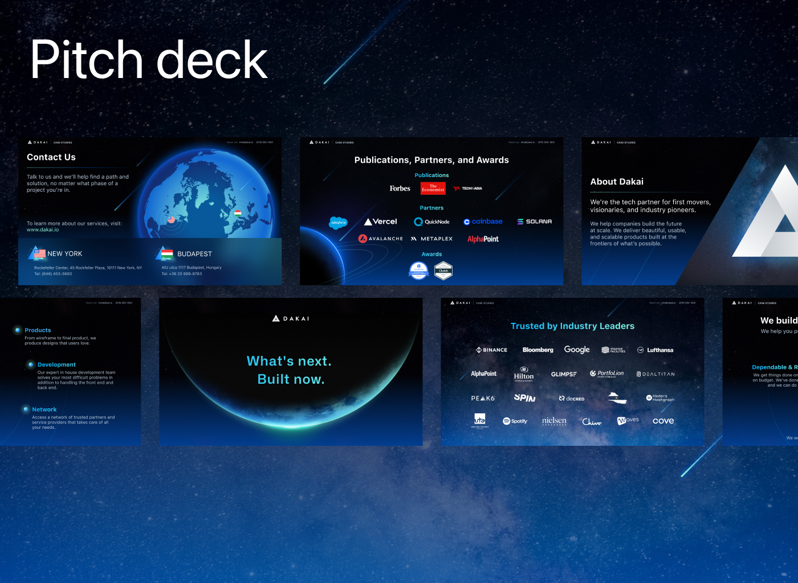
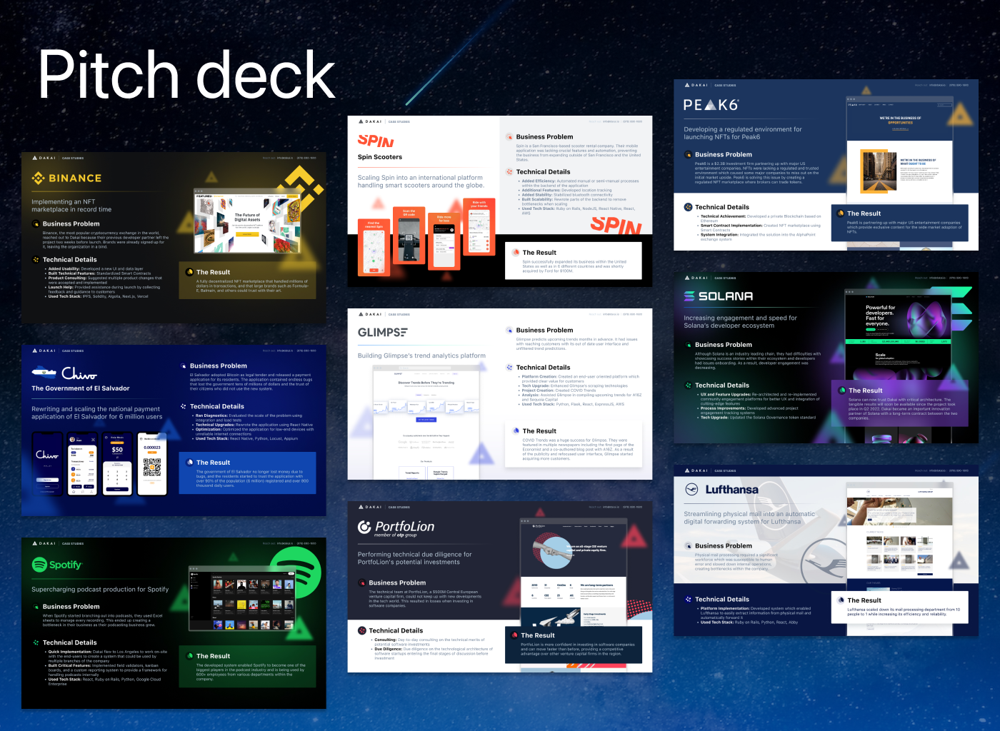
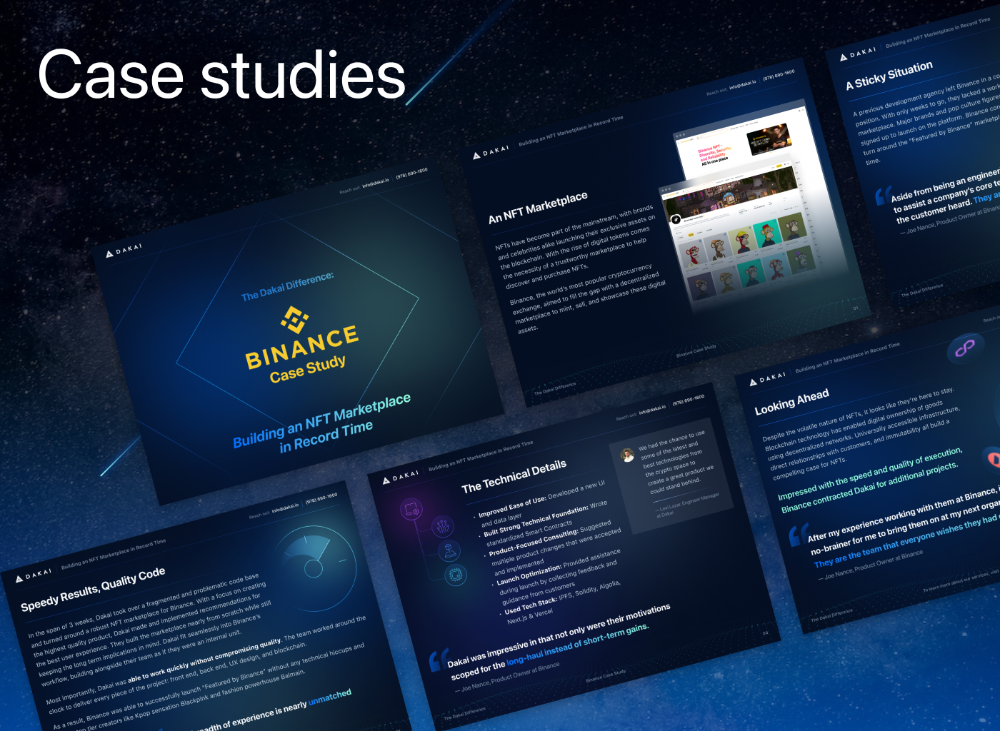
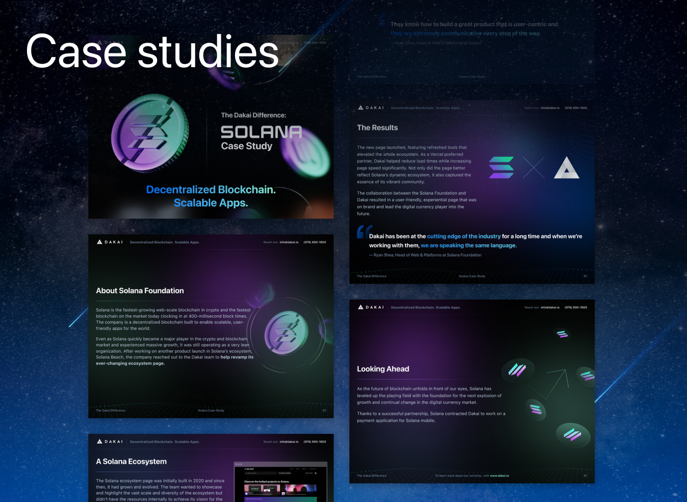

# Dakai

**Type:** Brand Refresh, UI/UX Design, Visual Design\
**Website**: [https://www.dakai.io](https://www.dakai.io/)\
**Project:** Dakai – A software development company\
**Role:** UI/UX & Visual Designer\
**Year:** 2022 – 2023

## **Overview**

Dakai is a software outsourcing company that helps businesses build websites, apps, and custom tech solutions. I joined the team to refresh the brand, improve design quality, and support both internal and client projects.

## **Goals**

* Build a stronger, more professional brand image.
* Improve design quality across websites, apps, and presentations.
* Make visual templates that are easy to reuse.
* Support sales, product, and marketing teams with clear and attractive designs.

## **My Contributions**

* **Rebranding:** Updated logo, color system, typography, and overall visual style.
* **Design System:** Created a UI kit and brand guideline for internal use.
* **Client Projects:** Designed websites and mobile apps for startup clients in healthcare, education, and finance.
* **Presentations:** Designed clean pitch decks, internal reports, and client proposals.
* **Marketing Assets:** Made social banners, blog covers, and infographics.
* **Team Support:** Worked closely with developers and product managers to ensure smooth handoff and consistency.

## **Focus Areas**

* Simple, modern, and flexible design for different industries.
* Reusable components to speed up delivery.
* Clear visual hierarchy and layout.
* Consistent branding across all materials.

## **Impact**

* Helped Dakai present a more trustworthy image to new clients.
* Improved design output for many outsourcing projects.
* Made it easier for teams to reuse assets and follow design rules.
* Strengthened collaboration between design and dev teams.

## **Review Work**

### **Logo**

The original Dakai logo had a good foundation, but its outline lacked perfection. My first step was to refine it into a more polished and precise version. Later, after additional feedback from the team, they requested a redesign to create a simpler and more tech-focused look. I provided a revised logo that aligns with these goals.

<figure><figcaption>
Old logo
</figcaption></figure>

<figure><figcaption>
After redesign
</figcaption></figure>

<figure><figcaption>
The current logo
</figcaption></figure>

### **Landing page**

I worked closely with the team to redesign the landing page. Over the course of the project, we developed two upgraded versions, with the second one being the final iteration. The theme they wanted was inspired by the universe, so I created multiple concepts before finalizing the design. I also handled content integration and ensured smooth handoff to the development team.

<figure><figcaption></figcaption></figure>

<figure><figcaption></figcaption></figure>

<figure><figcaption></figcaption></figure>

<figure><figcaption></figcaption></figure>

### **Dashboard**

The company needed a tool to manage their internal team operations. I collaborated with them to design the interface based on their provided wireframes, ensuring the visuals were clear, functional, and on-brand.

<figure><figcaption>
Wireframe
</figcaption></figure>

<figure><figcaption></figcaption></figure>

### **Deck**

I designed their presentation decks based on the content they provided, ensuring consistency in color, style, and theme with the company’s branding.

<figure><figcaption></figcaption></figure>

<figure><figcaption></figcaption></figure>

<figure><figcaption></figcaption></figure>

<figure><figcaption></figcaption></figure>

### **Brand Guidelines**

To maintain a cohesive identity across all platforms, I created a comprehensive brand guideline for Dakai. This document serves as a reference for all future designs, ensuring consistency in visual communication.

<figure><figcaption></figcaption></figure>

### Website


