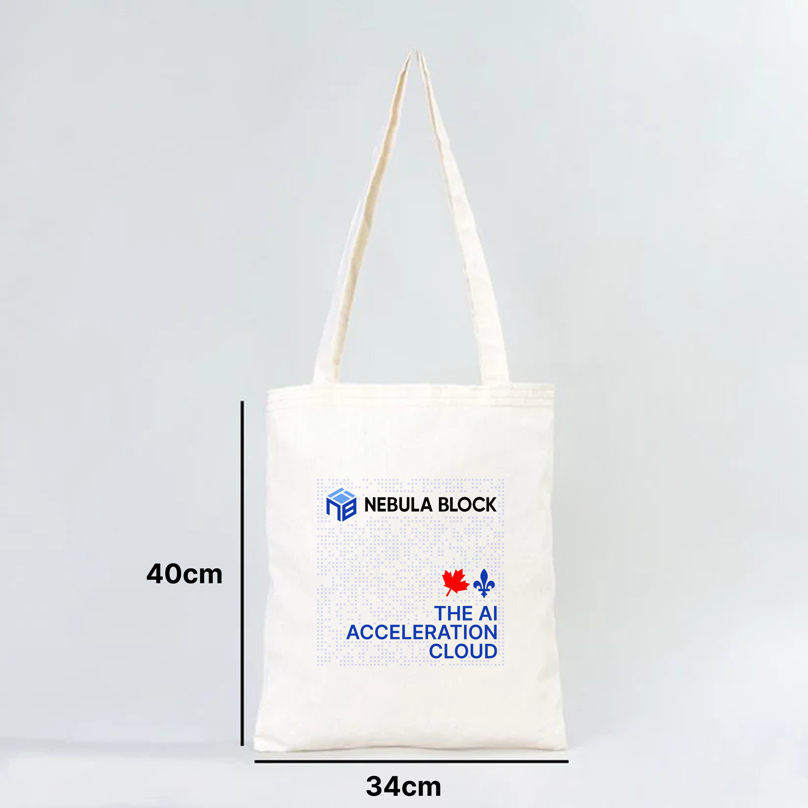

# Nebula Block

**Project Type:** Brand Refresh, UI/UX Design, Marketing Design\
**Website**: [https://www.nebulablock.com](https://www.nebulablock.com/)\
**Porject:** Nebula Block – High-performance GPU Cloud for AI Developers\
**Role:** UI/UX & Visual Designer\
**Year:** 2024 - 2025

## **Overview**

Nebula Block provides high-performance GPU cloud infrastructure tailored for AI developers and decentralized teams. The project aimed to rebrand Nebula Block and redesign its visual system, marketing assets, and product UI to align with its cutting-edge technology and Web3 positioning.

<figure><figcaption></figcaption></figure>

## **Goals**

* Establish a bold, futuristic brand identity.
* Redesign the marketing website and product UI for clarity and scalability.
* Deliver high-converting design assets for campaigns (email, banners, videos).
* Improve onboarding and explainability through motion graphics and tutorials.

## **My Contributions**

* **Brand Refresh:** Updated the logo, fonts, and colors to look more modern and tech-focused.
* **Website Redesign:** Designed clean and clear mockups for landing pages, pricing, and dashboard pages using a dark Web3 style.
* **Component Library:** Made reusable UI parts to help the team work faster and keep designs consistent.
* **Presentation Decks:** Created slides for investors and marketing to explain what Nebula does.
* **Motion & Media Assets:** Designed GIFs, charts, blog images, and videos to help explain the product.
* **Email Campaigns:** Built email templates that look good on all devices and encourage users to click.
* **User Research:** Helped find user problems and made the onboarding process better.

## **Design Focus**

* Data-driven layouts for pricing & instance comparison pages.
* Visual storytelling to explain complex infrastructure clearly.
* Accessibility and responsiveness across devices.
* Consistency in branding across all materials.

## **Results**

* Boosted user engagement via redesigned landing & pricing pages.
* Contributed to brand recognition across social channels.
* Enabled marketing team to scale campaigns faster with modular design assets.

***

## Review Work

### Blog Cover

Blog cover designs for Nebula Block, featuring bold visuals and clear typography to capture attention and reflect each article’s topic.



### Deck

A presentation deck designed for Nebula Block to communicate its value, features, and use cases.



### Email

Email promotion designs for Nebula Block, crafted to drive engagement and conversions.



### GIF

Animated GIFs created to showcase Nebula Block’s features, UI interactions, and workflows.

<figure><figcaption></figcaption></figure>

### Chart

Clean and data-focused chart designs for Nebula Block.

<figure><figcaption></figcaption></figure>

<figure><figcaption></figcaption></figure>

### Marketing Materials

Marketing assets for Nebula Block, maintain brand consistency and boost campaign engagement across channels.

<figure><figcaption></figcaption></figure> <figure><figcaption></figcaption></figure>

<figure><figcaption></figcaption></figure>

<figure><figcaption></figcaption></figure>

### Poster

A set of promotional posters designed for Nebula Block.



### Tutorial Videos

Tutorial video page designs that help users navigate Nebula Block’s features with ease.



### Explain Videos

A series of explain video page designs for Nebula Block, focusing on visual clarity and structured content.



### Redesign Website

Redesigned layout for the Nebula Block website.



### Brand Kit

Establish a cohesive and professional brand identity.



### Research User

Understand the target users & define product direction.


