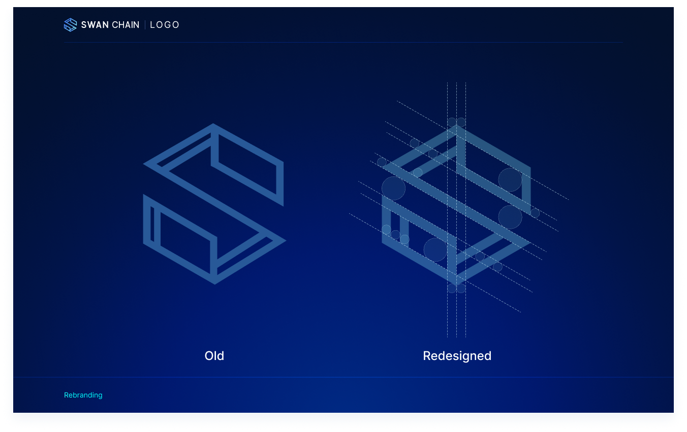
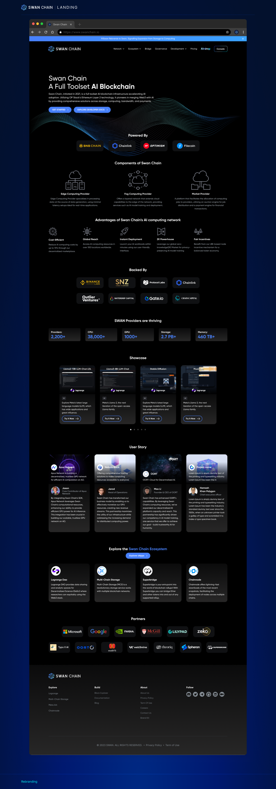
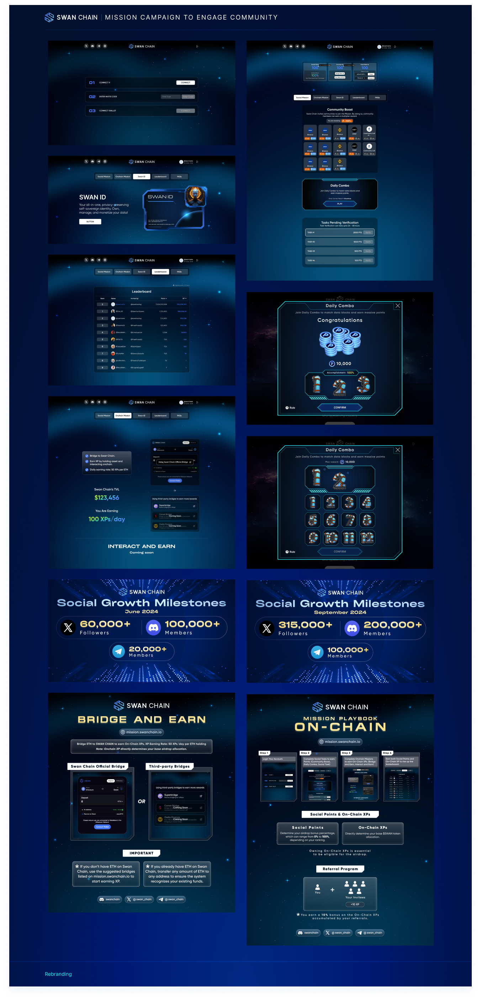
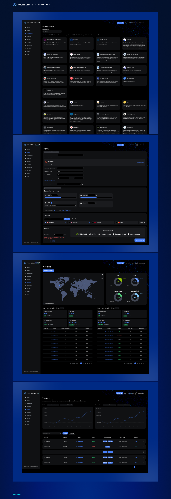
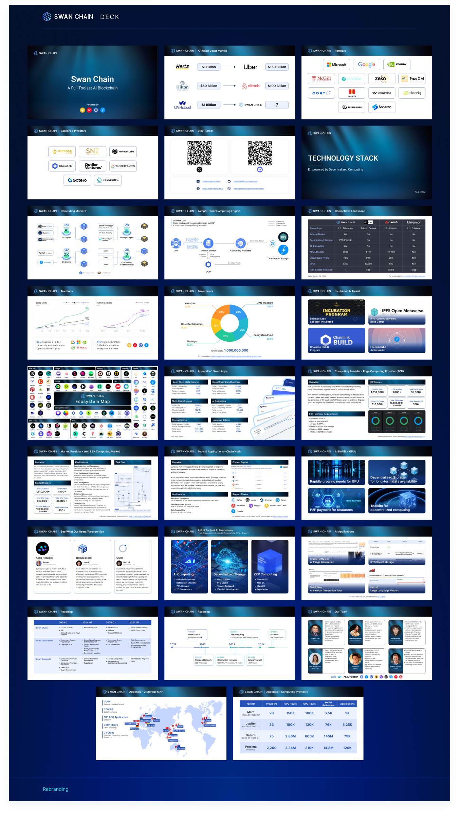
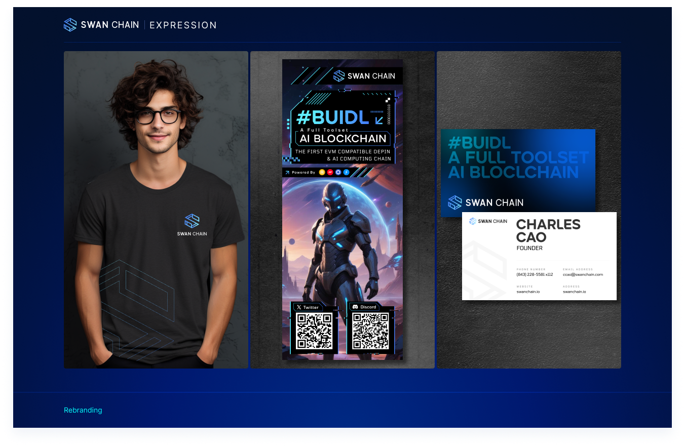

# Swan Chain Old

## **Overview**

The goal of this project was to elevate the entire company brand, including the logo, website, marketing materials, deck, and more.

## **Logo**

The original Swan Chain logo had a good foundation, but its outline lacked perfection. My task was to refine the logo, ensuring precise and polished outlines.

<figure><figcaption></figcaption></figure>

## **Landing Page**

I worked closely with the team to redesign the landing page. Over the course of the project, we developed two upgraded versions, with the second one being the final iteration. The theme they wanted was inspired by the universe, so I created multiple concepts before finalizing the design. I also handled content integration and ensured a smooth handoff to the development team.

<figure><figcaption></figcaption></figure>

<figure><figcaption></figcaption></figure>

## **Mission Campaign**

The primary objective of this campaign was to increase followers on platforms such as X (formerly Twitter), Discord, and Telegram through social mission tasks. I designed the visuals and assets to support this initiative, ensuring they aligned with the brand.

<figure><figcaption></figcaption></figure>

## **Dashboard**

The company required a tool to manage their console. I designed the dashboard interface based on their provided wireframes, ensuring clarity and consistency with the overall brand.

<figure><figcaption></figcaption></figure>

## **Deck**

I designed their presentation decks based on the content they provided, ensuring consistency in color, style, and theme with the company’s branding.

<figure><figcaption></figcaption></figure>

## **Graphics**

I supported the marketing team by creating banners and videos to communicate content effectively. All materials adhered to the company’s brand guidelines.

<figure><figcaption></figcaption></figure>

<figure><figcaption></figcaption></figure>

## **Brand Guidelines**

To maintain a cohesive identity across all platforms, I created a comprehensive brand guideline for Swan Chain. This document serves as a reference for all future designs, ensuring consistency in visual communication.

<figure><figcaption></figcaption></figure>

## Review Design


