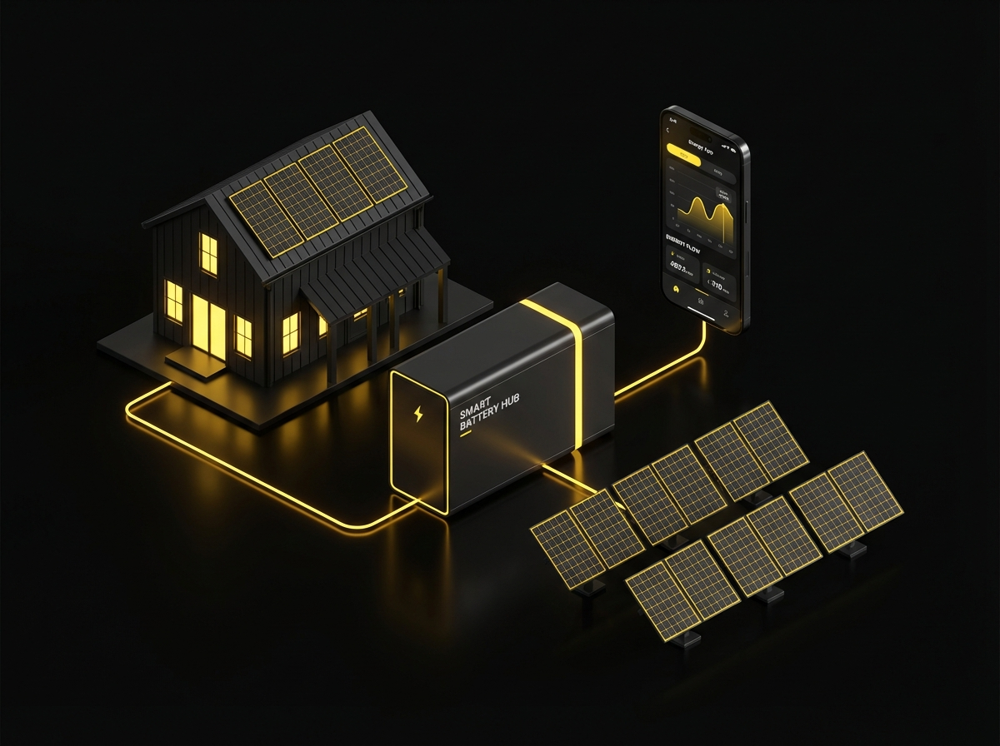
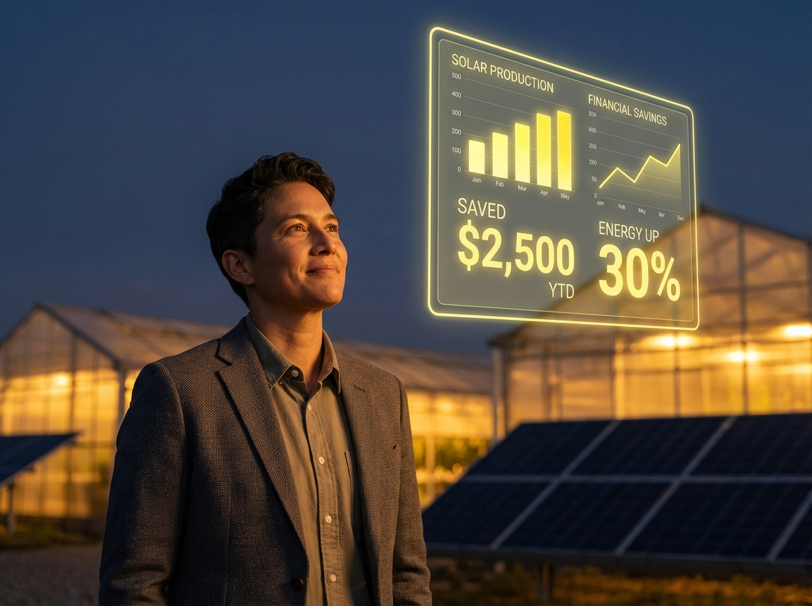
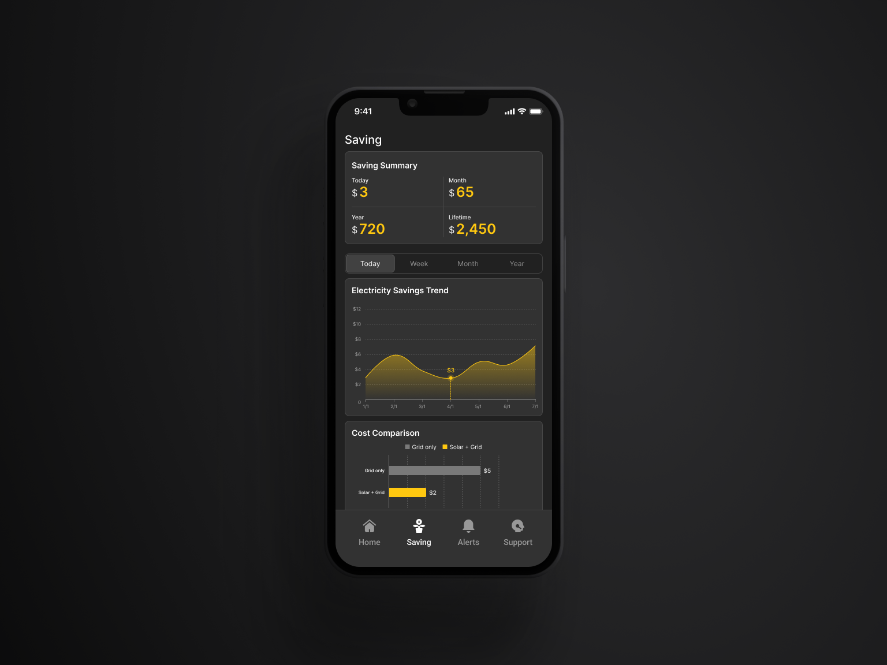
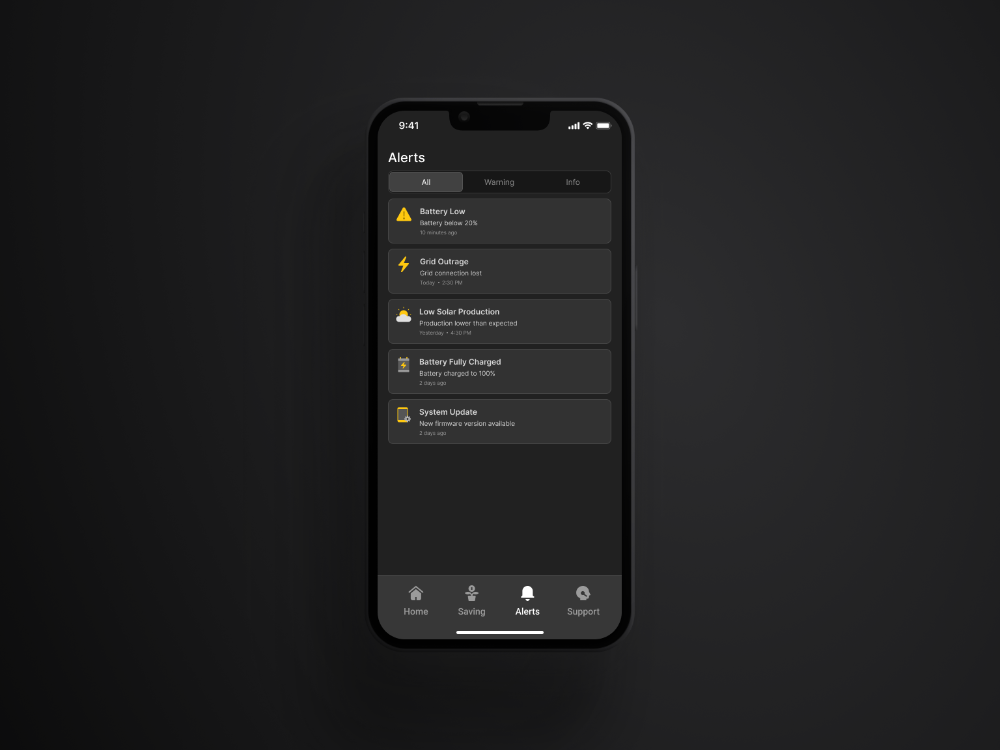
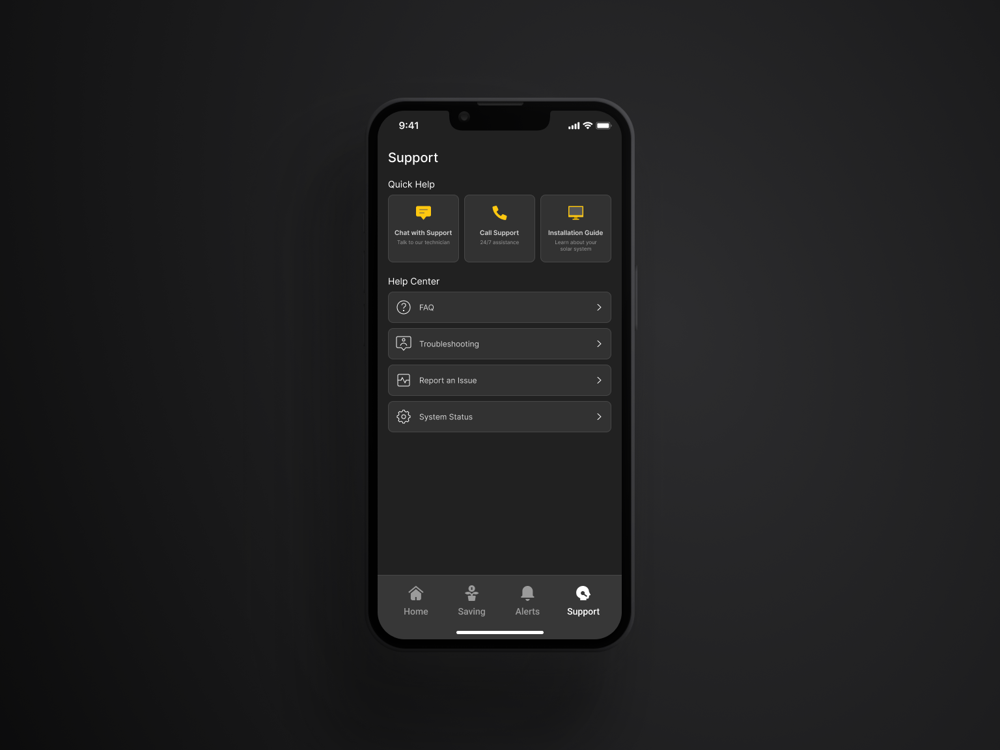
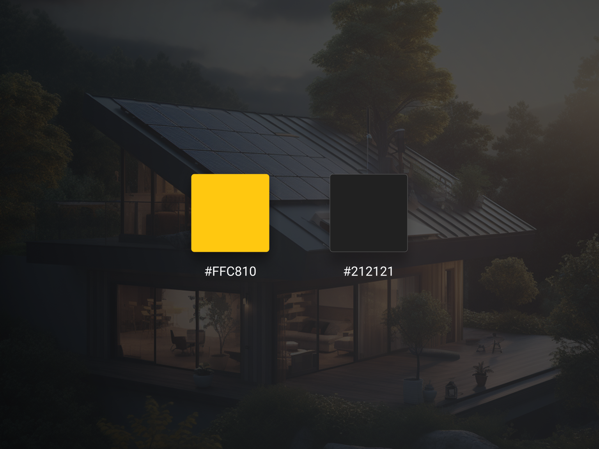

# Solar System App

## 1. Project Overview

This project focuses on designing a mobile application for a renewable energy company that provides intelligent solar power solutions for agricultural and commercial users. Once the hardware (Inverter, Battery, and Datalogger) is installed, customers use this app to monitor and optimize their energy performance.

* **Role**: UX/UI Designer.
* **Project type**: Design challenge.
* **Platform**: Mobile App (iOS/Android).

<figure><figcaption></figcaption></figure>

***

## 2. The Challenge & Goals

**The Challenge**: \
Solar energy data is often technical and difficult for non-expert users to interpret.&#x20;

**The Goals:**

* Simplify complex technical data into financial values and easily digestible information.
* Develop a modern, data-driven, and premium interface.
* Enable users to track real-time savings and system health effortlessly.

<figure><figcaption></figcaption></figure>

***

## 3.  Target Audience

<figure><figcaption></figcaption></figure>

**Primary Users**: \
Farm owners and business owners.

**Key Characteristics**: \
Users with limited technical knowledge who prioritize financial optimization, reliability, and simple data presentation. 

***

## 4. Design Solutions

The design strategy centers on a modern, data-driven, and premium interface that simplifies complex technical information into meaningful value for users.

### A. Home Screen

<figure><figcaption></figcaption></figure>

The goal of this screen is to provide an immediate snapshot of the system's health and financial performance.

**Energy Flow Visualization**: A dynamic diagram showing the real-time power flow between Solar → Battery → House → Grid, allowing users to understand their energy ecosystem at a glance.\
\
**Real-time Metrics**: High-contrast cards display current solar power (kW) and battery percentage to ensure constant awareness.\
\
**Financial Impact**: The screen prominently features the daily money saved, translating technical output into tangible economic value.\
\
**Actionable Insights**: Displays smart suggestions, such as prioritizing battery charging before an approaching storm, to help users optimize energy use proactively.

### B. Solar Production Screen

<figure><figcaption></figcaption></figure>

This screen breaks down production data into easy-to-digest visual formats for non-technical users.

**Multi-period Summaries**: Users can toggle between Daily, Monthly, and Yearly views to track production history.\
\
**Production** **Charts**: Intuitive graphs visualize energy trends throughout the day, highlighting peak production hours.\
\
**Energy** **Distribution**: A breakdown (often via donut charts) shows the percentage of solar energy consumed by the home, stored in the battery, or exported back to the grid.

### C. Saving Screen

<figure><figcaption></figcaption></figure>

As a core feature, this screen focuses on the user's primary concern: economic benefit.

**Cost Comparison**: A visual contrast between "Using only grid electricity" and "Using solar energy" to highlight the return on investment and monthly savings.\
\
**Electricity Savings Trend**: A historical graph that tracks financial optimization over time, reinforcing the long-term value of the system.\
\
**Environmental Impact**: Translates savings into relatable metrics, such as CO₂ reduction, to align with the brand's sustainable mission. 

### D. Alerts Screen

<figure><figcaption></figcaption></figure>

This screen ensures system reliability through simplified status notifications.

**Status Categorizatio**n: Alerts are clearly classified into categories like Low Battery, Grid Outage, Maintenance Reminders, or System Updates.

**Visual Clarity**: Uses the brand's high-contrast palette (Yellow #FFC810 and Black #212121) to make critical warnings stand out immediately.

**Plain Language**: Translates complex technical faults into simple, actionable information for users with limited technical knowledge. 

## E. Support Screen

<figure><figcaption></figcaption></figure>

The final step in the user flow ensures users feel supported and builds trust in the brand.

**Quick Help**: One-tap access to a Hotline, Messaging, or Email for immediate consultation.

**Help Center**: A categorized library for Troubleshooting, Reporting Issues, and checking System Status, empowering users to resolve simple queries independently 

***

## 5. Visual Identity

<figure><figcaption></figcaption></figure>

The design adheres to a modern and trustworthy brand direction:

**Primary Colors**: \
Yellow (#FFC810): Representing solar energy, power, and optimism.\
Black (#212121): Representing stability, technology, and trust.

**Visual Style**: A high-contrast Dark Mode interface was implemented to enhance the readability of data charts and maintain a premium tech-driven feel. 

***

## 6. Outcome

{% embed url="https://www.figma.com/proto/cdwLBIHHK5iUFCuKrRiw98/Solar-System-App--Preview-?node-id=1-1625&viewport=556%2C401%2C0.16&t=refekz7LYvqpieTY-1&scaling=scale-down&content-scaling=fixed&starting-point-node-id=1%3A1625&page-id=0%3A1\" %}

The final high-fidelity UI solution delivers:

**Strong Visual Hierarchy**: Ensuring the most critical data is noticed first.

**Intuitive** **Layout**: Logical card-based components that prevent data overload.

**Seamless** **Experience**: A user journey that successfully bridges the gap between technical monitoring and financial management 
