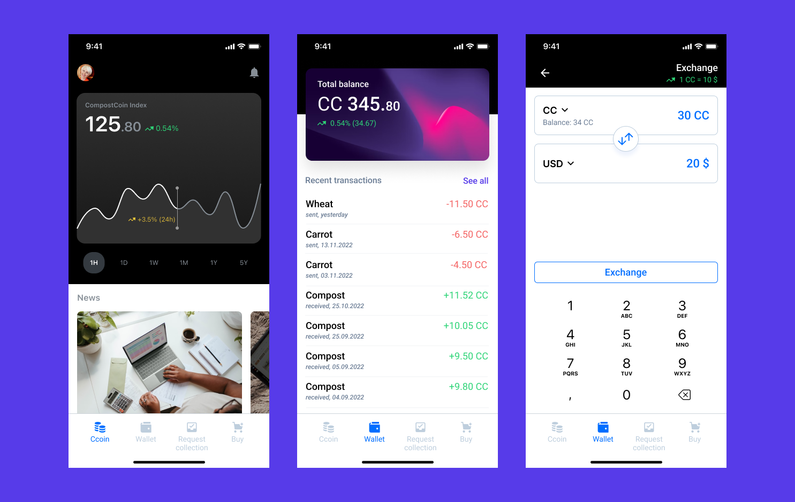
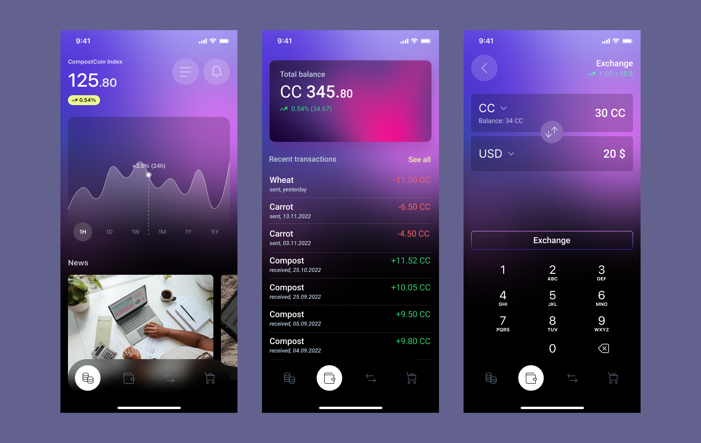
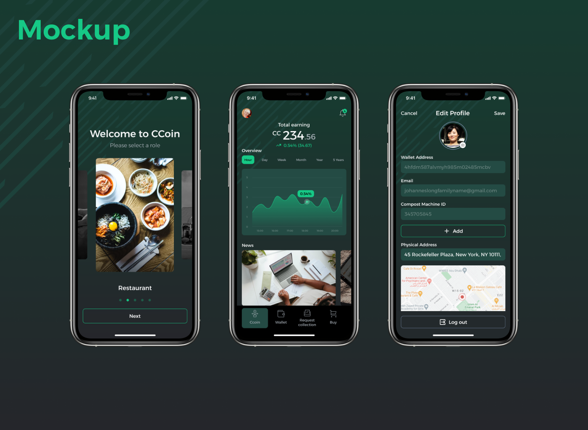

---
metaLinks:
  alternates:
    - /broken/spaces/Q1wr0S5TkpyomM2jKPhF/pages/RwNFjZtADTZM0v4YK794
---

# Compost Coin: A recycling app that rewards users with cryptocurrency

## **Project Overview**

Designed an application that assists recyclers and enables cryptocurrency transactions, promoting sustainability through blockchain technology.

<figure><figcaption></figcaption></figure>

## **Wireframe Analysis**

Received wireframes from team members and reviewed the user flow and functionality. Ensured the structure aligned with the project's goals.

<figure><figcaption></figcaption></figure>

<figure><figcaption></figcaption></figure>

<figure><figcaption></figcaption></figure>

<figure><figcaption></figcaption></figure>

## **Interface Exploration**

Designed and presented multiple interface options tailored for usability and visual appeal. Focused on clarity, accessibility, and seamless interaction.

<figure><figcaption></figcaption></figure>

<figure><figcaption></figcaption></figure>

<figure><figcaption></figcaption></figure>

<figure><figcaption></figcaption></figure>

<figure><figcaption></figcaption></figure>

## **Final Design Implementation**

Applied the most suitable interface based on the wireframe. Ensured consistency in UI elements, color schemes, and typography to enhance user experience.

<figure><figcaption></figcaption></figure>

<figure><figcaption></figcaption></figure>

<figure><figcaption></figcaption></figure>

<figure><figcaption></figcaption></figure>

<figure><figcaption></figcaption></figure>

## Review Design


