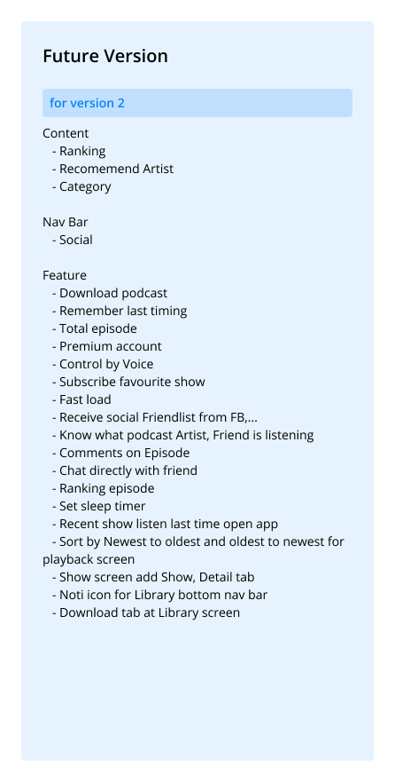

---
metaLinks:
  alternates:
    - /broken/spaces/Q1wr0S5TkpyomM2jKPhF/pages/oExMkz4YE7PzfkWFPSTX
---

# Design a Podcast App for Vietnamese User

## **Overview**

Design a podcast app for Vietnamese user.

## **Challenges**

The biggest challenge is building an MVP version in a short time while ensuring it fits the needs of Vietnamese users. Another challenge was making the app stand out in a market with big players like Spotify or Apple Podcasts.&#x20;

<figure><figcaption></figcaption></figure> <figure><figcaption></figcaption></figure> <figure><figcaption></figcaption></figure> <figure><figcaption></figcaption></figure> <figure><figcaption></figcaption></figure>

## **Solution**

Looked at popular apps to understand their core features and user flows. The team also talked to a few podcast listeners in Vietnam to see what they liked and what was missing in the current options.

<figure><figcaption></figcaption></figure>

## **Feature**

* Personalized recommendations
* Search and browse by categories (e.g., education, entertainment)
* A simple player interface with essential controls (speed, rewind, download)
* Basic user settings (language, preferences)
* Nice-to-have features like social sharing, comments, or advanced customization were left for future versions.

## **Prototyping**

Created mockups in Figma to get quick feedback from the team.

\
.png>)



## **Style guide**

* Vietnamese language support with clear and friendly fonts
* Focused on highlighting local podcast creators and trends
* Used colors and visuals that felt familiar to Vietnamese users

<figure><figcaption></figcaption></figure>

## **Collaboration**&#x20;

Worked closely with developers to prioritize features and ensure designs were easy to implement. This saved time and avoided miscommunication.\

## **Takeaway**

This project taught me how to:

* Design efficiently under tight deadlines
* Prioritize features based on user needs and technical constraints
* Collaborate with a team to deliver fast but still create something meaningful

<figure><figcaption></figcaption></figure>

## Review Design


