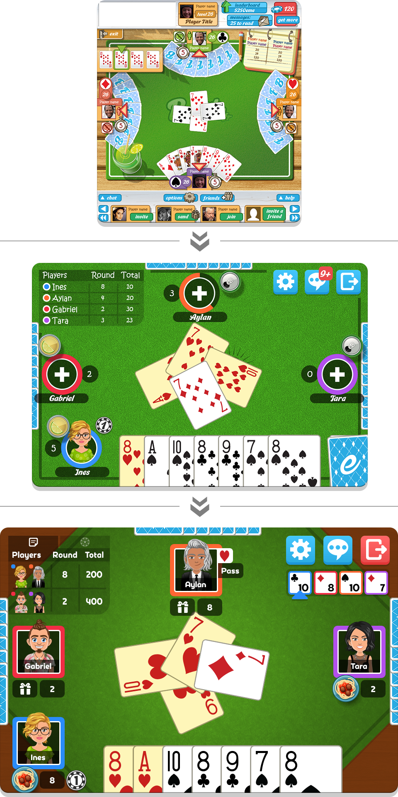
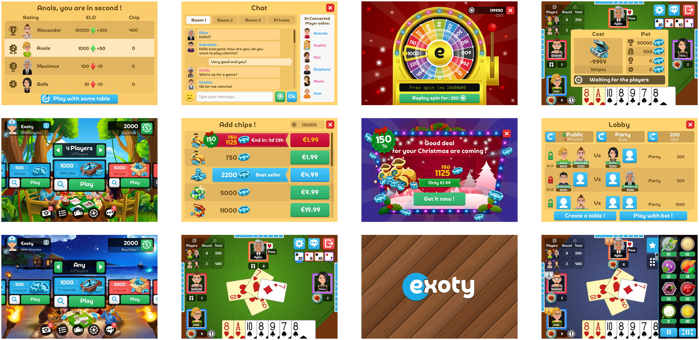

---
metaLinks:
  alternates:
    - /broken/spaces/Q1wr0S5TkpyomM2jKPhF/pages/WeuNbJopmZDRnBZkElI2
---

# Exoty: Multiplayer Card Games

## Overview

Redesigned a web-based card game for mobile, focusing on simplicity, engagement, and adaptability.

## Challenges

* **Finding the Right Concept**: The game needed to be simple yet engaging, with visuals that attract mobile players.
* **Creating a Scalable UI**: The design had to work smoothly across different screen sizes, from small smartphones to large tablets.
* **Designing for Reusability**: The UI style needed to be adaptable for future games or related projects.

## Solutions

* **Concept Development**: Used familiar card game design patterns for accessibility while adding a colorful, slightly 3D aesthetic for visual appeal.
* **Scalable UI**: Designed modular components to ensure flexibility and maintain usability across different screen sizes.
* **Consistency and Versatility**: Applied a clean, minimalistic style with vibrant accents, making it easy to integrate with other game interfaces.

## Takeaways

This project reinforced the importance of balancing creativity and functionality. By focusing on simplicity and scalability, I created a design that is visually appealing, user-friendly, and adaptable for different platforms.

## Design

<figure><figcaption></figcaption></figure>

<figure><figcaption></figcaption></figure>

<figure><figcaption></figcaption></figure>

<figure><figcaption></figcaption></figure>

## Rating on Google Play, Apple Store

<figure><figcaption></figcaption></figure>

<figure><figcaption></figcaption></figure>

<figure><figcaption></figcaption></figure>

<figure><figcaption></figcaption></figure>
