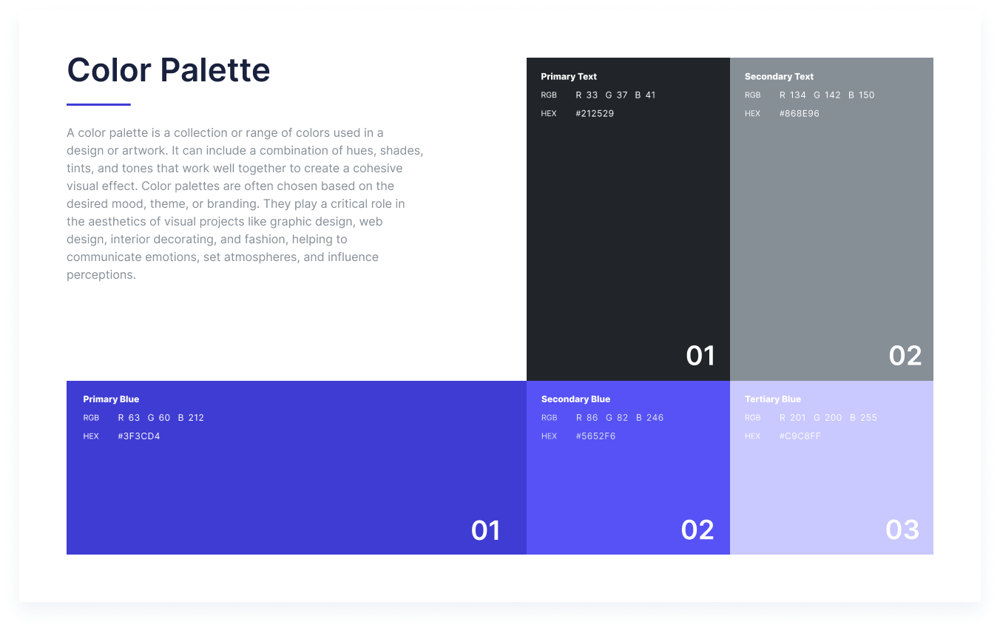

---
metaLinks:
  alternates:
    - /broken/spaces/Q1wr0S5TkpyomM2jKPhF/pages/GB5clazbjMpDxJMWO9p0
---

# The Solution App: A Service App

## **Overview**

Design a based on the wireframe of client

## **Challenges**

* Developing a concept that balances simplicity with visual appeal.
* Ensuring the design is intuitive and attractive for the average user.

## **Solution**

* Adopted widely recognized design patterns to ensure user-friendliness.
* Focused on clean, minimalistic elements that maintain a professional yet engaging look.

## **Takeaways**

* Enhanced my ability to translate wireframes into practical, user-centered designs.
* Gained valuable experience in creating designs that cater to a broad audience.

<figure><figcaption></figcaption></figure>

<figure><figcaption></figcaption></figure>

<figure><figcaption></figcaption></figure>

<figure><figcaption></figcaption></figure>

<figure><figcaption></figcaption></figure>

<figure><figcaption></figcaption></figure>

## Review Design


