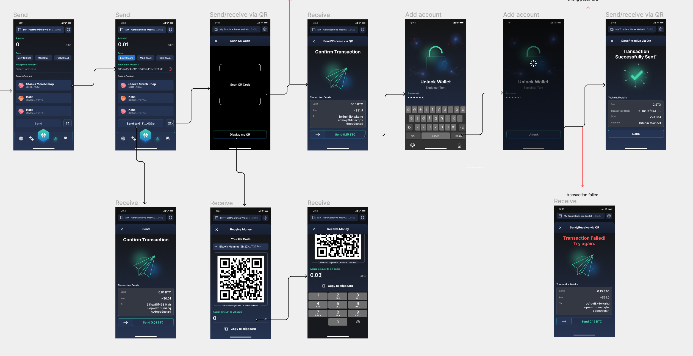

---
metaLinks:
  alternates:
    - /broken/spaces/Q1wr0S5TkpyomM2jKPhF/pages/GqL8PFfwrCl5z2iPqjeA
---

# Trust Machines Wallet: Crypto Asset Management

## **Overview**

Design crypto wallet app.

## **Challenges**

* Developing a concept that stands out in a saturated market.
* Ensuring the design is unique yet familiar to users.
* Implementing a dark theme that is visually appealing and functional.

## **Solution**

To address these challenges, I analyzed existing crypto wallets to understand common design patterns and user expectations. I then introduced a fresh visual style, combining modern elements with a sleek, dark theme. The result was an interface that is both attractive and user-friendly, ensuring it stands out while maintaining usability.

## **Takeaways**

This project significantly enhanced my design skills, particularly in translating wireframes into a polished UI. It also gave me deeper insight into designing for financial applications and creating visually distinctive yet practical designs.

## Receive the specification

<figure><figcaption></figcaption></figure>

## Receive the Wireframe

<figure><figcaption></figcaption></figure>

## Research competitor

<figure><figcaption></figcaption></figure>

## Design concept

<figure><figcaption></figcaption></figure>

## Design

<figure><figcaption></figcaption></figure>

<figure><figcaption></figcaption></figure>

<figure><figcaption></figcaption></figure>

<figure><figcaption></figcaption></figure>

<figure><figcaption></figcaption></figure>

## Style guide

<figure><figcaption></figcaption></figure>

## Review Design


