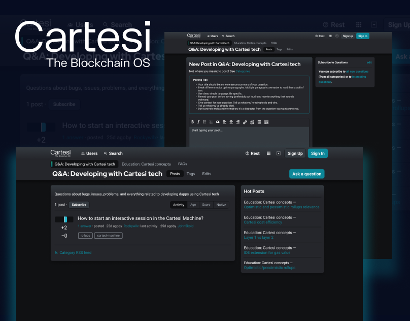
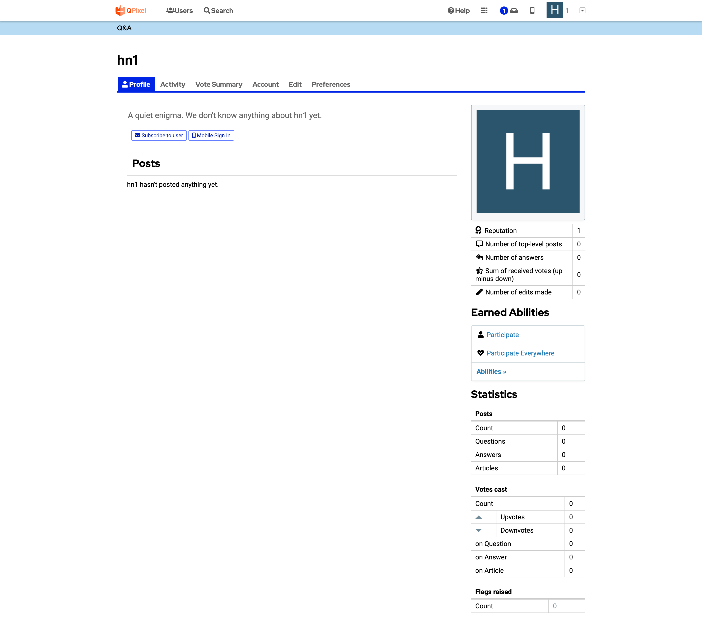
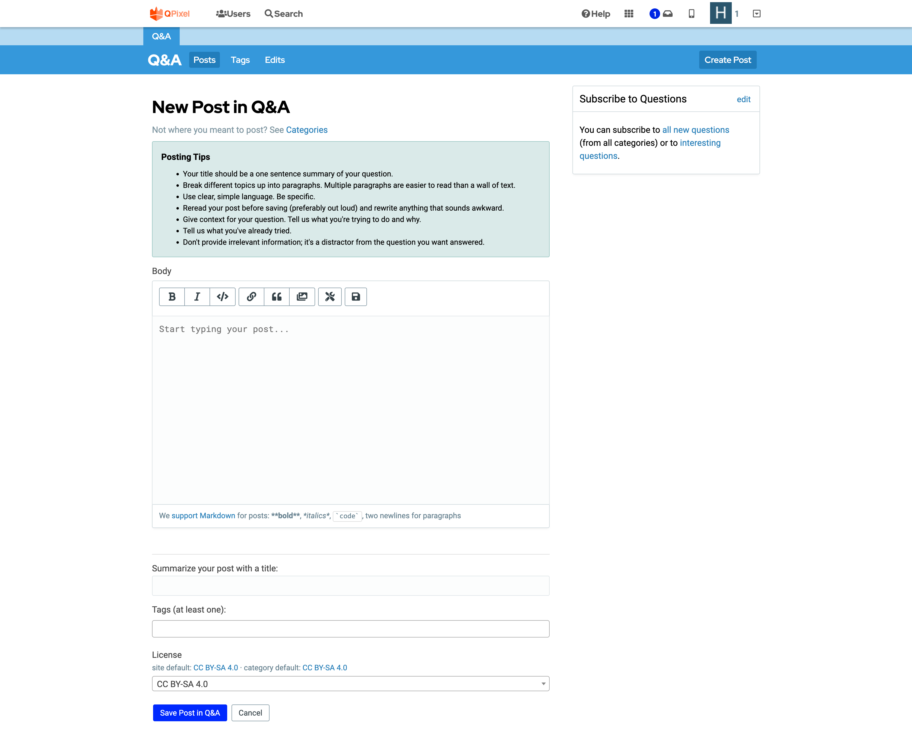
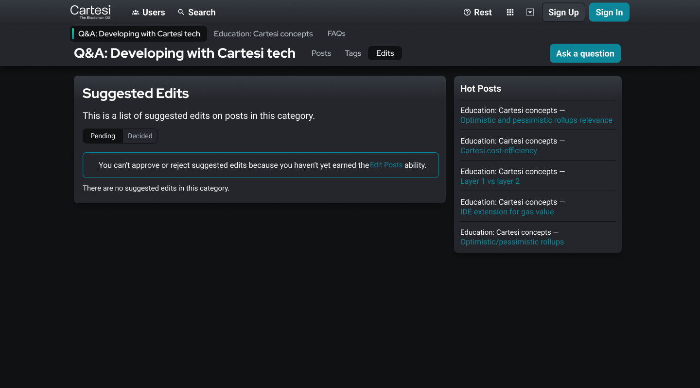
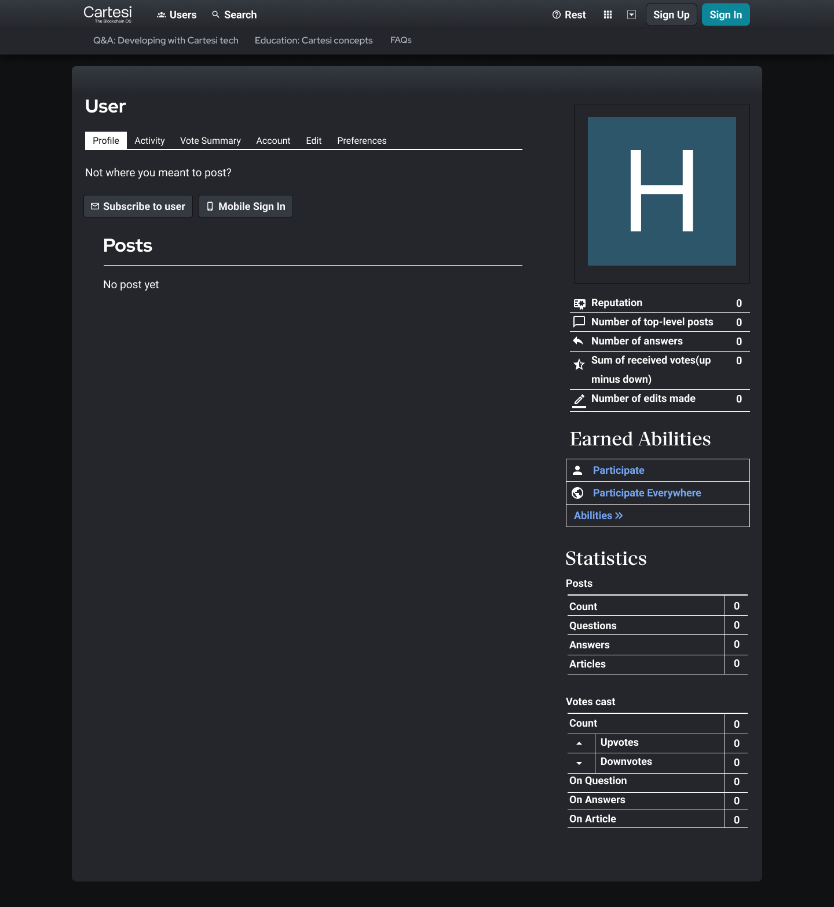

---
metaLinks:
  alternates:
    - /broken/spaces/Q1wr0S5TkpyomM2jKPhF/pages/AtMwHrmKe6DF67r35LjU
---

# Cartesi: Blog Redesign

**Type:** Web Design. UI/UX. Brand & Visual Design\
**Project:** Redesign the Cartesi blog to look modern and tech‑oriented\
**Role:** Web & Visual Designer\
**Year:** 2021

## Overview

I redesigned Cartesi’s blog page to look modern, clean and technology‑focused.

The goal was to improve visual appeal and make navigation easier for readers.

<figure><figcaption></figcaption></figure>

## **Process**

* I reviewed the existing blog layout and noted areas for improvement.
* I gathered design inspiration from modern web design platforms.
* I created moodboards and defined visual direction.
* I proposed layout concepts with clean structure and good readability.
* I designed high‑fidelity mockups and refined them with feedback.

## **Challenges & Focus**

* Representing a blockchain‑based brand through visual design.
* Balancing detailed visuals with simple navigation.
* Choosing fonts and layouts that support clear reading and brand identity.

## **Results**

* Delivered blog page mockups aligned with Cartesi’s tech image.
* Improved layout clarity and usability across desktop and mobile.
* Prepared final designs for development handoff.

***

## **Review Work**

### **The Current Page**

Analyzed the existing blog page and identified outdated design elements. Noted the need for a sleek, futuristic update to match the Cartesi brand and blockchain industry standards.

<figure><figcaption></figcaption></figure>

<figure><figcaption></figcaption></figure>

### **Moodboard & Research**

Collected design inspiration from Dribbble and Behance. Explored trendy UI styles, typography, and layouts suited for a tech-focused blog.

<figure><figcaption></figcaption></figure>

### **Concept Development**

Proposed multiple design concepts to modernize the blog's look and feel. Focused on clean layouts, better readability, and a visually engaging experience.

<figure><figcaption></figcaption></figure>

<figure><figcaption></figcaption></figure>

<figure><figcaption></figcaption></figure>

<figure><figcaption></figcaption></figure>

### **Mockup & Finalization**

Applied selected design elements and created high-fidelity mockups. Refined the design based on feedback to ensure a polished and functional blog page.

<figure><figcaption></figcaption></figure>

<figure><figcaption></figcaption></figure>

<figure><figcaption></figcaption></figure>

<figure><figcaption></figcaption></figure>

<figure><figcaption></figcaption></figure>

## Review Design


