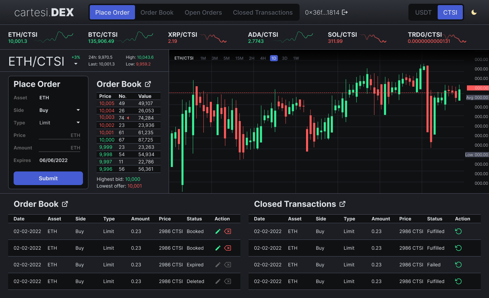
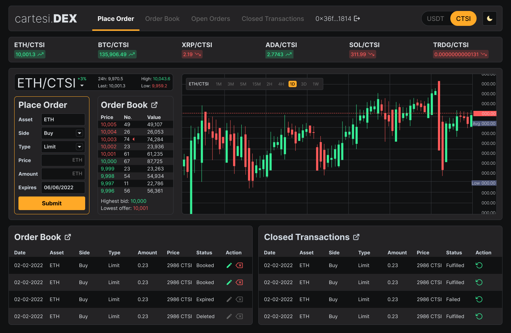
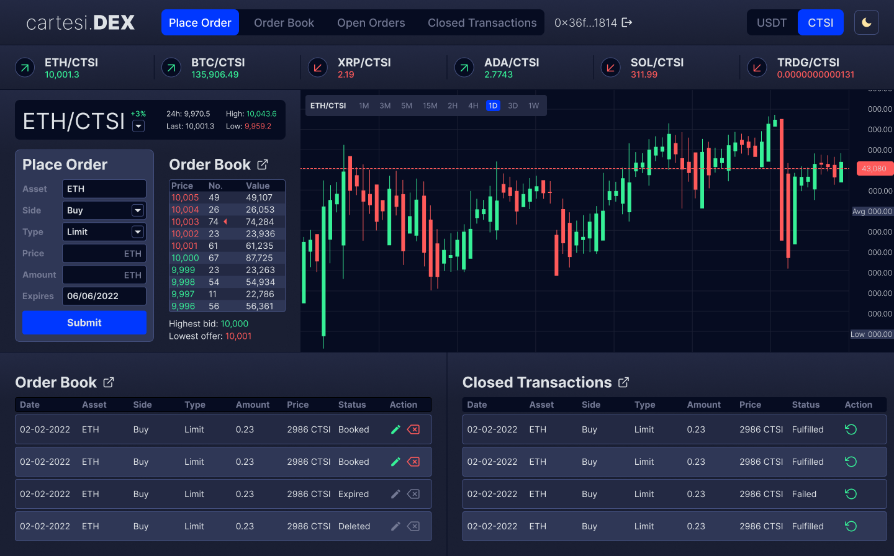
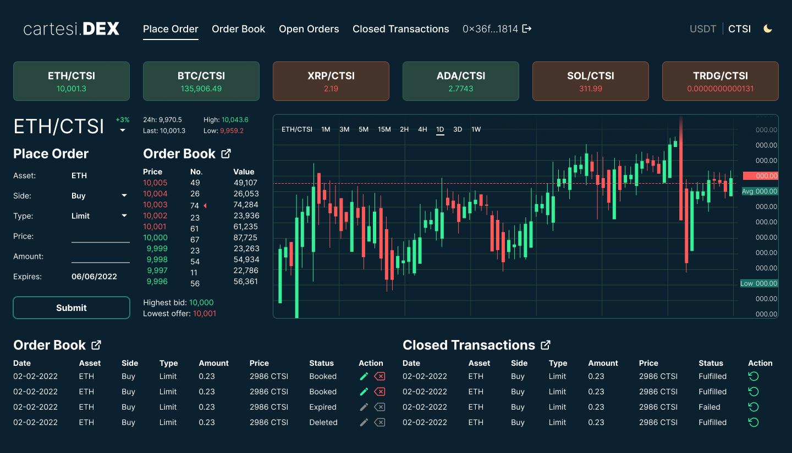
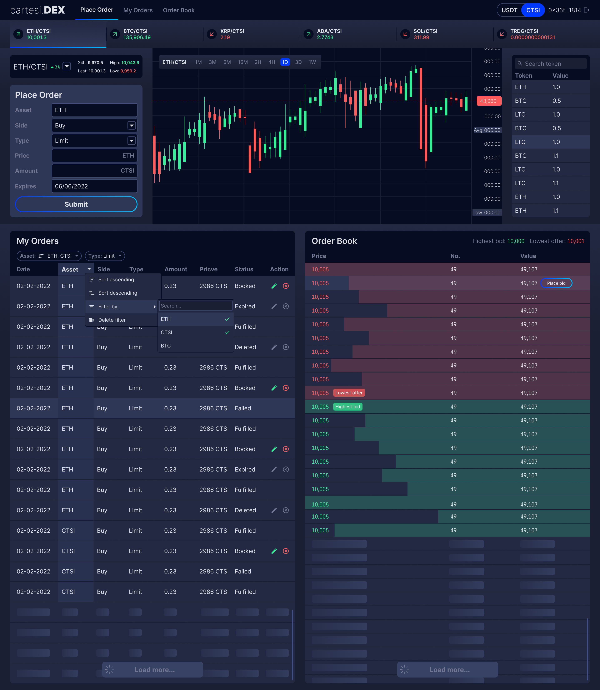

---
metaLinks:
  alternates:
    - /broken/spaces/Q1wr0S5TkpyomM2jKPhF/pages/n0thLE2utYLn4znob9xD
---

# Cartesi: Decentralized Platform

**Type:** Web Design, UI/UX, Brand & Visual Design\
**Project:** Redesign of the Cartesi blog page to match a high‑tech, blockchain aesthetic\
**Role:** Web & Visual Designer\
**Year:** 2021

## **Overview**

I redesigned the Cartesi blog page to look modern, sleek, and techy.\
The goal was to improve visual appeal and make the blog easier to use.

<figure><figcaption></figcaption></figure>

## **Process Steps**

* I analyzed the current blog page and noted outdated visual elements.&#x20;
* I created a moodboard and gathered inspiration from Dribbble and Behance.
* I proposed several design concepts focused on clean layout and good readability.
* I designed high‑fidelity mockups and refined them based on feedback.

## **Focus & Challenges**

* I aimed to match the Cartesi brand’s blockchain and decentralized technology image.
* The design needed to be both visually rich and easy to navigate.
* Templates, typography, and layouts were chosen to enhance brand identity and usability.

## **Outcomes**

* Delivered a modern blog interface aligned with blockchain aesthetics.
* Improved readability and navigation across devices.
* Provided a refined design ready for handoff to the development team.

## **Tools Used**

* Figma for layout design and mockups.
* Adobe Illustrator and Photoshop for visuals and icons.
* Feedback tools for iterative refinement.

***

## Review Work

### Wireframe Analysis

The design process began with receiving the wireframe from the client, which served as the foundation for the UI mockup. I carefully reviewed the key features and user flow to ensure a smooth and intuitive navigation experience.

<figure><figcaption></figcaption></figure> <figure><figcaption></figcaption></figure>

### Research & Inspiration

To enhance the design, I explored Dribbble and other design platforms to identify modern UI trends and best practices. Additionally, I analyzed successful trading platforms to improve usability, accessibility, and engagement.

<figure><figcaption></figcaption></figure>

### Concept Presentation

Based on the research, I designed and presented multiple sample interfaces for the team to review. Their feedback helped refine the design direction before proceeding to the final version.

<figure><figcaption></figcaption></figure>

<figure><figcaption></figcaption></figure>

<figure><figcaption></figcaption></figure>

<figure><figcaption></figcaption></figure>

<figure><figcaption></figcaption></figure>

### Final Version

After implementing the necessary revisions, I delivered a polished, functional, and visually compelling UI mockup that aligned with the project's goals and user needs.

<figure><figcaption></figcaption></figure>

<figure><figcaption></figcaption></figure>

## Review Design



