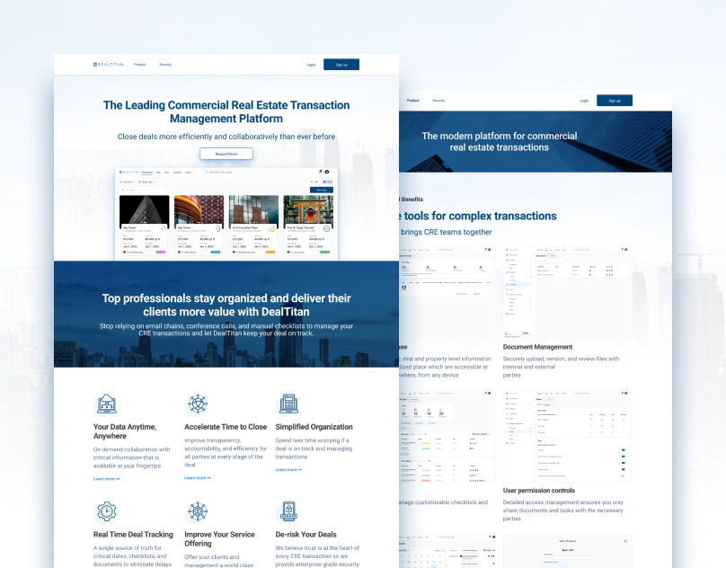
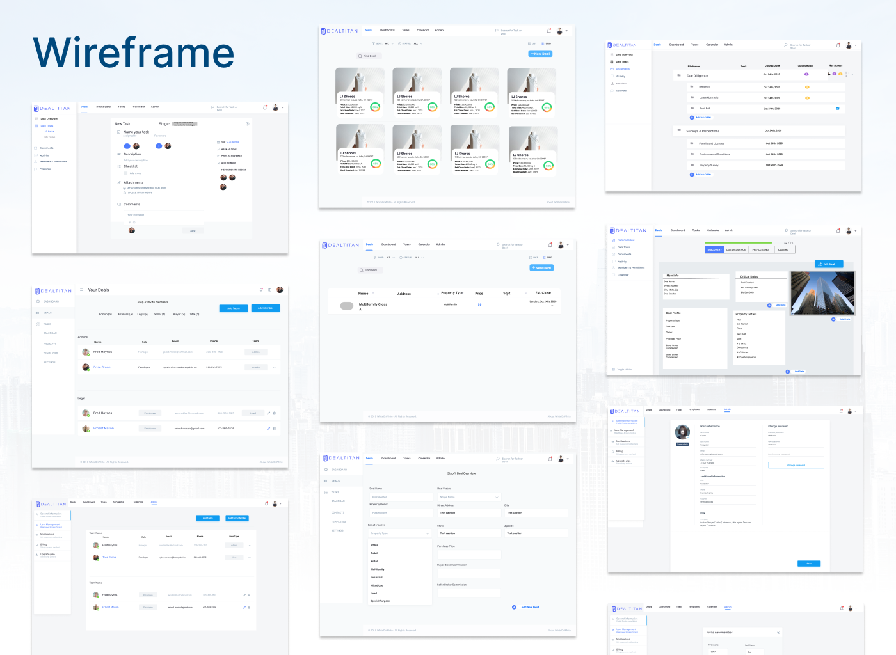
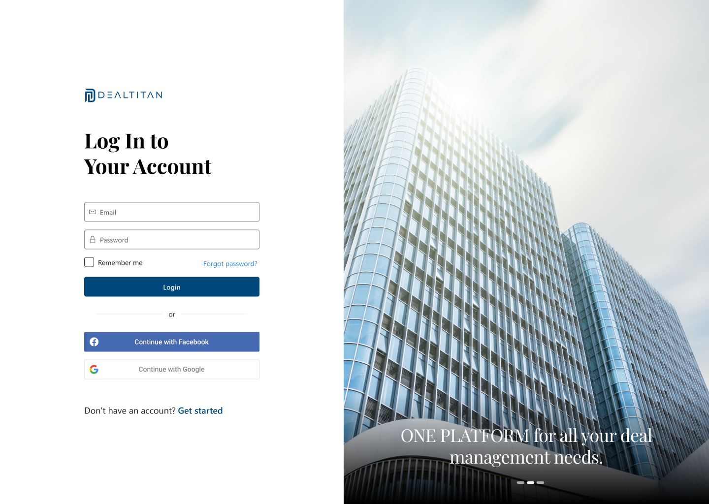
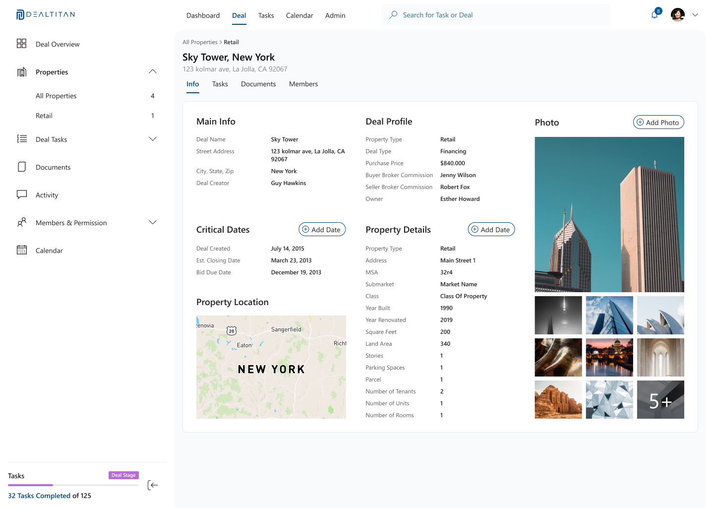
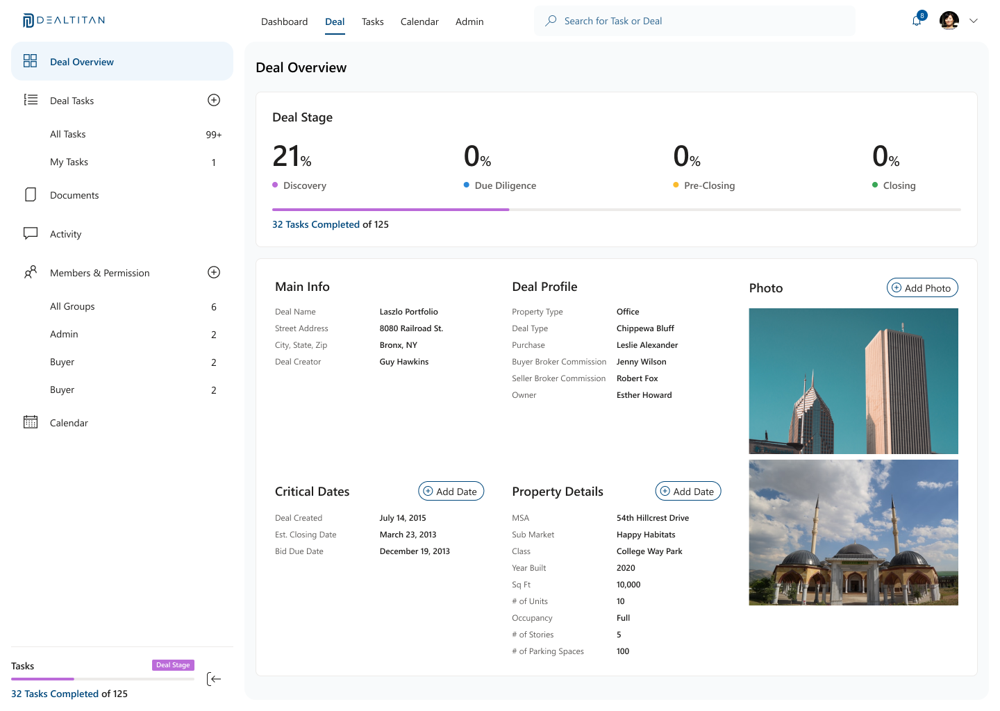
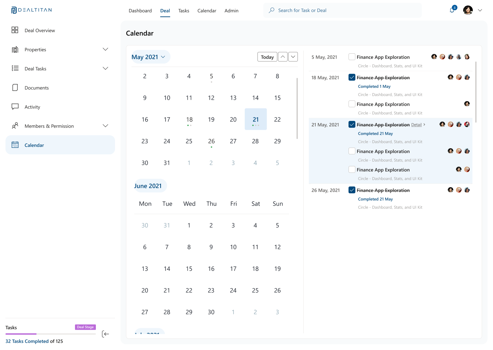
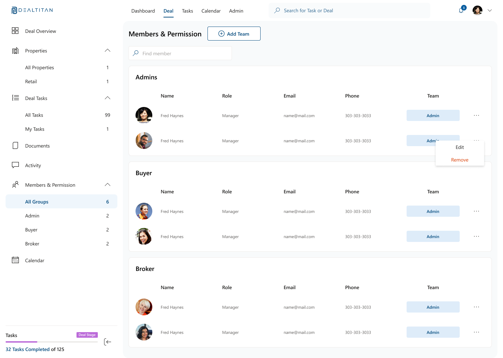
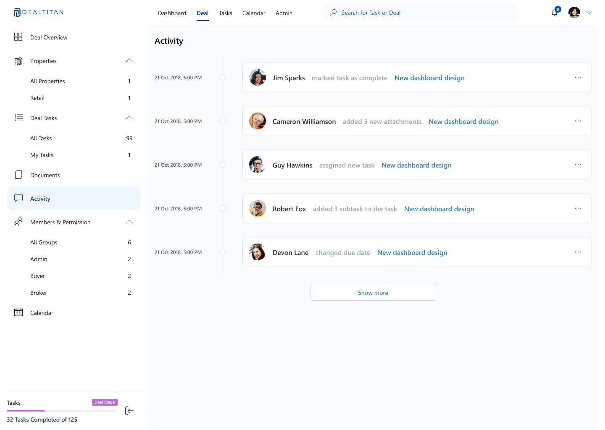
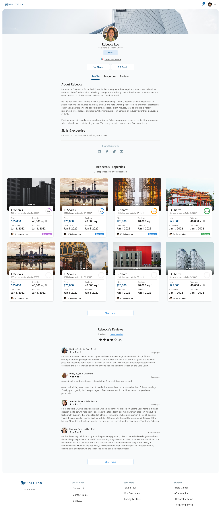
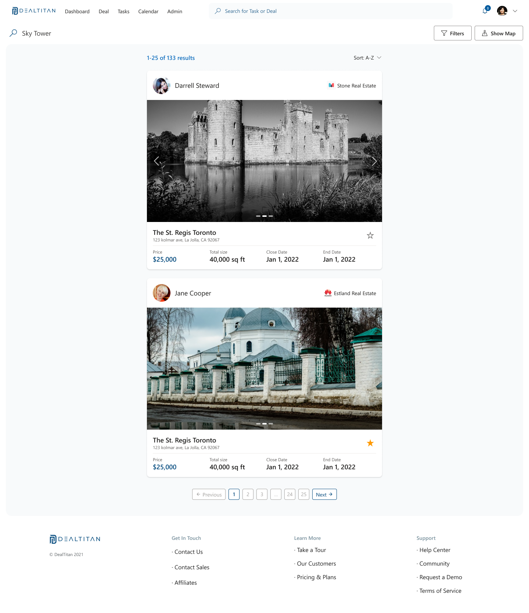

---
metaLinks:
  alternates:
    - /broken/spaces/Q1wr0S5TkpyomM2jKPhF/pages/bgfUYoqKBklg3Q1D140o
---

# Dealtitan: A Marketplace for Sales and Real Estate Transactions

**Type:** Web Design, UI/UX Design, Brand & Visual Design\
**Website**: Closed\
**Project:** Dealtitan – A platform for real estate sales and transactions\
**Role:** Web & Visual Designer\
**Year:** 2021

## **Overview**

I designed a user-friendly and professional marketplace platform for real estate sales.

The interface included advanced search filters, personalized recommendations, secure payments, and detailed property listings.

The goal was to make buying and selling property simple and enjoyable for users.

<figure><figcaption></figcaption></figure>

## **Responsibilities**

* Used project specifications and wireframes as a base to build the design.
* Conducted competitor research to learn best UI/UX practices in the real estate field.
* Designed interface mockups based on research insights and project needs.
* Built engaging, modern, and intuitive UI for both desktop and mobile use.

## **Challenges**

* Combining advanced real estate features with a clear and simple interface.
* Supporting search, listing, and payment workflows while keeping the design intuitive and trustworthy.

## **Design Solutions**

* Researched leading marketplace platforms to identify effective UI patterns.
* Followed modern UI trends to enhance usability and visual appeal.
* Created high-fidelity mockups that showcase property data, filters, and action flows.

## **Takeaways**

This project strengthened my skills in designing interfaces for real estate transactions.

I improved my ability to design user flows that support search, payments, and listings.

The experience boosted my understanding of creating UI that is both functional and visually engaging.

***

## Review Work

### Requirement Gathering

Received project specifications and wireframes as a foundation for the design.



<figure><figcaption></figcaption></figure>

### Research competitor

Analyzed competitor platforms to identify best practices.

<figure><figcaption></figcaption></figure>

### Research concept

Explored modern UI/UX trends to enhance usability and engagement.

<figure><figcaption></figcaption></figure>

### Mockup

Designed the marketplace interface based on specifications, wireframes, and research insights. Ensured an engaging, modern, and user-friendly experience.

<figure><figcaption></figcaption></figure>

<figure><figcaption></figcaption></figure>

<figure><figcaption></figcaption></figure>

<figure><figcaption></figcaption></figure>

<figure><figcaption></figcaption></figure>

<figure><figcaption></figcaption></figure>

<figure><figcaption></figcaption></figure>

<figure><figcaption></figcaption></figure>

<figure><figcaption></figcaption></figure>

### Review Design


