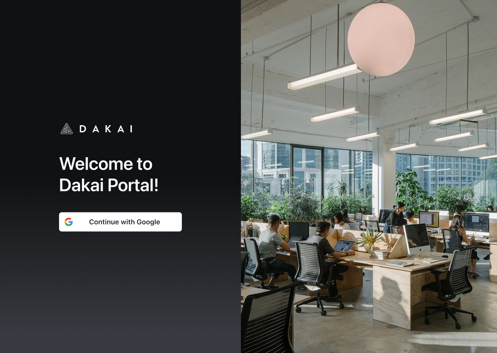
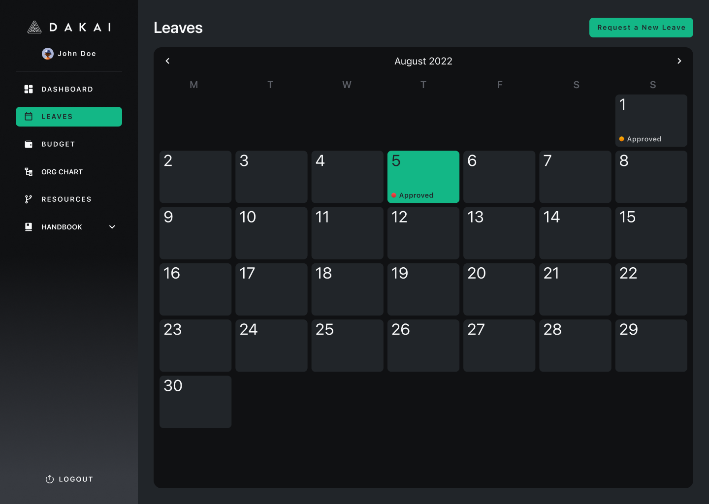
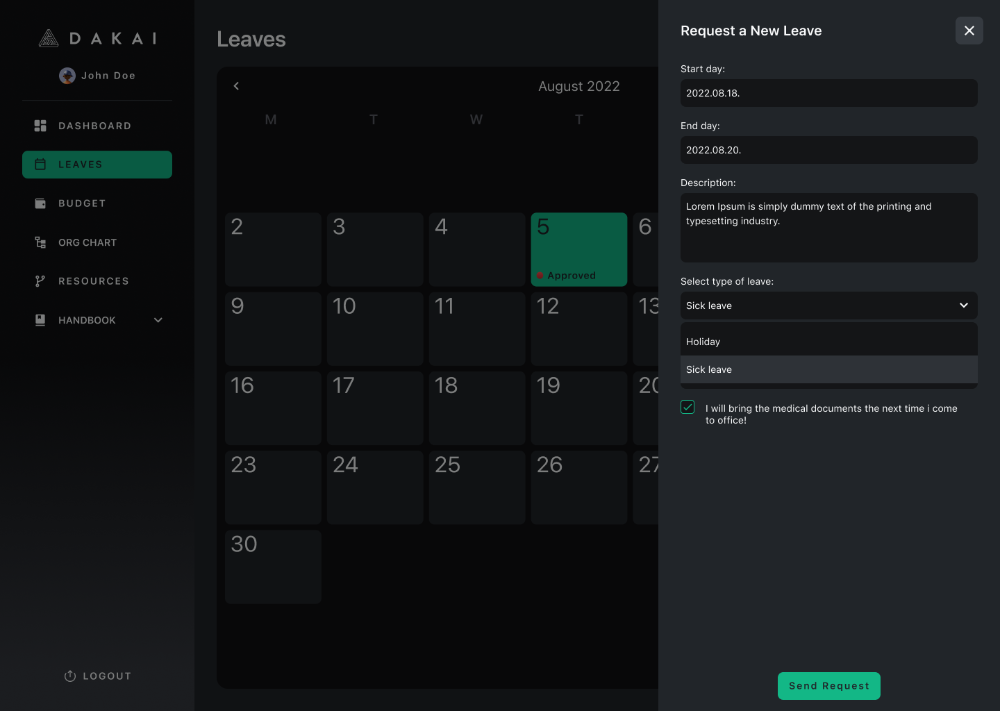
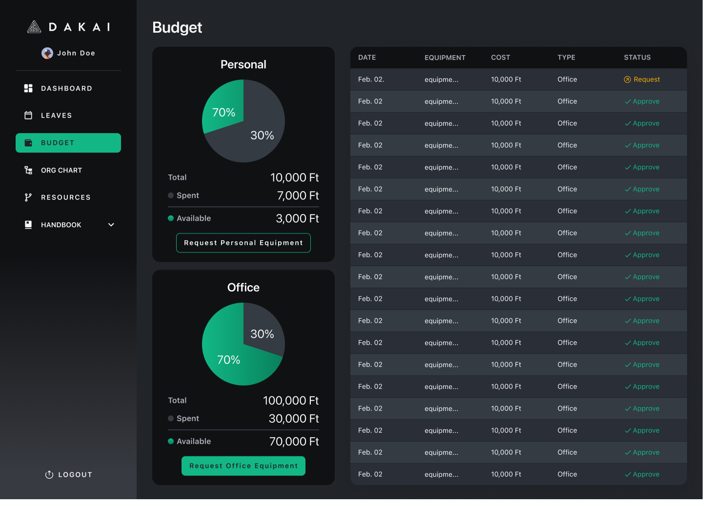
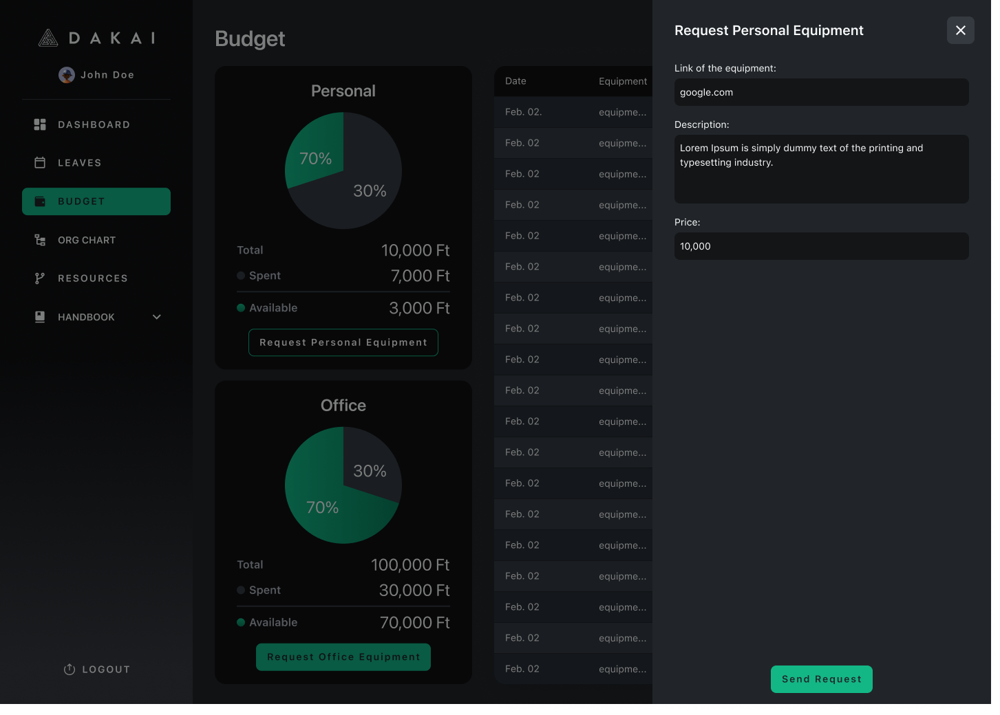
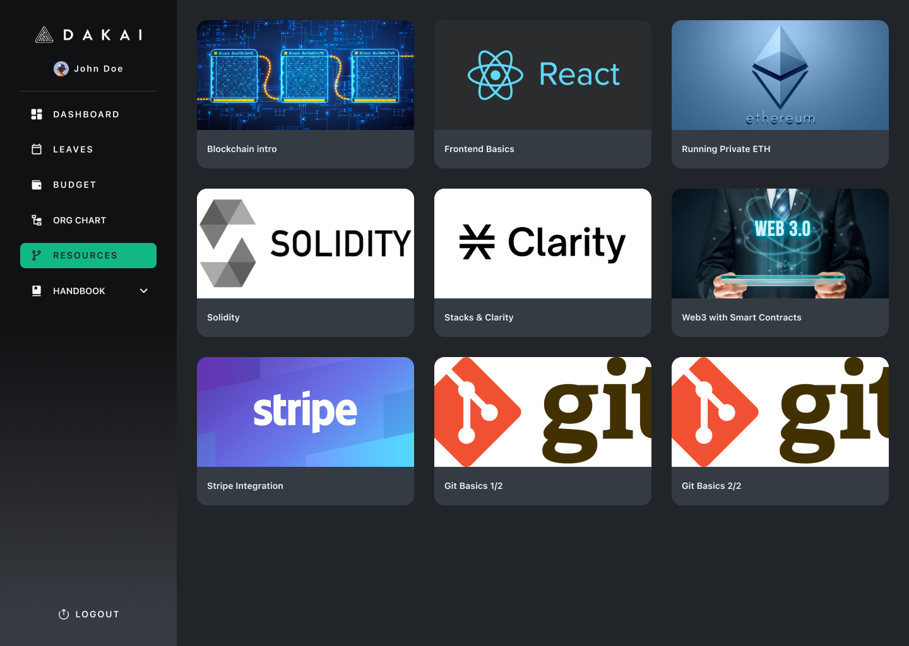
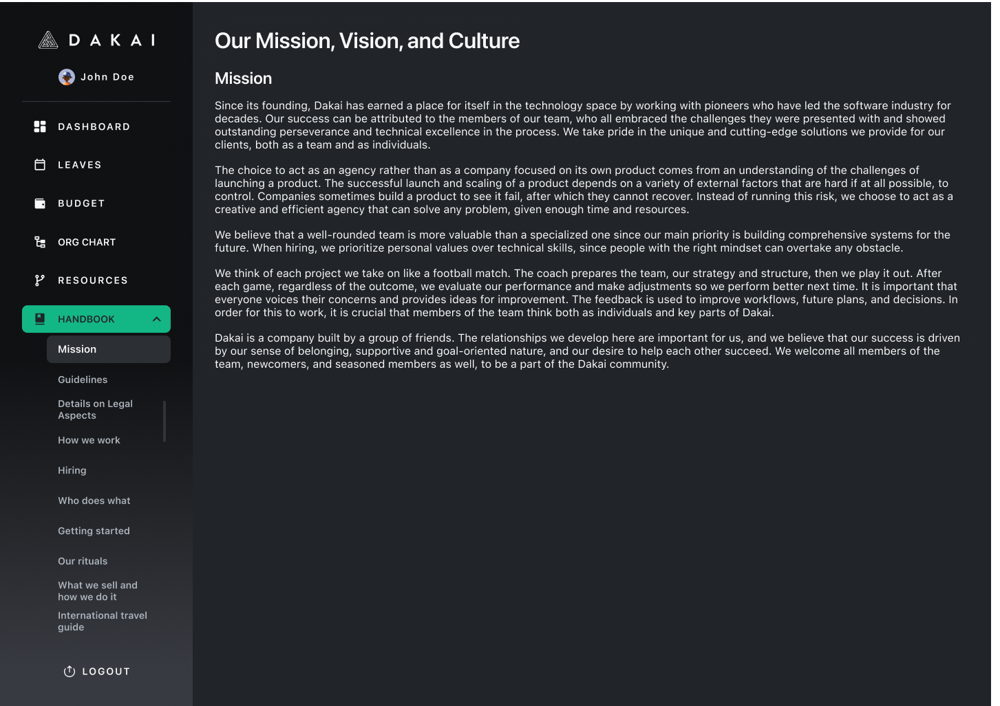

---
metaLinks:
  alternates:
    - /broken/spaces/Q1wr0S5TkpyomM2jKPhF/pages/Ftl9EpKeFwRHziE7toXP
---

# Internal Management

## **Project Overview**

I designed an internal website for the company that helps with employee management, asset tracking, and onboarding.

The platform serves as a central hub for schedules, leave requests, budgets, organizational structure, and company resources.

<figure><figcaption></figcaption></figure>

## **Tasks**

* I designed the interface based on the company’s Notion page structure and manager’s requirements.
* I refined wireframes that the team provided.

## **Challenges**

* The platform needed to group many internal tools and functions in a single site.
* The interface had to stay simple and clear under complex workflows.

## **Design Solutions**

* I organized navigation into clear sections: schedules, leave, assets, budgets, and resources.
* I refined wireframes to follow a consistent layout and visual hierarchy.
* I used clean design and clear labels so users could find what they needed quickly.

## **Learnings**

This project taught me how to simplify complex internal workflows.

I learned to design interfaces that help teams find information quickly and efficiently.

I improved my skills in structuring internal tools for UX clarity.

***

## Review Work

### Received Wireframe

Received and refined wireframes provided by the team.

<figure><figcaption></figcaption></figure>

### Mockup Page

<figure><figcaption></figcaption></figure>

### Dashboard

Displays employee schedules and provides quick access to key staff functions.

<figure><figcaption></figcaption></figure>

<figure><figcaption></figcaption></figure>

<figure><figcaption></figcaption></figure>

<figure><figcaption></figcaption></figure>

<figure><figcaption></figcaption></figure>

<figure><figcaption></figcaption></figure>

<figure><figcaption></figcaption></figure>

<figure><figcaption></figcaption></figure>

<figure><figcaption></figcaption></figure>

## Review Design



{% embed url="https://www.figma.com/design/F9KSSmR8DzT1Wq8h4iJvjF/Dakai-%7C-Portal?m=auto&t=Py701KJi5DYwzb40-1" %}
