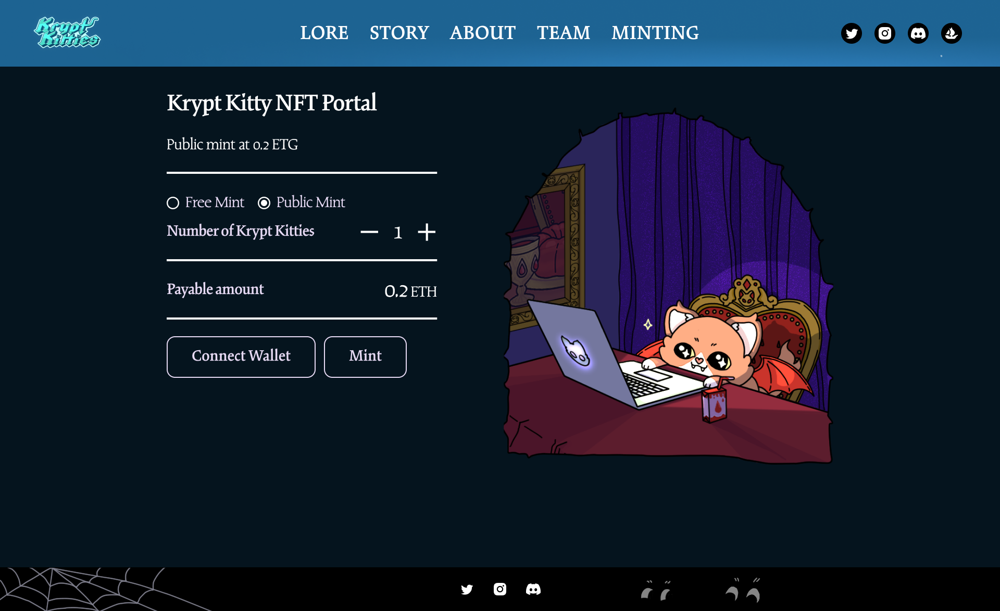
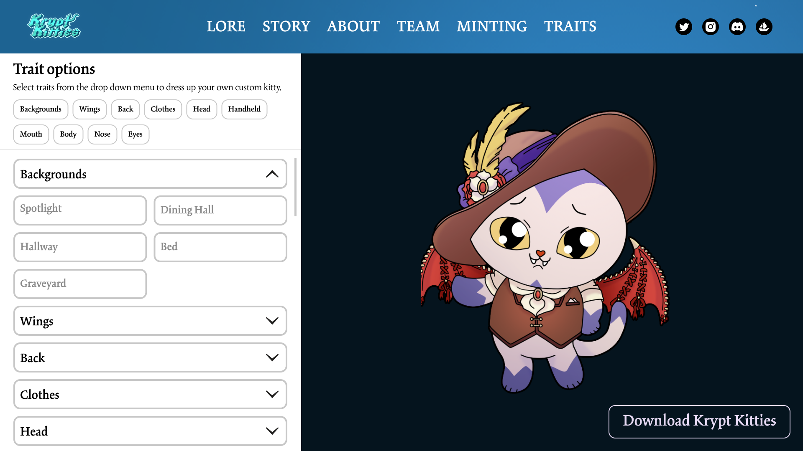
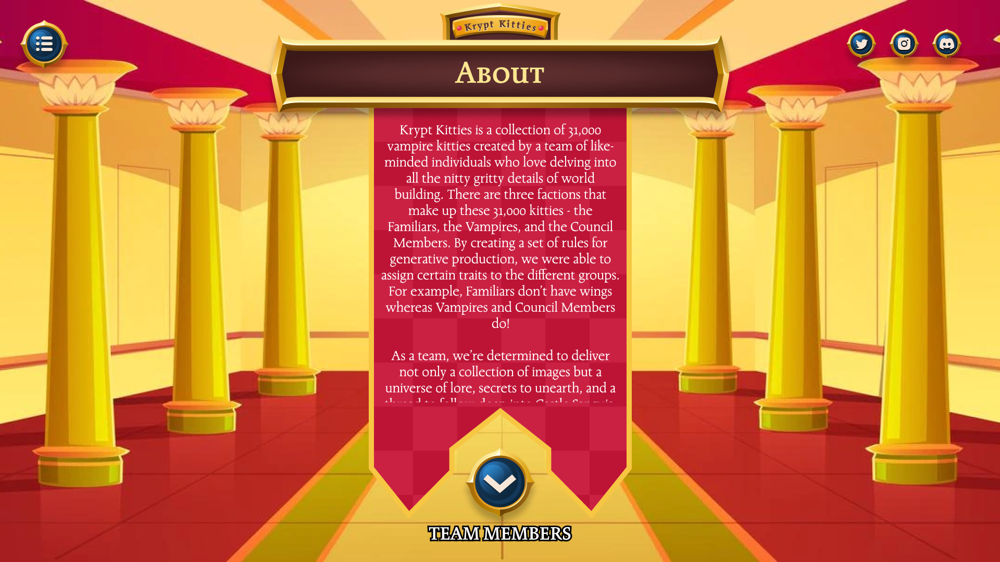
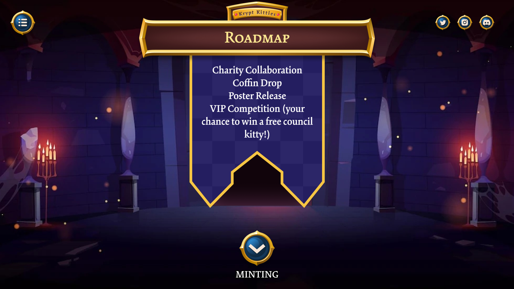
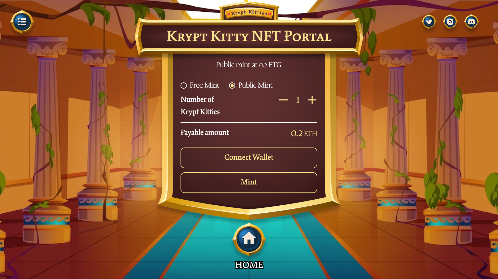

---
metaLinks:
  alternates:
    - /broken/spaces/Q1wr0S5TkpyomM2jKPhF/pages/Caf0D0goyfHB2vQYb079
---

# Krypt Kitties: unique NFT collection

**Type:** Web Design, UI/UX, Brand & Visual Design.\
**Website**: [https://x.com/kryptkitties](https://x.com/kryptkitties)\
**Project:** Krypt Kitties – A collection of 31,000 vampire-themed NFTs.\
**Role:** Web & Visual Designer.\
**Year:** 2021

### **Project overview**

Krypt Kitties are 31,000 vampire kitties in three factions: Familiars, Vampires, and Council Members.

Each group has unique traits like wings or no wings.

I worked on this project to design the web interface and visuals for the NFT collection.

<figure><figcaption></figcaption></figure>

### **Tasks**

* Understand requirements by talking with the client.
* Use wireframes and visual assets shared by the client.
* Design both desktop and responsive mobile layouts.
* Work closely with developers to hand off designs.
* Create animations, videos, and other graphics.

### **Challenges**

* Research other NFT projects to find good design practices.
* Choose the right font style to match a gothic vampire theme while keeping readability.
* Make a layout that is visually engaging but also easy to follow.

### **Design Solutions**

* Studied competitors to adopt UI trends and engagement features.
* Tested multiple font options and selected readable gothic fonts.
* Designed high-fidelity mockups that bring the vampire theme to life.
* Proposed a single‑page layout version to improve content flow.
* Iterated on the design based on feedback, though technical constraints limited full implementation.

### **Design Focus**

* Use a dark, gothic style to match the vampire lore.
* Tell the story of the Krypt Kitties world visually.
* Keep the interface clear and immersive.
* Ensure consistency across web pages and visual assets.

### **Results**

* Delivered clean, high-fidelity mockups that capture the brand.
* Built a strong visual identity around a vampire theme.
* Improved user storytelling through visuals and interface flow.
* Provided inputs for future improvements and updates.

***

## Review Work

### Receiving Wireframe & Assets

Received the wireframe and graphic assets from the client. Reviewed and organized materials to ensure consistency with the project’s design and branding.

<figure><figcaption></figcaption></figure>

<figure><figcaption></figcaption></figure>

### Competitor Research

Researched similar NFT projects to identify best design practices, UI trends, and engagement strategies to improve the overall experience.

<figure><figcaption></figcaption></figure> <figure><figcaption></figcaption></figure>

### Font Research & Selection

Explored and proposed several font options that matched the gothic-vampire theme while ensuring readability.

<figure><figcaption></figcaption></figure> <figure><figcaption></figcaption></figure> <figure><figcaption></figcaption></figure> <figure><figcaption></figcaption></figure> <figure><figcaption></figcaption></figure>

### Mockup Creation

Designed high-fidelity mockups based on the provided wireframe and assets, ensuring a visually engaging and user-friendly layout.

<figure><figcaption></figcaption></figure>

<figure><figcaption></figcaption></figure>

<figure><figcaption></figcaption></figure>

## Version 2: Enhancements & Iterations

The client requested an upgrade to Version 2. I researched new ideas and proposed a one-page design for better content flow and engagement. The client liked the concept, but due to technical limitations, it couldn’t be fully implemented.

<figure><figcaption></figcaption></figure>

### Version 2

The design focused on a gothic-vampire aesthetic, interactive storytelling, and a seamless user experience to bring the Krypt Kitties universe to life.

<figure><figcaption></figcaption></figure>

<figure><figcaption></figcaption></figure>

<figure><figcaption></figcaption></figure>

<figure><figcaption></figcaption></figure>

<figure><figcaption></figcaption></figure>

<figure><figcaption></figcaption></figure>

<figure><figcaption></figcaption></figure>

<figure><figcaption></figcaption></figure>
