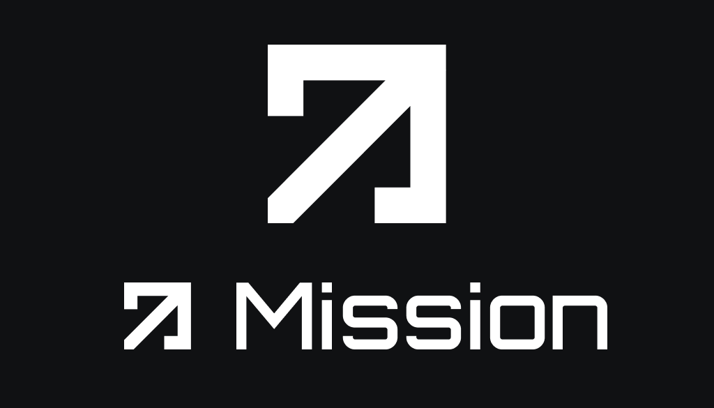
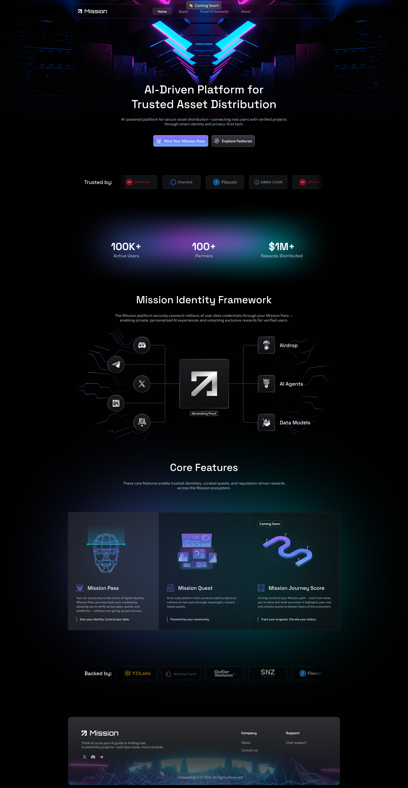

---
metaLinks:
  alternates:
    - /broken/spaces/Q1wr0S5TkpyomM2jKPhF/pages/YAi67XJvutf3IR0TQ8eT
---

# Mission 3: Community Engagement for Web3 Project

**Type:** Web Design, UI/UX, Brand & Visual Design\
**Website**: [https://app.missionhub.io/](https://app.missionhub.io/)\
**Project:** Mission 3 – A Web3 engagement platform where users complete missions to earn rewards and connect with the community\
**Role:** Web & Visual Designer\
**Year:** 2025

## **Overview**

Create a platform to build communities that enhance social engagement within a Web3 ecosystem. Users will participate in missions, complete tasks, and earn rewards, fostering interaction and collaboration in a decentralized environment.

## **Scope of Work**

* Collected design ideas and feature needs from the team.
* Researched similar platforms like Intract.io to find good ideas and improve them.
* Discussed goals and layouts with the product owner.
* Turned ideas into clean and easy-to-use web designs.

## **My Contributions**

* **Logo & Branding:** Designed the logo and brand look for Mission 3.
* **Visual Assets:** Made social media banners, posts, and visuals.
* **Web Design:** Created landing pages and dashboards for user missions.
* **Motion & Video:** Produced short videos and animations to explain how it works.
* **Marketing Tools:** Designed infographics, AI-generated images, and email layouts.

## **Design Focus**

* Simple and clear layouts for users to follow missions.
* Consistent visual style across all pages and media.
* Flexible design for future updates and new missions.
* Visual storytelling to explain features to new users.

## **Results**

* Delivered full design package for the platform.
* Helped users understand the project through visuals.
* Supported marketing with ready-to-use design materials.

***

## Review Work

### Dashboard

The design embody a Web3 aesthetic, utilizing modern, minimalist elements that evoke a sense of decentralization and user empowerment.

<figure><figcaption></figcaption></figure>



### **Logo Design**

Design a logo that captures the essence of a decentralized community-driven platform.

<figure><figcaption></figcaption></figure>

### **Landing page**

Crafted a user-friendly landing page that follows Web3 design principles, focusing on clarity and engagement.

<figure><figcaption></figcaption></figure>

### **Social Media Posts**

Create visually appealing social media posts that align with the platform's identity.&#x20;


