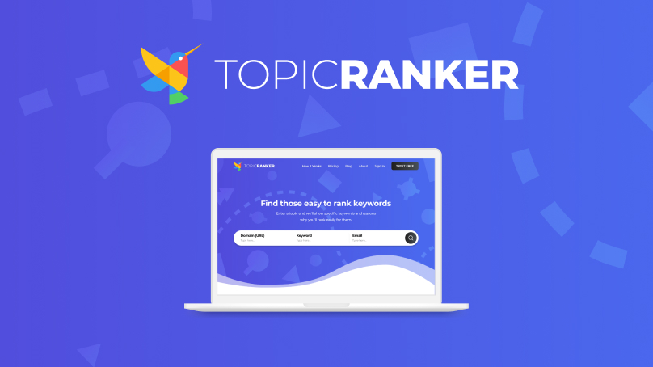
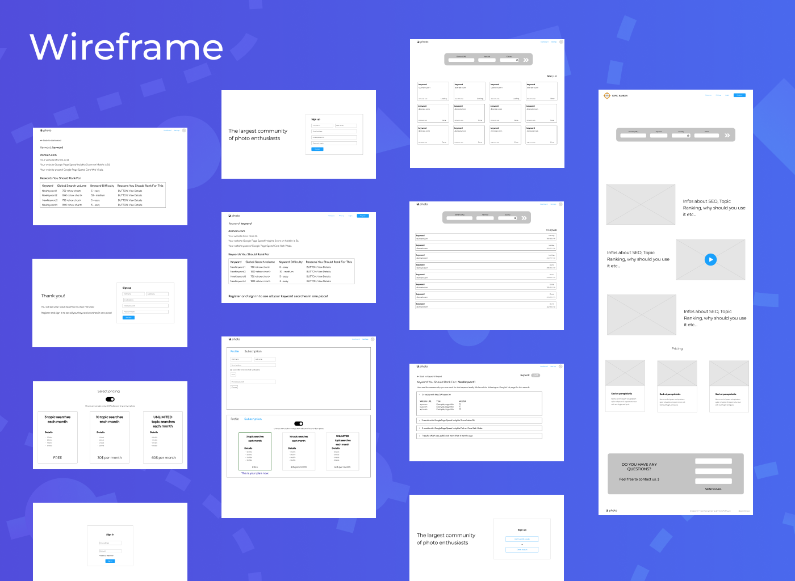
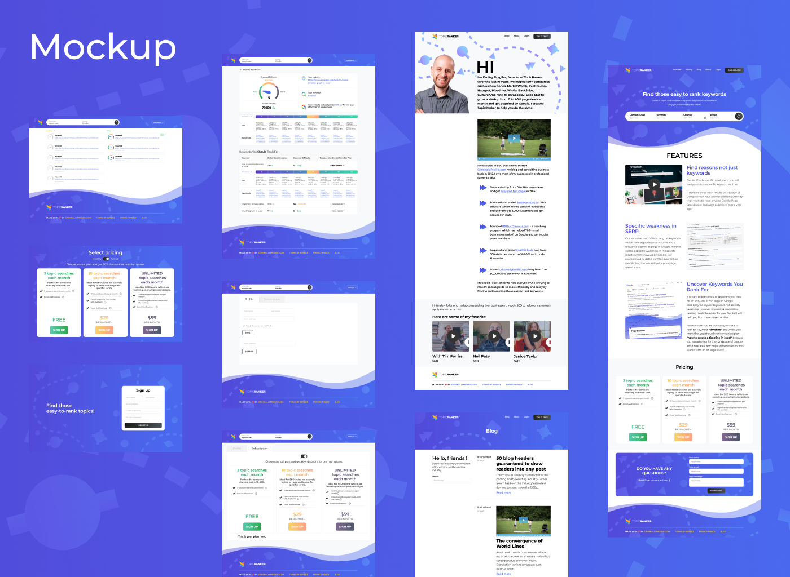

---
metaLinks:
  alternates:
    - /broken/spaces/Q1wr0S5TkpyomM2jKPhF/pages/kL7n5BX1YmjHd6F8Rc1j
---

# Topic Ranker: A Tool to Improve Search Engine Results Page on Google

**Type:** UI/UX Design, Web Platform\
**Website**: [https://topicranker.com/](https://topicranker.com/)\
**Project:** Topic Ranker – A tool to help improve search engine results on Google\
**Role:** UI/UX Designer\
**Year:** 2023

## Overview

Designed a user-friendly and functional UI for an SEO platform, working with the founder and development team to meet user needs and platform goals.

<figure><figcaption></figcaption></figure>

## Responsibilities

* Worked with the founder and development team to design an intuitive user experience.
* Created visually appealing and functional UI based on wireframe.

<figure><figcaption></figcaption></figure>

## Challenges

* Balancing simplicity with engaging visuals to enhance user interaction.
* Designing a UI that makes complex SEO functions easy to understand and use.

<figure><figcaption></figcaption></figure>

## Solutions

* Applied well-known design principles for familiarity and usability.
* Used a colorful, minimalistic UI to attract users while keeping clarity and function.

<figure><figcaption></figcaption></figure>

## Takeaways

This project improved my ability to design UI that is both visually appealing and functional. It also deepened my understanding of creating intuitive user experiences for SEO-focused platforms.

## Review Design


