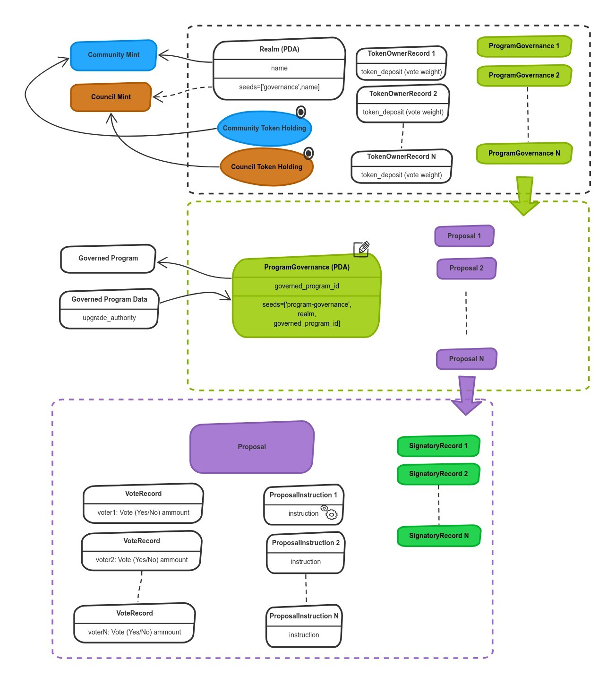
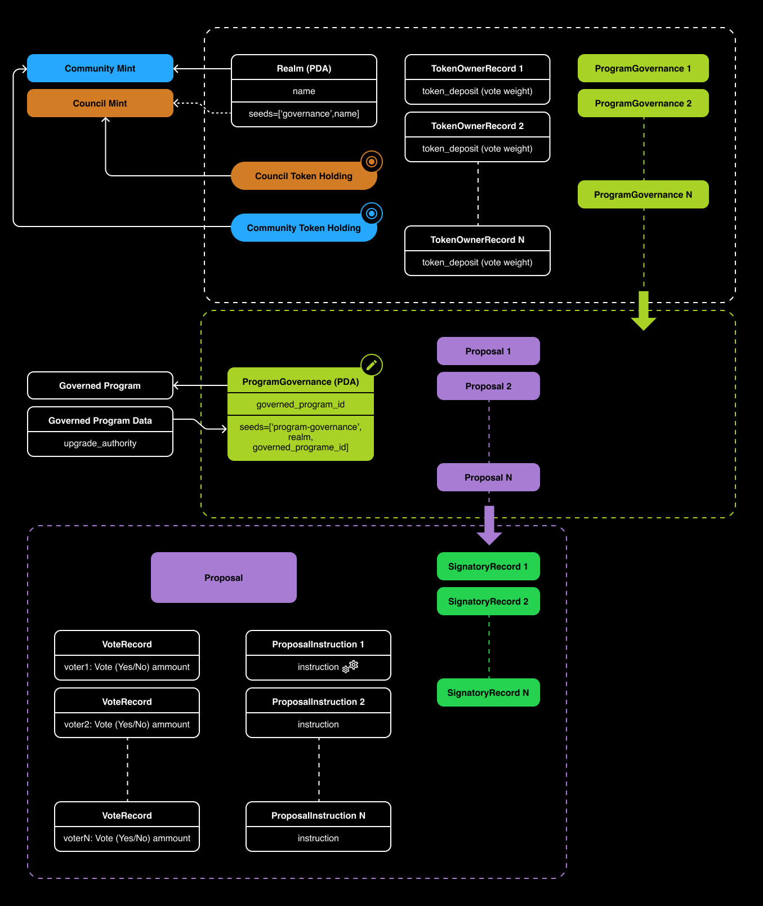

# Infographic

## **Receive Brief**

I start by reviewing the provided content, understanding the objectives, and ensuring alignment with brand guidelines. Clarity at this stage helps streamline the entire design process.

## **Research & Inspiration**

I explore design trends, gather references, and seek inspiration from platforms like X (Twitter) to find fresh and effective visual approaches.

## **Design & Layout**

I create a well-structured layout that presents the content clearly and is easy to read. I carefully choose illustrations and design elements to enhance engagement.

## **Finalization**

I present the initial design, collect feedback, and refine the visuals through iterations until the final version is polished and ready for use.

## Review Design

<figure><figcaption></figcaption></figure>

<figure><figcaption></figcaption></figure>

<figure><figcaption></figcaption></figure>

<figure><figcaption></figcaption></figure>

<figure><figcaption></figcaption></figure>

<figure><figcaption></figcaption></figure> <figure><figcaption></figcaption></figure>

<figure><figcaption></figcaption></figure> <figure><figcaption></figcaption></figure>

