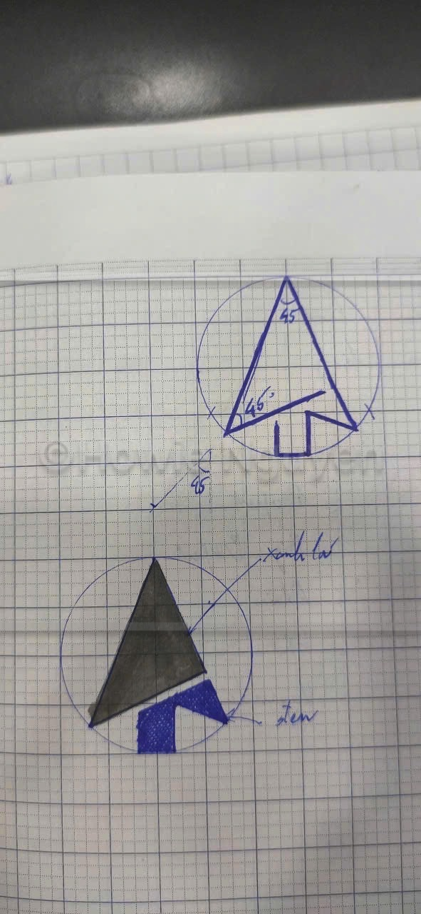
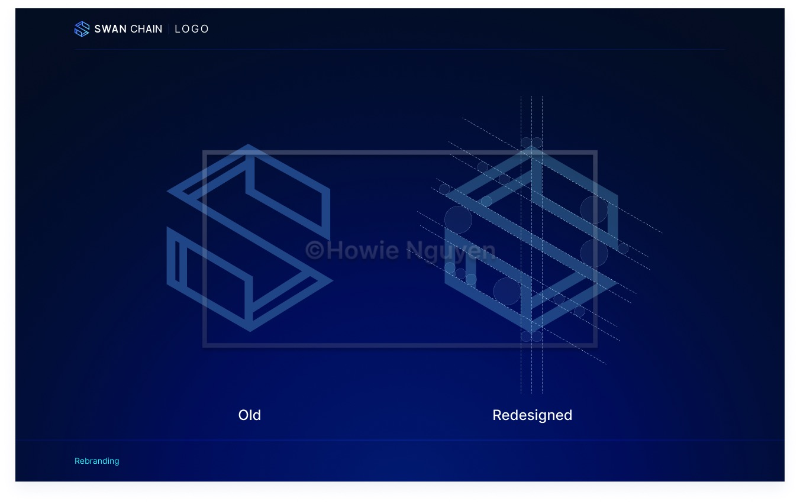
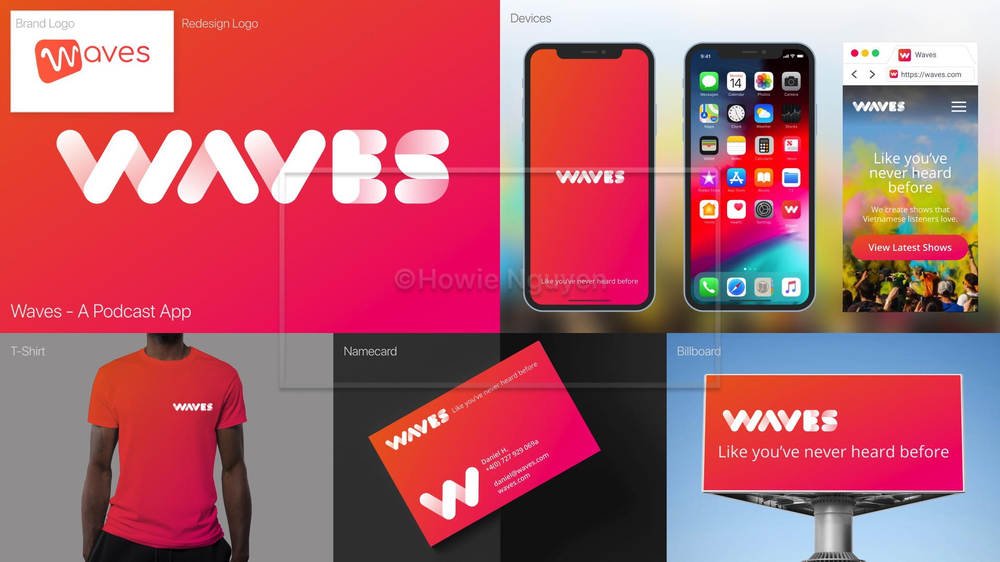
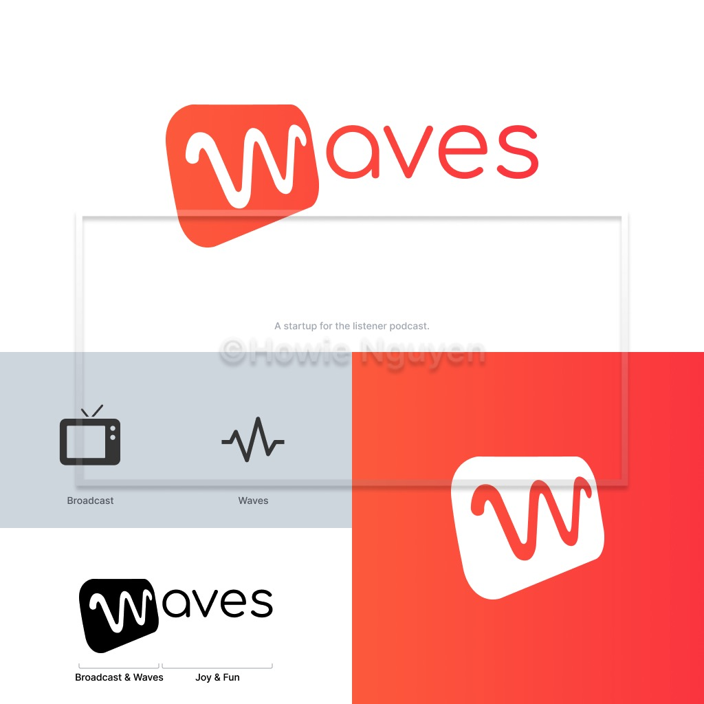
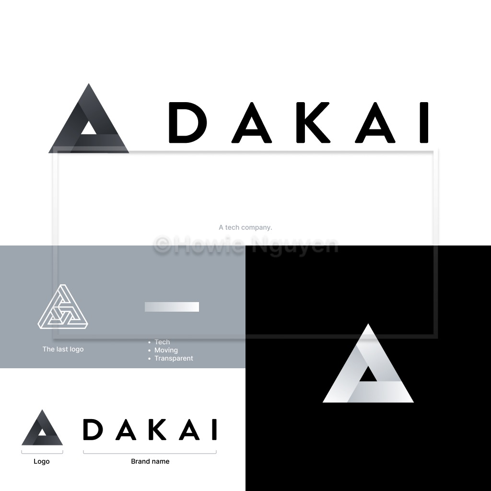
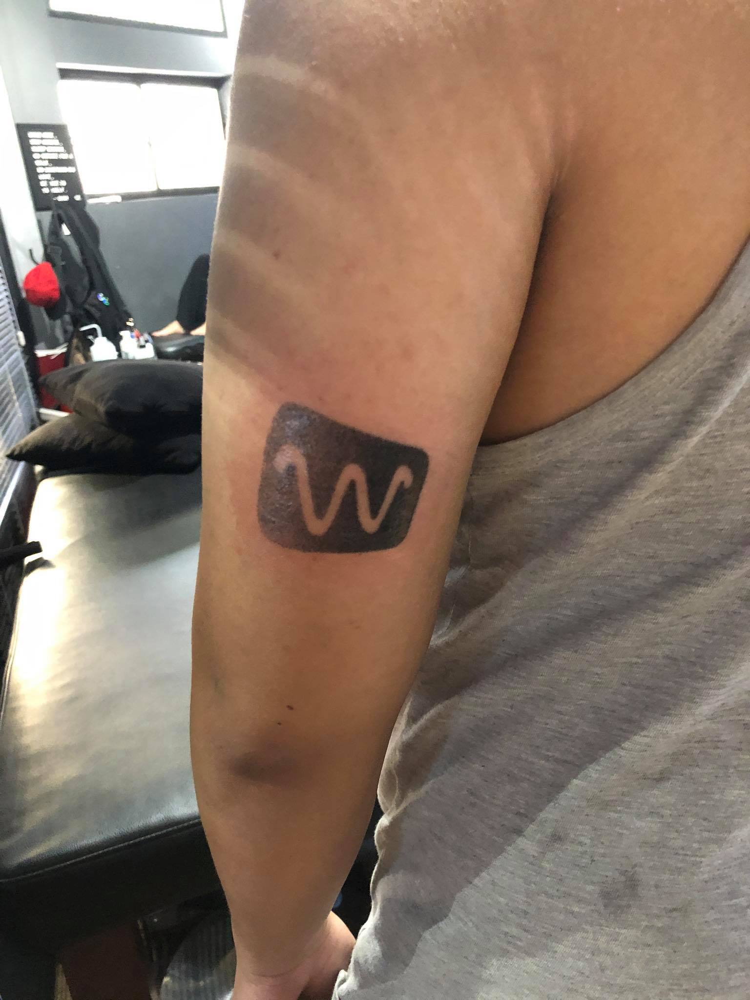
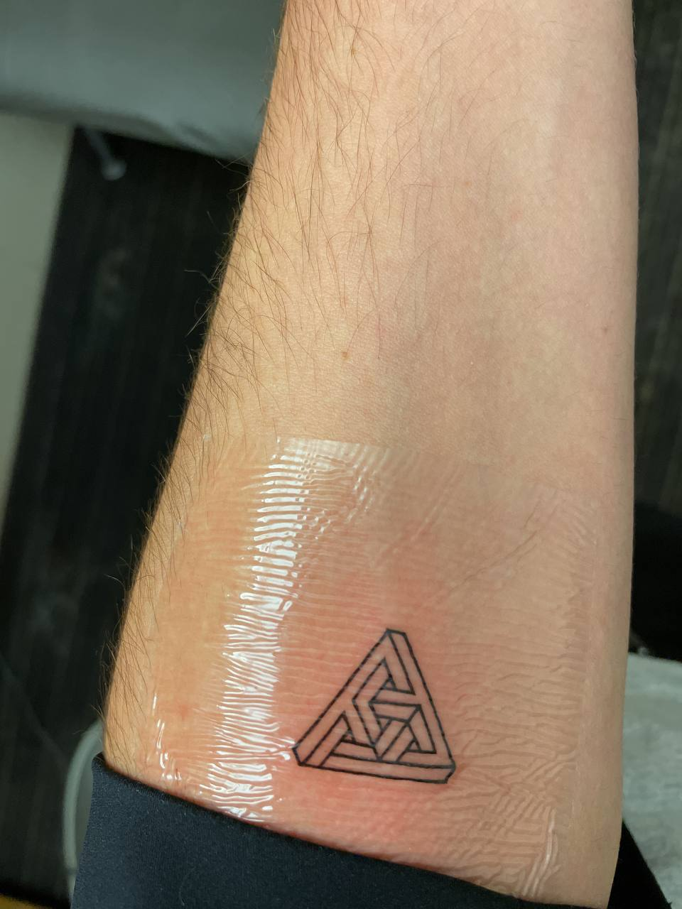

# Logo

## Receive the Brief

Understand the project requirements, brand values, and target audience.

## Research

Explore industry trends, competitor logos, and suitable colors or shapes.

<figure><figcaption></figcaption></figure>

## Sketch

Sketch on paper to draft ideas.

<figure><figcaption></figcaption></figure>

## Design

Create multiple concepts, discuss feedback, and refine the final design.

<figure><figcaption></figcaption></figure> <figure><figcaption></figcaption></figure> <figure><figcaption></figcaption></figure> <figure><figcaption></figcaption></figure>

## Make sure the perfect layout

<figure><figcaption></figcaption></figure>

<figure><figcaption></figcaption></figure>

## Review

Test the logo at different sizes and platforms, ensuring consistency.&#x20;

<figure><figcaption></figcaption></figure>

## Brand guideline

Finalize with a simple brand guideline.

<figure><figcaption></figcaption></figure>

## Final logo

<figure><figcaption></figcaption></figure>

<figure><figcaption></figcaption></figure>

<figure><figcaption></figcaption></figure>

<figure><figcaption></figcaption></figure>

<figure><figcaption></figcaption></figure>

## Got some feedbacks

<figure><figcaption></figcaption></figure> <figure><figcaption></figcaption></figure>

