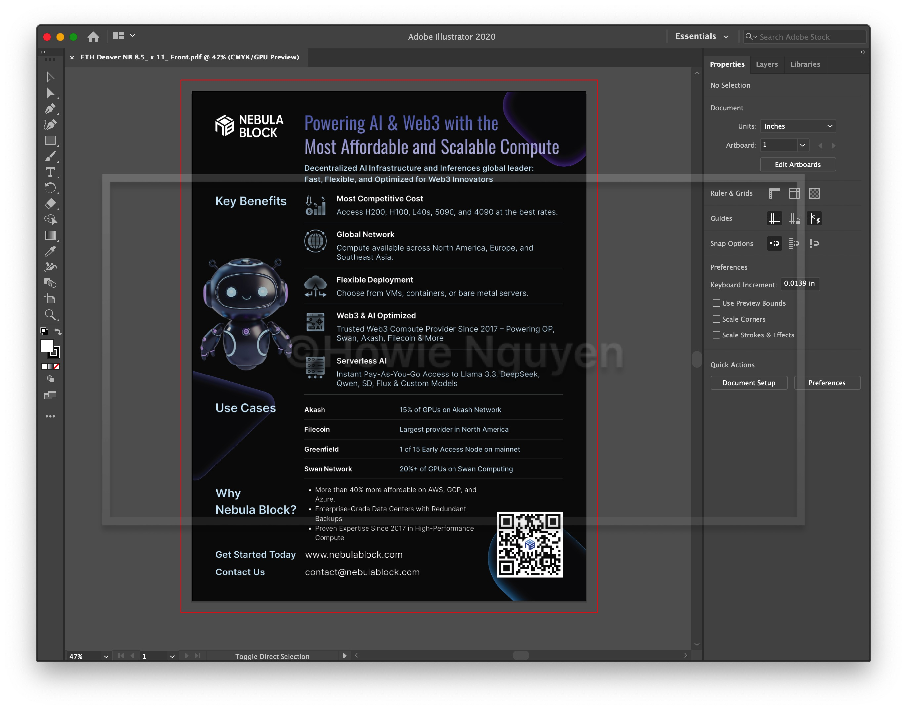
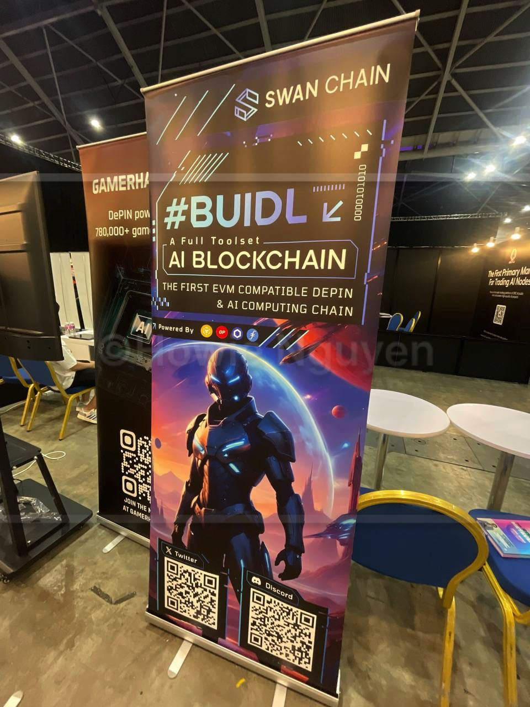
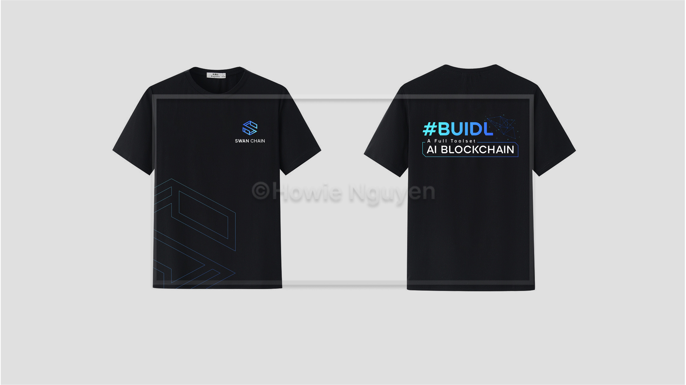
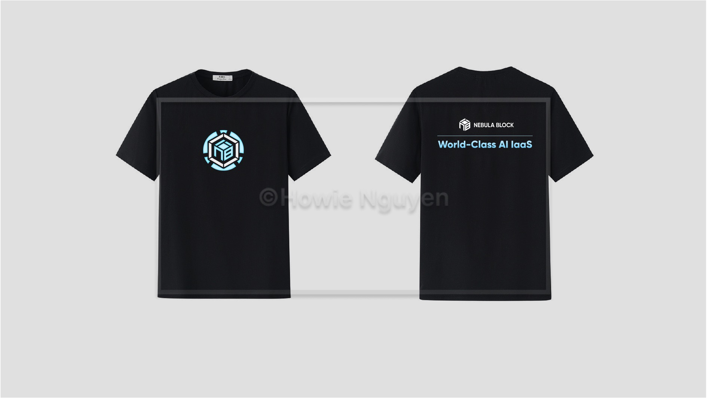
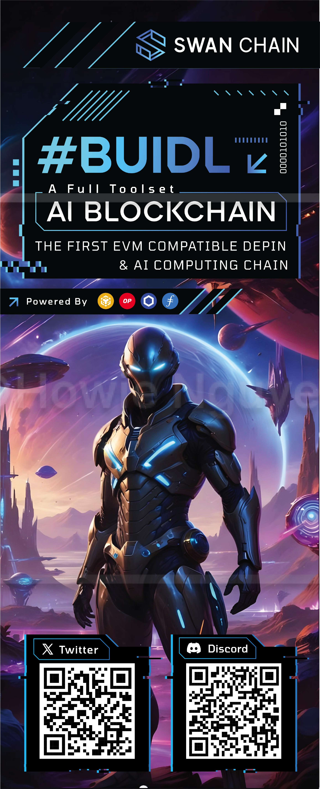
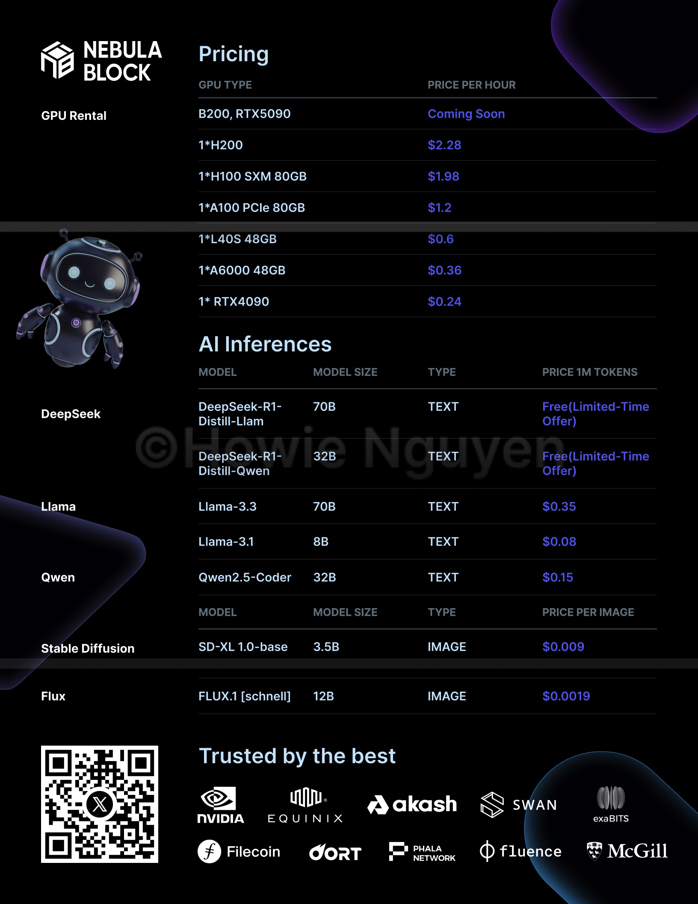
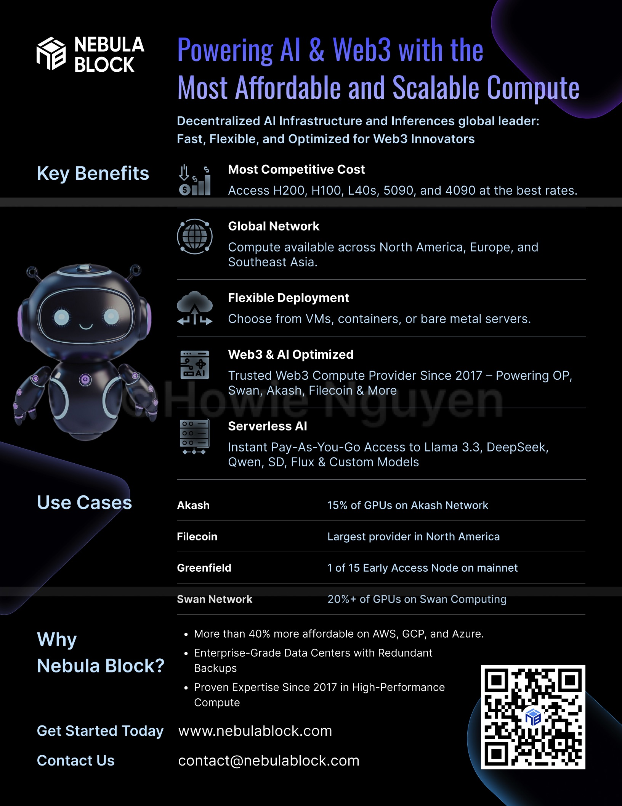
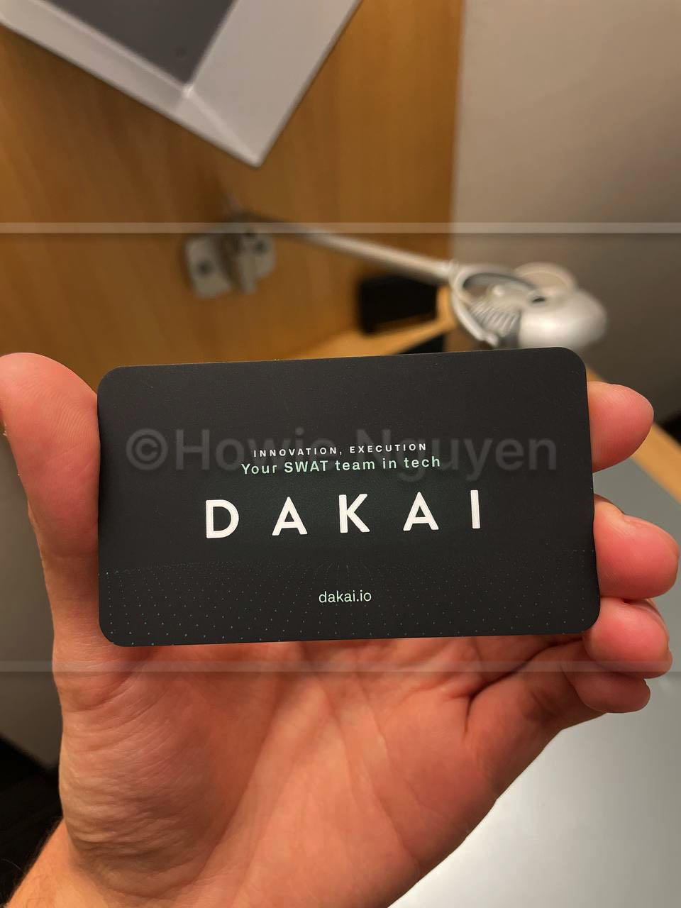
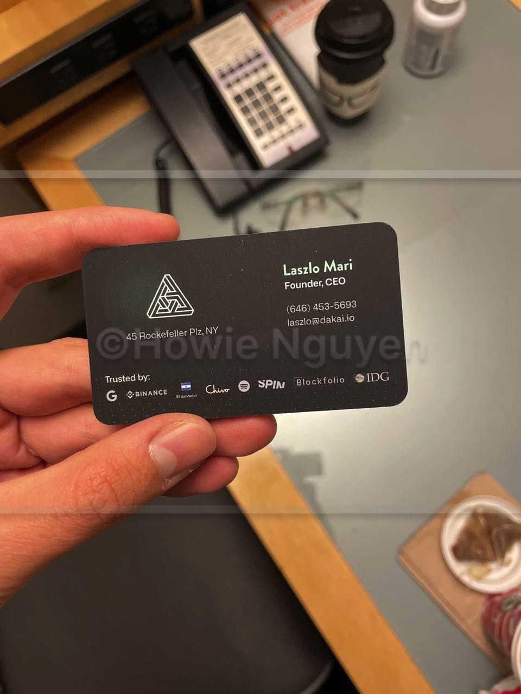

# Marketing Materials

## Receive Requirements

* Get requirements from the team or client.
* Understand the needs, goals, and deadlines.

Sample requirements

Nebula Block: The Most Cost-Effective Web3 Infrastructure & AI Inference Provider

1. Header (Large, Bold) Powering AI & Web3 with the Most Affordable and Scalable Compute
2. Subheader (Smaller but Prominent) The Airbnb for GPUs – Deploy AI & Web3 workloads seamlessly on a global network of cost-effective compute resources.
3. Key Benefits (Icons + Bullet Points) ✅ Lowest Cost Compute – Access H100, H200, L40s, and 4090 GPUs at the best rates. ✅ Global Network – Compute available across North America, Europe, and Southeast Asia. ✅ Flexible Deployment – Choose from VMs, containers, or bare metal servers. ✅ Web3 & AI Optimized – Built for blockchain, AI inference, and fine-tuning. ✅ Serverless Endpoints – Simplify AI agent deployment with instant, scalable inference.
4. Use Cases (Two Columns with Short Descriptions) • AI Startups – Scale inference and fine-tuning affordably. • Blockchain Projects – Cost-efficient node hosting and DePIN computing. • LLM Inference Providers – High-performance, low-latency solutions. • Enterprises & Research – Reliable, secure, and scalable AI infrastructure.
5. Why Nebula Block? • More Affordable than AWS, GCP, Azure • Enterprise-Grade Data Centers with Redundant Backups • Proven Expertise Since 2017 in High-Performance Compute
6. Call to Action (CTA) 🔗 Get Started Today – \[Insert Website Link] 📩 Contact Us – \[Insert Email]

## **Research**

* Look at similar marketing materials for ideas.
* Find inspiration from art, illustrations, and designs.

<figure><figcaption></figcaption></figure>

## Design & Review

* Create the design based on the requirements.
* Get feedback and make changes.
* Follow branding and guidelines.

<figure><figcaption></figcaption></figure>

## Final File for Print

* Check colors, sizes, and layout.
* Make sure fonts are clear and easy to read.
* Prepare the final file for print or digital use.

<figure><figcaption></figcaption></figure>

## Final Design

### T-Shirt

<figure><figcaption></figcaption></figure>

<figure><figcaption></figcaption></figure>

### Standee

<figure><figcaption></figcaption></figure>

### Flyer

<figure><figcaption></figcaption></figure> <figure><figcaption></figcaption></figure>

<figure><figcaption></figcaption></figure> <figure><figcaption></figcaption></figure>

### Business Card

<figure><figcaption></figcaption></figure> <figure><figcaption></figcaption></figure>

