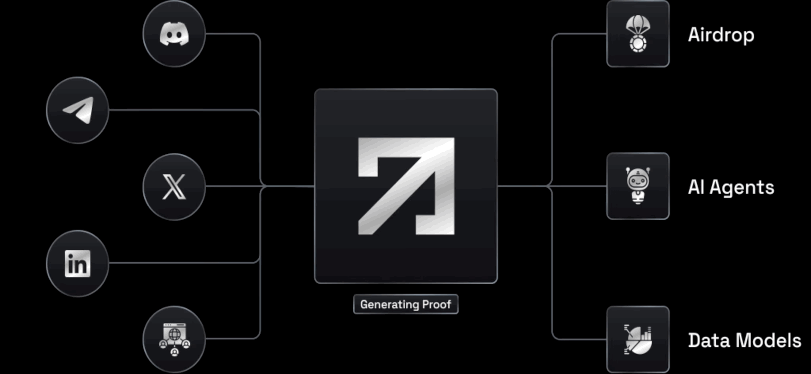
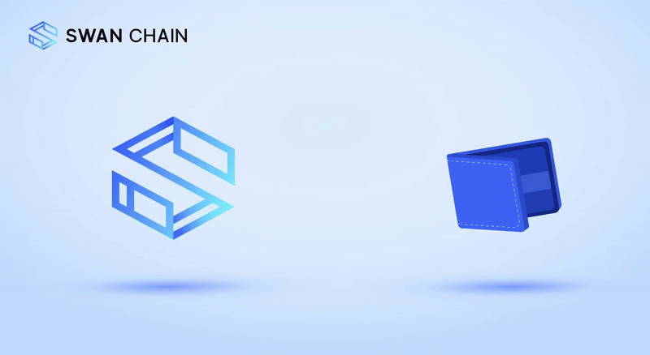
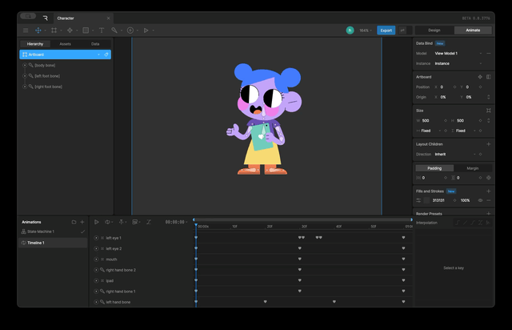
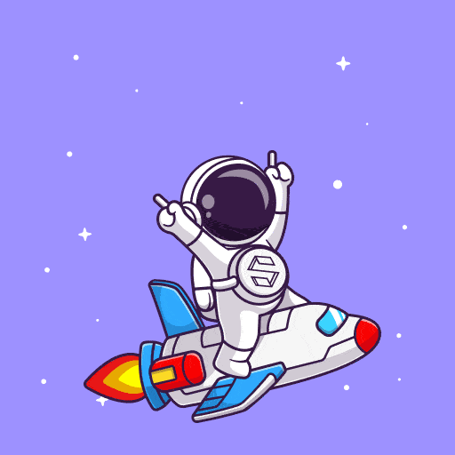
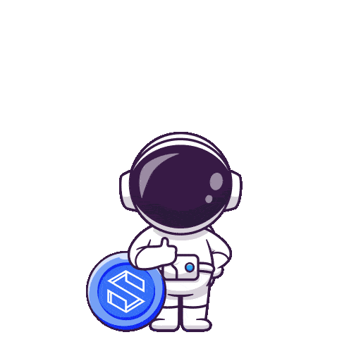

# Video & Animation

## **Receive Brief**

Start by reviewing the project brief, usually provided as a document file. Understand the video’s purpose, target audience, and specific requirements.

Sample brief

\*\*Short Video Script: Explaining Nebula Block’s AI Cloud Solution\*\* &#x20;

\*\*\[Opening Scene: Dynamic Animation]\*\*  \
\- Show a map of global data centers lighting up.  \
\- Display GPUs such as Nvidia 4090, L40s, H100, and H200 powering up with animated icons of AI, data streams, and revenue graphs. &#x20;

\*\*Voiceover (Energetic and Clear):\*\*  \
"At Nebula Block, we connect data centers around the world, enabling them to transform their GPUs into revenue-generating machines." &#x20;

\---

\*\*\[Scene 2: Data Centers Transforming]\*\*  \
\- Visualize different types of data centers (small, mid-size, and large) partnering with Nebula Block.  \
\- Show a seamless onboarding process of GPUs joining the AI cloud. &#x20;

\*\*Voiceover:\*\*  \
"Whether you're running a private data center or managing GPUs of any kind, Nebula Block provides a simple solution to join our AI cloud." &#x20;

\---

\*\*\[Scene 3: Tech Companies Using AI]\*\*  \
\- Depict tech companies leveraging APIs for LLM inference, shown by animations of developers coding, apps being used, and AI agents in action. &#x20;

\*\*Voiceover:\*\*  \
"We help tech companies harness the power of AI by providing LLM inference APIs. With Nebula Block, adapting AI becomes effortless." &#x20;

\---

\*\*\[Scene 4: Maximizing GPU Utilization]\*\*  \
\- Show GPU utilization graphs rising, and dollars flowing to partners’ accounts.  \
\- Include a happy data center owner with a "Revenue Increased!" notification. &#x20;

\*\*Voiceover:\*\*  \
"Our platform ensures GPUs are fully utilized, helping our partners unlock new revenue streams while driving AI innovation worldwide." &#x20;

\---

\*\*\[Closing Scene: Logo and Call to Action]\*\*  \
\- Display Nebula Block’s logo with the tagline:  \
\*"Make AI agents as easily as making an app."\*  \
\- Add a CTA:  \
\*"Join the Nebula Block AI Cloud today!"\* &#x20;

\*\*Voiceover:\*\*  \
"Join Nebula Block and power the future of AI with your GPUs." &#x20;

## **Research**

Gather inspiration by exploring similar videos on platforms like YouTube, X, or social media. Analyze trends, styles, and competitive content to inform your approach.

## **Layout**

Create a simple storyboard with visuals, audio, and text for each scene to preview the video’s flow and ensure alignment with the project’s goals.

<figure><figcaption></figcaption></figure>

## **Editing and Production**&#x20;

Use tools like After Effects, Maya, or CapCut to produce the video, incorporating stock footage, animations, or sound as needed. Refine the output with transitions, color grading, and polished effects.

<figure><figcaption></figcaption></figure>

<figure><figcaption></figcaption></figure>

<figure><figcaption></figcaption></figure>

<figure><figcaption></figcaption></figure>

## **Export**

Finalize the video in a high-quality format.



<a data-footnote-ref href="#user-content-fn-1">Source video</a>, <a data-footnote-ref href="#user-content-fn-2">Video concept</a>













## Animation

<figure><figcaption></figcaption></figure>

<figure><figcaption></figcaption></figure>

<figure><figcaption></figcaption></figure>

<figure><figcaption></figcaption></figure>

<figure><figcaption></figcaption></figure>

<figure><figcaption></figcaption></figure>

<figure><figcaption></figcaption></figure>

<figure><figcaption></figcaption></figure>

[^1]: 

[^2]: 
